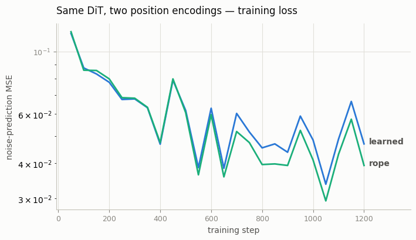
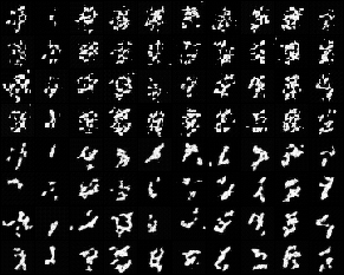
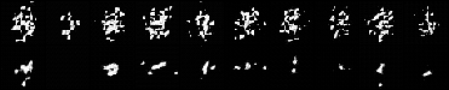

# 2D RoPE for DiT

## Key Insight

A [transformer](/shared/glossary/#transformer) has no built-in sense of position — to it, a sequence of image [patches](/shared/glossary/#patch) is just an unordered bag — so you must tell it *where* each patch sits. [2D RoPE (rotary position embedding)](/shared/glossary/#rope) does this by rotating each token's query and key vectors by an angle set from its row and column, so the [attention](/shared/glossary/#attention) [dot product](/shared/glossary/#dot-product) between two patches depends only on their relative spacing rather than their absolute coordinates. Swapping a [DiT](/shared/glossary/#dit)'s learned position vectors for 2D RoPE usually improves quality — especially when generating at resolutions larger than the model was trained on, because rotations extrapolate to unseen positions far more gracefully than a fixed lookup table of learned vectors.

To unpack that last point: *learned position vectors* are a **lookup table** — during training the model memorizes one vector for position 0, one for position 1, and so on, up to the largest grid it ever saw (say 32×32 patches). Ask it to place patch number 40 and there is simply no row in the table for it — the model never learned one, so it improvises badly and the extra-large image comes out distorted. It is like a printed seating chart that lists seats 1–32: show up holding ticket 40 and the chart is blank, leaving you to guess where to stand. RoPE has no table at all. It turns a position into an *angle* with a fixed formula — position 1 rotates a little, position 2 a little more — so any position, even one never seen in training, just gets a slightly larger rotation and the math keeps working smoothly. That is the difference between a memorized chart and a rule like "each seat is half a metre further along the wall": the rule still tells you exactly where seat 40 — or seat 400 — sits, because it *computes* the answer instead of looking it up.

## What's in this directory

| File | Role |
|------|------|
| `rope2d.py` | Axial 2D rotary embeddings: half of each head's channels rotate with the row index, half with the column index |
| `compare_positions.py` | Trains two otherwise-identical DiTs (learned table vs RoPE), compares loss and samples, then runs the resolution-extrapolation test |

```bash
python compare_positions.py       # trains both models, ~9 min total on CPU
```

This is why project 43 wrote its attention by hand: RoPE must rotate `q`
and `k` *before* their dot product, a spot `nn.MultiheadAttention` does not
expose. The injection point is one optional callable on the `Attention`
module; `dit.py` is otherwise untouched.

## Implementation notes

- **Axial split.** For a head dimension of 32, channels are processed in
  rotation pairs: the first 8 pairs rotate by `row * freq_i`, the last 8 by
  `col * freq_i`, with the same geometric frequency ladder as 1D RoPE. Row
  offsets and column offsets are therefore encoded in disjoint channels and
  cannot interfere.
- **Relative by construction.** A rotation by `theta_i` on queries and
  `theta_j` on keys contributes `cos/sin` of `(theta_i - theta_j)` to their
  dot product — only the offset survives. No parameters are learned; the
  RoPE model has strictly fewer parameters than the learned-table model.
- **Any grid, same table.** The angle table is precomputed for a 16×16 grid
  once; training crops the 7×7 corner, and the extrapolation test crops
  9×9 — the *same rule* evaluated at more positions.

## Results

Both variants train at a deliberately short budget (1 200 steps — see
project 43 on mini-DiT convergence), so absolute sample quality is rough;
everything below is about the *relative* comparison, which is what the
controlled experiment isolates.

**In-distribution: a small but real RoPE edge.** The loss curves overlap
for the first half of training, after which the RoPE curve sits
consistently a few percent below. The sample grids
(`outputs/samples28.png`, learned in the top four rows, RoPE below) agree —
the RoPE model's strokes are visibly smoother and more connected at the
same step count. The relative-position bias apparently helps even on a
fixed 7×7 grid, which is the guide's "usually improves quality":





**Out-of-distribution: the point.** Both models are asked to sample at
36×36 — a 9×9 token grid neither ever saw. The learned model's table is
bilinearly interpolated (the standard ViT trick — the best you can do with
a chart that has no row for seat 40); RoPE simply rotates by the larger
indices. Top row learned, bottom row RoPE:



Both degrade off-distribution (the *denoiser* also never saw 36×36 image
statistics), but they degrade differently, and the difference is the
lesson: the interpolated-table model scatters fragments across the whole
canvas — positions between table rows all look alike to it, so structure
loses its anchoring — while the RoPE model still produces one compact,
coherently-placed object. At real scale this asymmetry compounds; it is
why Flux and friends generate gracefully at aspect ratios and resolutions
they never trained on, and why 2D RoPE is the modern default the guide
says it is.

## Things to try

- Push to 44×44 (an 11×11 grid). Interpolation stretches the same 7 rows
  ever thinner; rotation just keeps counting.
- Set the RoPE frequency `base` to 10 instead of 100: coarser angle
  resolution at long range — watch large-offset attention degrade.
- Give RoPE *and* the learned table to one model. At the trained size the
  table can only help; check whether it hurts extrapolation (it does — the
  model leans on the memorized part).
