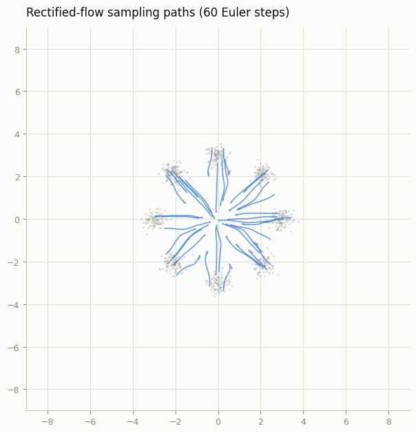
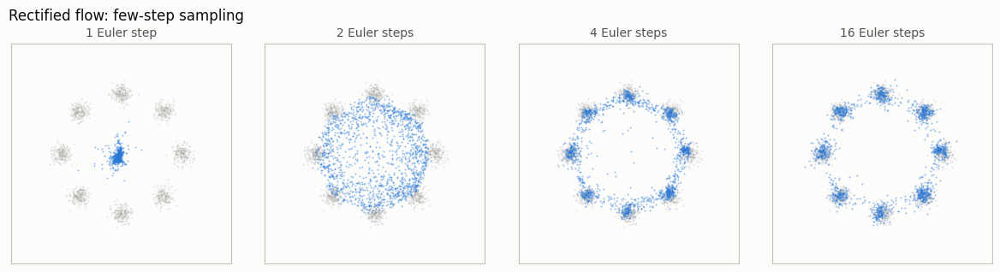
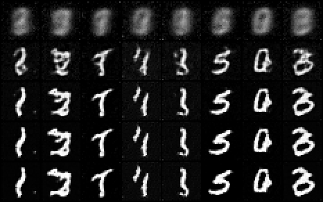

# Rectified Flow from Scratch

## ELI5 (Explain Like I'm 5)

- **The Big Idea:** Traditional diffusion models add noise in a curved, complex way. Rectified Flow simplifies this by drawing a straight line directly from the clean image to the random noise. The model is trained to predict the "velocity" (the speed and direction) of this straight path, allowing us to generate images in very few steps by just walking along these straight arrows.
- **Analogy:** Imagine driving from your house to a shop. Standard diffusion is like navigating winding, twisty country roads with lots of turns (noise schedule). Rectified Flow is like building a straight highway directly from your driveway to the shop, so you can just point the steering wheel straight and drive.
- **Example:** Instead of needing a complicated noise schedule table with parameters to tune, Rectified Flow uses a simple formula `x_t = (1-t)*x_0 + t*eps` and converges faster, producing clean images in 20 steps.


## Key Insight

[Rectified flow](/shared/glossary/#rectified-flow) is a kind of [flow matching](/shared/glossary/#flow-matching): instead of predicting the noise added at a discrete step the way [DDPM](/shared/glossary/#ddpm) does, you train the model to predict a *velocity* — the straight-line direction `ε - x_0` that points from a half-noised image back toward clean data. Because the training paths are straight lines, [sampling](/shared/glossary/#sampling) simply steps along the predicted arrows by solving an [ODE](/shared/glossary/#ode) (with [Euler](/shared/glossary/#euler-method) or [Heun](/shared/glossary/#heuns-method)), and you reach good images in only 10–50 steps. Re-deriving your earlier diffusion model with this objective shows how little has to change — the same network, but a simpler loss with no [noise schedule](/shared/glossary/#noise-schedule) to tune — yet it trains cleanly and few-step sampling works out of the box.

## What's in this directory

| File | Role |
|------|------|
| `rf.py` | The whole method: interpolation, loss, Euler sampler — ~40 lines |
| `train_rf_toy.py` | 2D toy training plus the trajectory and few-step figures |
| `train_rf_mnist.py` | The [DDPM on MNIST](../24-ddpm-on-mnist/README.md) project's U-Net retargeted from noise to velocity |
| `sample_rf_mnist.py` | Few-step Euler grids on MNIST |

```bash
python train_rf_toy.py         # ~1 min on CPU
python train_rf_mnist.py       # ~3 min
python sample_rf_mnist.py
```

## What is NOT in this directory

Compare `rf.py` against phase 5's `diffusion.py` and notice everything that
vanished: no beta schedule, no `alpha_bar` table, no posterior variance, no
discrete `T`, no `q_sample`-vs-`p_sample` asymmetry. The forward "process"
is `x_t = (1-t) x0 + t eps` and its exact velocity is the constant
`eps - x0`. The loss is one MSE. The sampler is Euler on `dx/dt = v`. This
is why the field moved: the schedule zoo the earlier phases carefully tuned
(the [Cosine vs linear schedule](../26-cosine-vs-linear-schedule/README.md), [EDM reparameterization](../33-edm-reparameterization/README.md), and [VP vs VE comparison](../35-vp-vs-ve-comparison/README.md) projects) is replaced by a linear interpolation with nothing to
tune. In sigma-language (the [EDM reparameterization](../33-edm-reparameterization/README.md) project), rectified flow is one more choice of
interpolation path — but the cleanest-conditioned one, with unit-scale
inputs and targets at every `t` for free.

The `eps` argument in `rf_loss` looks redundant today — by default noise is
drawn randomly per batch. It is the single hook the [Re-flow](../47-re-flow/README.md) project needs:
pass FIXED (sample, noise) couples instead and the same function performs
reflow training.

## Results — 2D toy (where you can see the mechanism)

**The trajectories.** Sampling paths radiate from the prior toward the
modes, mostly straight (measured chord/arc straightness 0.871 — compare
the [Probability flow ODE](../34-probability-flow-ode/README.md) project's visibly curved diffusion ODE paths on this same dataset). Not
perfectly straight: random pairing means paths *would* cross, and the
marginal velocity field must bend near the center where crossings
concentrate. That residual bend is exactly what the [Re-flow](../47-re-flow/README.md) project removes:



**Few-step sampling.** With mostly-straight paths, a handful of Euler steps
lands close: 4 steps is already usable, 16 is clean. One step collapses to
the paths' shared early direction — the bend near t = 1 is the whole error:



## Results — MNIST (the same objective at image scale)

Rows top to bottom: 1, 2, 4, 8, 16 Euler steps, same starting noise. Two
steps gives ghosted but recognizable digits; four is legible; sixteen is
comparable to the 300-step DDPM loop of the [DDPM on MNIST](../24-ddpm-on-mnist/README.md) project — with the *same U-Net*,
retrained for ~3 minutes on the velocity target:



The only change to the network is a wrapper scaling `t in [0,1]` into the
sinusoidal embedding's comfortable range — `VelocityUNet` in
`train_rf_mnist.py` is four lines.

## Things to try

- Sample the MNIST model with Heun (the [Higher-order sampler](../31-higher-order-sampler/README.md) project's solver on `dx/dt = v`):
  at 4–8 steps the second-order correction still buys visible quality.
- Plot `||v_theta(x_t, t)||` along a sampling path: for straight paths it
  should be nearly constant in `t` — a cheap straightness diagnostic.
- Train with `t ~ Beta(2, 2)` instead of uniform (more mid-path samples,
  where the task is hardest) — the RF cousin of EDM's log-normal sigma
  sampling, and the kind of knob SD3's paper tunes.
