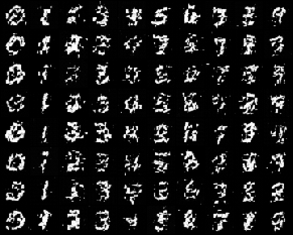
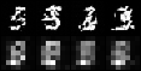

# MMDiT Block

## Key Insight

In a standard [DiT](/shared/glossary/#dit), text guides the image through [cross-attention](/shared/glossary/#cross-attention) — the image tokens look at the text tokens, but not the other way around. [MMDiT (Multi-Modal Diffusion Transformer)](/shared/glossary/#mmdit), the block behind [Stable Diffusion 3](/shared/glossary/#stable-diffusion) and [Flux](/shared/glossary/#flux), instead concatenates text and image tokens and runs them through *one shared* [self-attention](/shared/glossary/#attention) ("joint attention"), while giving each [modality](/shared/glossary/#modality) its own normalization and [MLP](/shared/glossary/#mlp) weights. Letting text and image attend to each other freely in both directions improves compositional prompts — getting "a red cube on a blue sphere" right instead of swapping the colors — which is why most strong 2024+ open models adopted it.

## What's in this directory

| File | Role |
|------|------|
| `mmdit.py` | The `MMDiTBlock` (two `Stream`s, joint attention) and a mini model whose "caption" is two learned tokens per class |
| `train_mmdit.py` | Training with the rectified-flow objective (the SD3/Flux pairing), per-class sampling, and the joint-attention visualization |

```bash
python train_mmdit.py            # ~8 min on a multicore CPU
```

The full-scale version conditions on a T5/CLIP-encoded caption over a
captioned photo dataset; the mini version stands in a 2-token learned
"caption" per digit class, which preserves everything architectural — two
streams, joint attention, per-stream weights — at CPU cost. Note the
deliberate pairing: this model trains with project 45's flow-matching loss,
because MMDiT + rectified flow is literally the SD3 recipe.

## The block, and what makes it MMDiT

Look at `MMDiTBlock.forward` and find the three design decisions:

1. **Each stream owns its parameters.** `Stream` bundles a modality's
   AdaLN, qkv, output projection, and MLP. Text-token statistics and
   image-token statistics are too different to share weights — SD3 ablates
   this and shared weights lose.
2. **The attention is joint.** Queries, keys, and values from both streams
   are concatenated along the token axis and one softmax runs over
   everything. Every image patch can read every caption token AND vice
   versa — the caption tokens are *updated* by what the image looks like as
   generation proceeds, which is precisely what cross-attention (a one-way
   read of frozen text) cannot do.
3. **After attention, the streams split back apart** and each applies its
   own gate, residual, and MLP. The only place the modalities touch is the
   attention matrix.

Everything else — AdaLN-Zero modulation, zero-init gates, the final
modulated projection — is project 43's DiT machinery, reused.

## Results

**Per-class samples** (16 Euler steps, one column per class token pair).
Class identity flows through *attention alone* — unlike projects 28/43,
where the label enters through AdaLN, here AdaLN carries only the timestep
and the label reaches the image exclusively via the caption tokens the image
attends to:



**Watching the joint attention.** Top row: partially generated 3s. Bottom
row: how much each image patch attends to the caption tokens (bright = more
attention mass), at the last block, mid-generation. The attention
concentrates where the digit's strokes are being decided — the patches that
most need to know *which* digit they are drawing are the ones querying the
caption hardest:



## Things to try

- Ablate the joint attention into cross-attention: let image tokens attend
  to text keys/values but mask the text-query rows. Same parameters,
  one-way information flow — compare class control at equal steps.
- Share one `Stream` for both modalities and retrain: the SD3 ablation,
  reproduced in one line.
- Grow the caption to 4 tokens per class and check whether the extra
  capacity changes anything at this scale (the answer at SD3 scale is yes;
  seeing where it starts mattering is the experiment).
