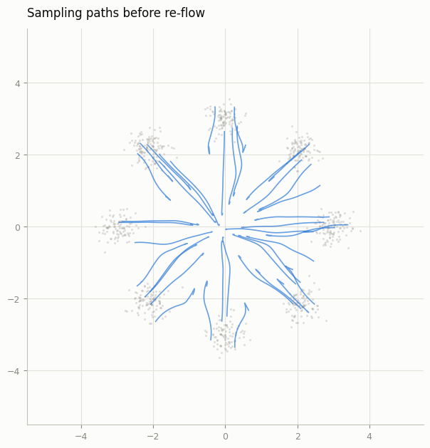
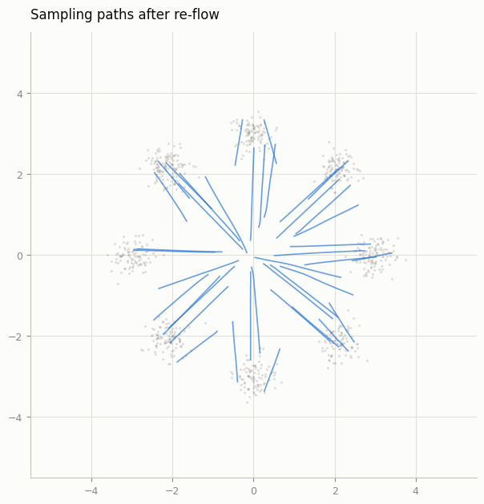
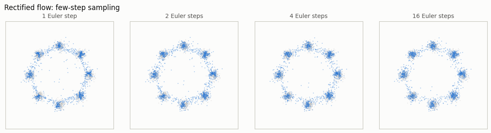

# Re-flow

## Key Insight

A freshly trained [rectified flow](/shared/glossary/#rectified-flow) model already follows fairly straight paths from noise to image, but they are not perfectly straight, so taking very few [sampling](/shared/glossary/#sampling) steps still wobbles off course. "Re-flow" fixes this by using the trained model to generate many (noise, image) pairs, then training a *second* model to map each noise sample directly to its paired image along a straight line — literally teaching it the shortcut the first model discovered. After one or two rounds the trajectories become straight enough to sample in as few as one or two steps, which is the foundation of the fast [distillation](/shared/glossary/#distillation) methods behind real-time image generators.

## What's in this directory

| File | Role |
|------|------|
| `reflow.py` | The whole procedure: generate couples from the [Rectified flow from scratch](../45-rectified-flow-from-scratch/README.md) project's model, retrain on them, measure straightness and 1-step quality before/after |

```bash
python reflow.py            # ~2 min on CPU (needs the Rectified flow from scratch toy checkpoint)
```

## Why random pairing bends paths — and fixing the pairing unbends them

The [Rectified flow from scratch](../45-rectified-flow-from-scratch/README.md) project trains on *random* (data, noise) pairs: every batch, each data
point is matched with fresh noise. Individually each training pair defines a
straight line, but lines from different pairs **cross**, and a velocity
field is single-valued — at a crossing point it must output one vector, so
the learned marginal field bends to average the traffic. That bend is the
few-step error.

Re-flow's move is almost embarrassingly simple:

```python
eps = torch.randn(n, 2)
x0, _ = euler_sample(model1, eps, steps=60)   # let round-1 pick the pairing
model2 = train(pairs=(x0, eps))               # train on the FIXED couples
```

The couples produced by *integrating the round-1 ODE* have a special
property: ODE trajectories cannot cross (uniqueness of solutions), so the
new pairing is crossing-free — and the optimal velocity field for a
crossing-free coupling is genuinely straight lines. Note the code reuse:
`train(pairs=...)` is the [Rectified flow from scratch](../45-rectified-flow-from-scratch/README.md) project's training function; re-flow changed the
*dataset*, not the objective. Also note round 2 never sees real data — only
round-1 samples. Reflow is self-distillation, and any bias in round 1's
samples is inherited (why you stop after a round or two).

## Results (recorded run, `outputs/metrics.csv`)

| | straightness (1 = straight) | 1-step energy distance (lower = better) |
|---|---|---|
| round 1 (random pairing) | 0.871 | 1.96 |
| round 2 (re-flowed) | **1.000** | **0.0105** |

**Paths, before and after.** Same model class, same sampler — only the
pairing changed. Before: gentle curves that bend near the center. After:
line segments, drawn with a ruler:





**One step is now enough.** After re-flow, a SINGLE Euler step from the
prior lands on the eight modes — compare the [Rectified flow from scratch](../45-rectified-flow-from-scratch/README.md) project's 1-step panel, which
collapsed to a blob. The 1-step energy distance improving by ~190x is that
picture as a number:



This chain — flow matching → re-flow → 1-step generation — is the ancestry
of the real-time generators of phase 10 (consistency distillation, project
60, is the same "teach the shortcut" idea with a different loss), and of
the "Turbo" models used in phase 7's inference projects.

## Things to try

- A third round: generate couples from model 2 and train model 3. Measure
  where the gains stop (and watch sample bias compound).
- Break it on purpose: generate the couples with only 3 Euler steps. Sloppy
  couples = sloppy shortcut — teacher quality bounds student quality.
- Re-flow the MNIST rectified flow from the [Rectified flow from scratch](../45-rectified-flow-from-scratch/README.md) project (same two lines with
  image tensors) and compare its 1-step row before and after.
