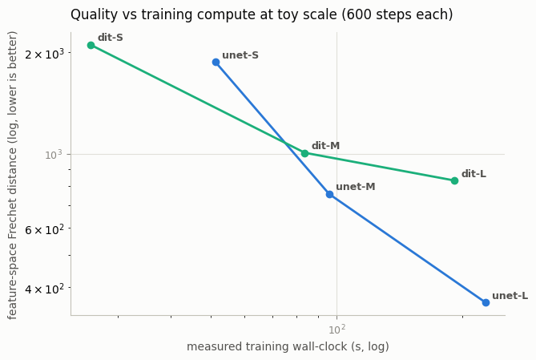

# Compare DiT and U-Net Scaling

## Key Insight

The reason the field switched from [U-Nets](/shared/glossary/#u-net) to [Diffusion Transformers (DiT)](/shared/glossary/#dit) is not that a small DiT beats a small U-Net — often it does not — but that DiT obeys cleaner [scaling laws](/shared/glossary/#scaling-laws): as you grow the model and the compute you spend on it, quality improves along a smoother, steeper line. Training DiT-S, DiT-B, and DiT-L on the same data and plotting [FID](/shared/glossary/#fid) against [FLOPs](/shared/glossary/#flops) makes that slope visible — the DiT curve keeps dropping where the U-Net flattens out. This is the same lesson that played out in language modeling: predictable scaling beats clever architecture once you can afford to scale.

## What's in this directory

| File | Role |
|------|------|
| `scaling_study.py` | Trains three U-Net sizes and three DiT sizes under one fixed protocol and plots quality against measured training compute |

```bash
python scaling_study.py            # six models, ~10 min total on CPU
```

## The protocol (which is the actual lesson)

Six unconditional models — U-Nets at base width 8/16/32, DiTs at
dim 64/128/192 — trained with identical data, optimizer, batch size, and a
fixed 600-step budget. Per model, two numbers:

- **Compute axis:** measured training wall-clock. Honest at this scale
  (parameter counts flatter the DiT, whose attention costs more per
  parameter; FLOPs estimates hide constant factors that wall-clock does not).
- **Quality axis:** Fréchet distance in MNIST-classifier feature space
  (the [Cosine vs linear schedule](../26-cosine-vs-linear-schedule/README.md) project's metric) over 256 samples drawn with 50-step DDIM — the
  budget FID protocol scaled to a CPU. All six models are scored by the
  same frozen feature net against the same 2 048 real digits, so the
  *ranking* is meaningful even though the absolute numbers are not
  publishable FIDs.

Everything is deliberately reused: `UNet` from the [DDPM on MNIST](../24-ddpm-on-mnist/README.md) project, `DiT` from
the [Implement DiT-S/2](../43-implement-dit-s-2/README.md) project, `DDIMSampler` from the [DDIM sampler](../27-ddim-sampler/README.md) project, the metric from the [DDPM on CIFAR-10](../25-ddpm-on-cifar-10/README.md) and [Cosine vs linear schedule](../26-cosine-vs-linear-schedule/README.md) projects.
A scaling study is a harness around pieces you already trust.

## Results



The recorded run (`outputs/results.csv`) shows the guide's claim, measured:
at this scale **the U-Net curve sits below the DiT curve at every matched
compute level** — convolution's built-in locality and translation
equivariance are priors the transformer must buy back with data and steps
it hasn't been given. The interesting structure is in the slopes: quality
improves as each family grows, and nothing here contradicts the crossover
story — it just locates it *above* toy scale. What the DiT paper showed
(and why everyone switched) is that as compute keeps growing, the DiT line
keeps its slope while the U-Net's bends flat; the frontier lives far up and
to the right of this plot.

Read this figure alongside the [Implement DiT-S/2](../43-implement-dit-s-2/README.md) project's convergence finding (the mini-DiT
needed ~2.3x the U-Net's steps for comparable samples) — same effect, two
views.

Honest caveats worth internalizing, because they apply to every scaling
plot you will ever read: three points per family is a trend, not a law;
one seed per point; a fixed step budget favors fast-converging
architectures; and a feature-space FD on 256 samples carries sampling
noise. The published DiT scaling curves differ from this one mainly in
having none of those excuses — that is what made them convincing.

## Things to try

- Give every model a fixed *wall-clock* budget instead of fixed steps (the
  fairer fight for slow-per-step architectures) and re-plot.
- Add DiT with patch 2 as a seventh point: more compute per parameter,
  usually better quality per parameter — patch size moves you along the
  curve, not off it.
- Re-run with 3 seeds per point and add error bars; watch which apparent
  gaps survive.
