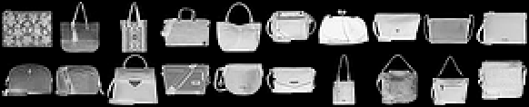
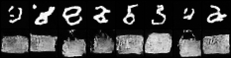
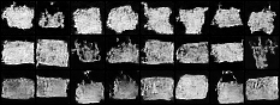

# LoRA Fine-Tune

## ELI5 (Explain Like I'm 5)

- **The Big Idea:** A big image-drawing AI already knows how to draw almost anything you ask for. Teaching it one brand-new thing the "normal" way means adjusting every one of its millions of internal settings — slow, expensive, and risky, since nudging everything can make it forget things it already knew. LoRA instead bolts on a tiny handful of new, easy-to-train numbers next to the existing ones, trains only those, and leaves every original setting exactly where it was.
- **Analogy:** Think of the model as a thick, finished cookbook with thousands of recipes already worked out. To make one recipe extra garlicky, you don't rewrite the cookbook — you clip a sticky note onto that page: "add 1 tsp garlic." The book stays untouched and usable for everything else; the note weighs a gram next to a book that weighs a kilogram, and you can peel it off any time.
- **Example:** We take a model that only knows how to draw handwritten digits, freeze it completely, and train a tiny rank-4 side-attachment on 20 photos of a bag. A few minutes later, the exact same frozen model draws bags too — and the "bag knowledge" lives in a file a fraction the size of the original model.

## Key Insight

[LoRA (Low-Rank Adaptation)](/shared/glossary/#lora) is the reason you can teach a giant [Stable Diffusion](/shared/glossary/#stable-diffusion) checkpoint a brand-new subject on a single consumer GPU. Instead of [fine-tuning](/shared/glossary/#fine-tuning) all of the model's frozen [weights](/shared/glossary/#weights), you leave them untouched and train only a tiny pair of [low-rank](/shared/glossary/#low-rank) matrices that nudge each layer's output — so the result is a few megabytes you can share and swap, not a full multi-gigabyte model. The practical lesson of training on ~20 images of a custom subject is the tension between learning the subject and [overfitting](/shared/glossary/#overfitting): too many steps and the model can only ever redraw your training photos, too few and it never locks onto the subject at all.

## What's in this directory

| File | Role |
|------|------|
| `lora.py` | The method: `LoRAConv2d` (frozen conv + trainable low-rank residual) and `inject_lora` to wrap a whole U-Net. Reused by the [Style LoRA](../56-style-lora/README.md) project |
| `train_base.py` | Pretrain the frozen base — the phase-5 [DDPM on MNIST](../24-ddpm-on-mnist/README.md) U-Net, re-run here |
| `train_lora.py` | Inject LoRA, fine-tune only the adapters on 20 subject images, emit the figures |

```bash
python train_base.py     # ~3 min — the frozen base
python train_lora.py     # ~2 min — the LoRA adaptation
```

## How the adapter works

A frozen conv computes `y = W x`. LoRA adds a parallel low-rank residual,
`y = W x + (alpha/r) B(A x)`, where `A` squeezes the input to `r = 4` channels
and `B` expands back. `A` starts random but `B` starts at **zero**, so the
residual is exactly zero at init — the wrapped model behaves identically to the
frozen one on step one, and every subsequent step only learns a small
correction. That is the whole of `LoRAConv2d`; `inject_lora` just swaps every
Conv2d in the U-Net (except the input/output stems) for a wrapped copy and
freezes the originals.

## Results

The frozen base draws MNIST digits; the base never saw a *bag* (we use a
FashionMNIST bag as the "custom subject" — a solid blob nothing like a thin
digit stroke). We train a rank-4 LoRA on 20 of them.

**The 20 training images:**



**Top row — the frozen base (digits). Bottom row — the same model with the
LoRA (bags).** Only the adapters changed; the base weights are byte-for-byte
identical. The distribution has clearly moved onto the new subject:



**Parameter accounting** (`outputs/params.txt`):

```
frozen base parameters : 366,625
trainable LoRA params  : 39,168  (rank 4)
LoRA as % of base      : 10.68%
```

On a real Stable Diffusion checkpoint this ratio is well under 1% — a few
megabytes against several gigabytes. It is larger here only because the toy
U-Net's convs are themselves tiny, so a rank-4 residual is a bigger *relative*
slice. The lesson transfers regardless: you trained ~10% of the parameters and
never touched the base.

**The learning/overfitting tension.** Samples after 150 / 400 / 1200 adapter
steps (top to bottom), same starting noise per column. Early on the subject is
still forming; by the last row every column is a solid bag — the adapter has
locked on, and the diversity across a row has already started to shrink. Push
the step count far higher and it collapses toward re-drawing the 20 training
images, the [overfitting](/shared/glossary/#overfitting) failure the Key
Insight warns about:



## Things to try

- Drop the rank to 2 or raise it to 16 and watch the parameter count and
  subject fidelity move together.
- Change `SUBJECT_CLASS` in `train_lora.py` to a different FashionMNIST class
  (a sneaker, a shirt) and re-run only `train_lora.py` — the base is reused.
- Compare this adapter against full fine-tuning in the [DreamBooth](../51-dreambooth/README.md)
  project and against a single learned token in the [Textual Inversion](../52-textual-inversion/README.md)
  project — the same subject, three points on the size/fidelity trade-off.
