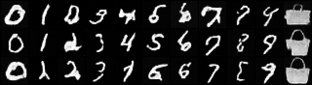
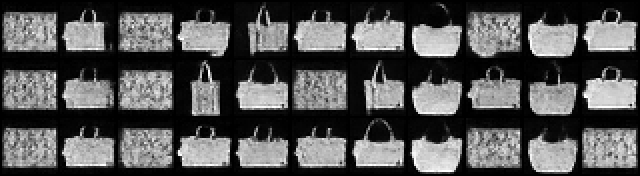

# DreamBooth

## ELI5 (Explain Like I'm 5)

- **The Big Idea:** Teach a model a specific subject by retraining *the entire model* on 3–5 photos of it, tied to a made-up name. The likeness is superb — but if you train only on those photos, the model forgets everything else. So you also keep showing it generic examples, to protect what it already knew.
- **Analogy:** A brilliant portrait artist studies five photos of your dog until they can draw it perfectly. If that is *all* they practice, they slowly forget how to draw any other dog. The fix: between sessions, have them keep sketching ordinary dogs so the general skill survives.
- **Example:** We bind a new token V to a bag and fully fine-tune the model. With a "keep drawing digits" (prior-preservation) term, digits *and* the bag both work. Without it, every prompt — even "draw a 3" — comes out a bag.

## Key Insight

[DreamBooth](/shared/glossary/#dreambooth) personalizes a [diffusion model](/shared/glossary/#diffusion-model) by [fine-tuning](/shared/glossary/#fine-tuning) *the whole network* on just 3–5 photos of a subject, binding it to a rare trigger word so you can later prompt "a photo of [V] dog on the moon." Because every [weight](/shared/glossary/#weights) is updated the likeness is excellent, but the saved file is the size of the full model — the opposite trade-off from a lightweight [LoRA](/shared/glossary/#lora). The danger is [catastrophic forgetting](/shared/glossary/#catastrophic-forgetting): train so hard on five images that the model forgets what every *other* dog looks like, which is exactly why DreamBooth adds a [prior-preservation loss](/shared/glossary/#prior-preservation-loss) — extra training on the model's own generic class images so the broad concept survives while the specific subject is learned.

## What's in this directory

| File | Role |
|------|------|
| `train_cond_base.py` | Pretrain the shared class-conditional base (the phase-5 [class-conditional DDPM](../28-class-conditional-ddpm/README.md)). Projects 52/55/56 import this too |
| `dreambooth.py` | Full fine-tune on 5 subject images bound to token V, run twice — with and without prior preservation — and the figures |

```bash
python train_cond_base.py     # ~3 min — the base
python dreambooth.py          # ~4 min — both fine-tunes + figures
```

The class labels 0-9 stand in for text prompts; we add an 11th token V for the
subject (a FashionMNIST bag), the MNIST-scale version of "a photo of [V] bag".

## The experiment

`dreambooth.py` fine-tunes the *entire* 367,905-parameter model twice on the
same 5 bags:

- **With prior preservation** — each step mixes the 5 subject images (labeled V)
  with a batch of generic base-distribution digits (labeled with their real
  class). That second term is the [prior-preservation loss](/shared/glossary/#prior-preservation-loss).
- **Without it** — only the 5 bags.

## Results

**The 5 training images** — that is all DreamBooth needs:


**With prior preservation.** Each row prompts classes 0-9 then V. The digits
still render *and* V is a clean bag — the subject was learned without destroying
the model's prior:



**Without prior preservation.** Same prompts — but now *every* column, including
the digits, collapses to a bag. Five images bulldozed everything the model knew;
this is [catastrophic forgetting](/shared/glossary/#catastrophic-forgetting)
made vivid, and the whole reason the prior-preservation term exists:



**Parameter accounting** (`outputs/params.txt`):

```
DreamBooth updates EVERY weight: 367,905 trainable parameters.
The saved artifact is the full model — the opposite of LoRA's few %.
```

Compare the [LoRA](../50-lora-fine-tune/README.md) project (39k trainable, a
small side file) and the [Textual Inversion](../52-textual-inversion/README.md)
project (128 numbers): same subject, three very different costs. DreamBooth pays
the most and, with prior preservation, buys the best likeness.

## Things to try

- Drop `PRIOR_WEIGHT` toward 0 and watch the with-prior result slide toward the
  no-prior collapse — the term is a dial, not a switch.
- Use *model-generated* class images for the prior set (sample the base before
  fine-tuning) instead of real MNIST — the canonical DreamBooth recipe, which
  preserves the model's own distribution rather than the data's.
- Fine-tune only the later layers and see how much likeness survives at a
  fraction of the trainable count — the conceptual bridge to LoRA.
