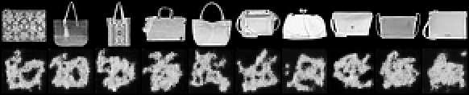

# Textual Inversion

## ELI5 (Explain Like I'm 5)

- **The Big Idea:** The model already knows how to draw. Instead of changing the model at all, you invent one brand-new "word" and teach *only that word* to mean your subject. You are learning a single vector of numbers — nothing else moves.
- **Analogy:** Imagine a painter who can paint anything you name. You do not retrain the painter; you just teach them one new nickname, "Bloop," for a specific bag. Now "paint a Bloop" works, but the painter can only render Bloop as well as their existing skill allows.
- **Example:** We freeze a digit model completely and optimize one 128-number embedding for token V on 20 bag images. The whole artifact is 512 bytes — and the model still draws every digit exactly as before, because not one weight changed.

## Key Insight

[Textual Inversion](/shared/glossary/#textual-inversion) takes the opposite tack from [DreamBooth](/shared/glossary/#dreambooth): it changes *nothing* in the [diffusion model](/shared/glossary/#diffusion-model) itself and instead learns a single new [word embedding](/shared/glossary/#embedding) — a fresh row added to the [text encoder](/shared/glossary/#text-encoder)'s [embedding matrix](/shared/glossary/#embedding-matrix) — that points at your subject. Because only that one vector is trained, the result is a few kilobytes, the smallest personalization artifact there is. The catch is capacity: a single vector can capture a recognizable "vibe" but cannot match the fidelity of [LoRA](/shared/glossary/#lora) or DreamBooth, because the frozen [weights](/shared/glossary/#weights) can only render what the model already knows how to draw.

## What's in this directory

| File | Role |
|------|------|
| `textual_inversion.py` | `InvertedToken` — frozen base + one trainable token vector spliced in wherever the label equals V — and the training loop |

Our base is the phase-5 [class-conditional DDPM](../28-class-conditional-ddpm/README.md), whose class-embedding table plays the role of the [text encoder](/shared/glossary/#text-encoder)'s vocabulary. A "token" here is one row of that table.

```bash
# reuse the shared conditional base (also used by projects 51/55/56):
python ../51-dreambooth/train_cond_base.py --out checkpoints/cond_base.pt
python textual_inversion.py     # ~2 min
```

## How one vector is trained

The base has an embedding row per digit; a normal prompt looks a row up and adds
it to the time embedding. Our new token has no row. `InvertedToken` keeps the
entire model frozen and holds a single learnable vector; at every forward pass
it splices that vector in wherever the label equals V. Back-propagation reaches
*only* that vector — 128 numbers — and nothing else can move. Because the LR
touches one tiny tensor we can push it high (`5e-2`).

## Results

**Top row — the real subject bags. Bottom row — samples for the learned token
V.** The token captures the *gist* of a bag — a rounded body, a handle-ish top —
but the strokes are soft and the fidelity is well below the [LoRA](../50-lora-fine-tune/README.md)
result on the same 20 images. That is the ceiling of a single vector: it can
only steer the frozen model toward shapes it already knows how to render.



**The model is untouched — digits 0-9 still render perfectly**, because training
changed exactly zero of its weights:


**Artifact size** (`outputs/params.txt`):

```
Textual Inversion trains ONE vector: 128 parameters (512 bytes as float32).
Compare: LoRA ~ tens of thousands (project 50);
DreamBooth ~ the entire 367,905-param model (project 51).
```

## The trilogy

Same subject (20 bag images), three methods, three points on the size/fidelity
curve:

| Method | Trains | Artifact | Fidelity |
|--------|--------|----------|----------|
| [Textual Inversion](../52-textual-inversion/README.md) (this) | one token vector | ~512 bytes | vibe only |
| [LoRA](../50-lora-fine-tune/README.md) | low-rank residuals | tens of KB | good |
| [DreamBooth](../51-dreambooth/README.md) | every weight | full model | best, but heaviest |

## Things to try

- Raise `N_SUBJECT` or `STEPS` — a single vector saturates quickly; more data
  barely helps, which is the whole capacity lesson.
- Learn *two* tokens instead of one (a tiny table of new rows) and see fidelity
  climb toward LoRA — the bridge between this method and richer adapters.
