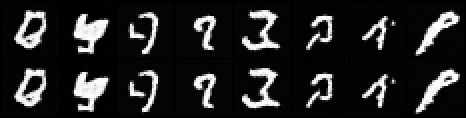
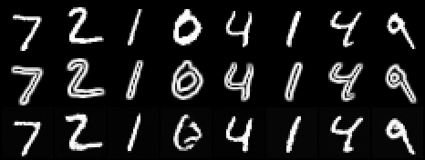

# ControlNet from Scratch

## ELI5 (Explain Like I'm 5)

- **The Big Idea:** A good image model can draw great pictures, but you often can't tell it exactly *where* things should go. ControlNet fixes this by attaching a second, trainable copy of part of the model that looks at a guide picture — here, just the outline of a shape — and whispers hints back into the original: "put your stroke right here." The original artist (the frozen model) never changes; only the whisperer standing behind it learns anything.
- **Analogy:** Picture a master painter (frozen, never retrained) with an apprentice standing behind them holding a stencil. On day one, the apprentice presses the stencil so lightly it leaves no mark at all — the painting comes out exactly as if the apprentice weren't there. Over many practice sessions, the apprentice learns exactly how firmly to press so the final painting follows the stencil's outline, all without the master ever changing how they paint.
- **Example:** We freeze a digit-drawing model, then train a small control branch that reads just the *outline* of a digit. Show it an outline it has never seen before, and it fills in a matching, solid digit that traces that exact outline.

## Key Insight

[ControlNet](/shared/glossary/#controlnet) gives a [diffusion model](/shared/glossary/#diffusion-model) precise spatial control by cloning the [U-Net](/shared/glossary/#u-net)'s encoder into a parallel branch that reads a conditioning image — here a [Canny edge map](/shared/glossary/#canny-edge-detector) — and injects its features back into the frozen original. The trick that makes this trainable without wrecking the pretrained model is the [zero-convolution](/shared/glossary/#zero-conv): the connections start at exactly zero, so on step one the branch contributes nothing and the base model behaves as before, then the zero-convs gradually learn how much control to add. Building it from scratch on Canny edges makes the core idea concrete — the model learns to *trace* the edge map while still inventing texture, color, and lighting from the prompt.

## What's in this directory

| File | Role |
|------|------|
| `controlnet.py` | `ZeroConv`, `edge_map` (Sobel-magnitude, a dependency-free Canny stand-in), and `ControlledUNet` — a trainable copy of the [DDPM on MNIST](../24-ddpm-on-mnist/README.md) encoder that injects control features into the frozen base's skips |
| `train_controlnet.py` | Train the control branch on edge maps; emit the figures |

```bash
# make a frozen base first (the phase-5 unconditional DDPM):
python ../50-lora-fine-tune/train_base.py --out checkpoints/base_mnist.pt
python train_controlnet.py     # ~3 min
```

## The architecture, concretely

`ControlledUNet` re-implements the base U-Net's forward pass so it can splice
into the skip list the base normally hides. It holds:

- a **trainable deep copy** of the base encoder + middle (initialized from the
  base's own weights — ControlNet's "locked copy / trainable copy" pair);
- a small **hint encoder** that reads the edge map, ending in a `ZeroConv`;
- **one `ZeroConv` per skip connection** (and one for the middle block).

Every injection is `base_skip + zero_conv(control_feature)`. Because each
`ZeroConv` is initialized to all-zero weight *and* bias, all injections are zero
at init and the controlled model reproduces the frozen base exactly — only then
does the branch learn how much to add. Only the branch, hint encoder and
zero-convs train (140,352 params); the base stays frozen.

## Results

**Zero-conv identity at init.** Both rows sample from the *same* noise with the
*same* per-step randomness; the top row is the frozen base, the bottom row is
the freshly-built controlled model fed edge maps. They are **pixel-for-pixel
identical** (max difference `0.0`) — the control branch contributes exactly
nothing before training, which is why bolting it on cannot damage the
pretrained model:



**After training — control takes hold.** Top row: held-out test digits. Middle
row: their edge maps (the only spatial signal the model gets). Bottom row:
images generated *from those edge maps*. The samples trace the outline — the
model learned to fill the structure the control image dictates:



On MNIST "fill the outline" is most of the picture; on a real ControlNet the
same mechanism fixes *pose, depth or composition* while the prompt still invents
texture, color and lighting inside those constraints.

## Things to try

- Swap `edge_map` for a different control signal — a coarse segmentation mask,
  or a downsampled-then-upsampled "blurry pose" — and retrain; the plumbing is
  identical.
- Scale the injected control (multiply the zero-conv outputs by 0.0–2.0 at
  sampling time) to see control strength as a continuous dial.
- Feed an edge map that conflicts with a class-conditional prompt (from the
  [class-conditional DDPM](../28-class-conditional-ddpm/README.md) project) and
  watch structure fight identity — the everyday tension in real ControlNet use.
