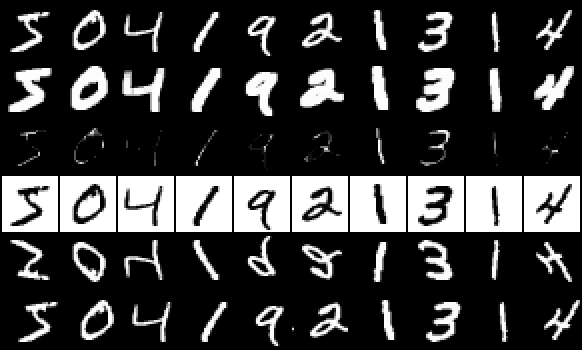
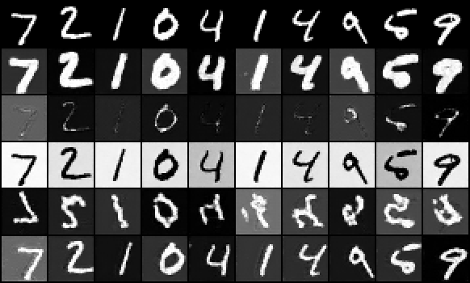

# InstructPix2Pix-Style Data

## ELI5 (Explain Like I'm 5)

- **The Big Idea:** To build an editor that obeys typed instructions like "make it bold" or "flip it upside down," you first need thousands of "before and after" example pairs to learn from. Making those by hand one at a time would take forever, so instead you generate them automatically. Once you have enough pairs, one model learns to jump straight from (a picture + an instruction) to the edited picture, in a single step — no slow trial and error.
- **Analogy:** A cooking student learns much faster from a big stack of "before" and "after" photos of dishes than from watching one dish cooked in slow motion. Study enough of those photo pairs, each labeled with the recipe's name, and eventually the student can picture the finished "after" dish the moment they see the "before" ingredients and the recipe name — no step-by-step demonstration required.
- **Example:** We auto-generate hundreds of (digit, instruction, edited-digit) example triples using simple, scripted image edits standing in for a real image-editing AI. Then we train one model that, given a fresh digit and any of five instructions ("thicken", "invert", "flip", ...), produces the edited result in a single pass.

## Key Insight

[InstructPix2Pix](/shared/glossary/#instructpix2pix) turns image editing into a single instruction — "make it winter" — by training on a synthetic dataset of (original image, instruction, edited image) triples. The clever part is *how that data is made*: a [large language model](/shared/glossary/#llm) like GPT invents an instruction and a pair of before/after captions, then a text-to-image model with [Prompt-to-Prompt](/shared/glossary/#prompt-to-prompt) generates a matched image pair that differs *only* in the edited detail. Generating that data yourself shows why the approach scales — no human ever hand-edits a photo — and why the resulting editor runs in one [forward pass](/shared/glossary/#forward-pass) instead of the slow per-image optimization that earlier editing methods required.

## What's in this directory

| File | Role |
|------|------|
| `editor.py` | `INSTRUCTIONS` + `apply_edit` (the synthetic-data ops) and `InstructEditor` (a U-Net that conditions on the original image + an instruction embedding) |
| `train_editor.py` | Build triples on the fly, train the editor, emit the figures |

```bash
python train_editor.py     # ~3 min on CPU
```

## The one honest substitution

Real InstructPix2Pix builds its triples with **GPT** (to invent the instruction
and a before/after caption pair) and **Prompt-to-Prompt** (to render a matched
image pair that differs *only* in the edited region). We have neither model
offline, so we swap in a handful of **procedural** edits — each instruction is a
deterministic image op:

| Instruction | Operation |
|-------------|-----------|
| `thicken` | morphological dilation |
| `thin` | morphological erosion |
| `invert` | negate the image |
| `flip` | flip top-to-bottom |
| `shift right` | roll pixels right |

That swap changes *where the pairs come from*, nothing about the method. The
architecture (concatenate the original image to the noisy input, condition on
the instruction) and the payoff (one-pass editing) are exactly InstructPix2Pix.
In a real pipeline you would replace `apply_edit` with a GPT+P2P generator and
the rest of the file would not change — see the Key Insight's caption-pair idea.

## Results

**The synthetic dataset.** Top row: original digits. Each row below is the
procedural target for one instruction — this is literally the training signal
the editor sees:



**The trained editor on held-out test digits.** Top row: the input originals.
Each row below is the editor's output for one instruction, produced in a single
denoising loop conditioned on `(original, instruction)` — no per-image
optimization. `thicken`, `thin`, `invert` and `shift right` are crisp; `flip`
(upside-down) is the hardest and comes out the roughest, but every row clearly
obeys its instruction:



The editor never sees these test digits during training, yet applies each
learned instruction to them — the generalization that makes an instruction-tuned
editor useful.

## Things to try

- Mix instructions *within* a batch instead of one per step — closer to how the
  real dataset is shuffled, and a small stability win.
- Add a real GPT+P2P generator behind `apply_edit` (the drop-in point) and keep
  everything else; the training loop is provider-agnostic.
- Add classifier-free guidance on *both* the image and the instruction (the two
  guidance scales InstructPix2Pix exposes) and watch edit strength become a
  dial.
