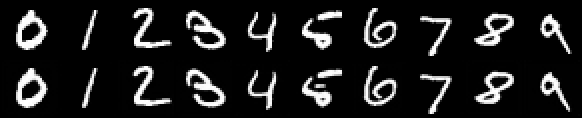
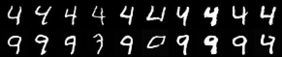

# DDIM Inversion and Editing

## ELI5 (Explain Like I'm 5)

- **The Big Idea:** A diffusion model's normal trick is turning random static into a picture. To edit a real picture you already have, you first need to run that process **backwards** — finding the exact patch of static that would have produced your real picture, had you started from it. Once you have that static, you run forward again but ask for something slightly different this time. Because you start from almost the same static, the layout and pose stay put, and only the thing you asked to change actually changes.
- **Analogy:** Picture a river that always flows downhill from a mountain spring to a lake (static flowing down into a picture). To nudge a boat already sitting in the lake, you can't just shove it — instead you trace the river's current backward, up to the exact spring it came from, then let it flow back down again, but slightly redirect where it empties out. Since it follows almost the same riverbed the whole way, the boat ends up in nearly the same spot on the lake, just gently shifted.
- **Example:** We take real photos of handwritten 4s, run the process backward to find their "static," then run forward again asking for a 9 instead. The resulting 9s keep the original 4's slant, stroke thickness and position — same handwriting, different digit.

## Key Insight

To edit a *real* photo with a [diffusion model](/shared/glossary/#diffusion-model) you first need the noise that would regenerate it — and [DDIM inversion](/shared/glossary/#ddim-inversion) finds it by running the deterministic [DDIM](/shared/glossary/#ddim) sampler *backwards*, adding noise along the same path the model would later remove. Once you hold that starting noise you change the prompt and denoise forward again: because the trajectory is largely shared, the new image keeps the original's layout and pose while swapping the content you re-described. The imperfection you will see — inversion drifts, so the reconstruction is never pixel-perfect — is exactly the gap that follow-up methods like *null-text inversion* were built to close.

## What's in this directory

| File | Role |
|------|------|
| `ddim_invert.py` | The matched pair: `ddim_invert` (walk the deterministic path *up* to noise) and `ddim_denoise` (walk it back *down*) |
| `edit.py` | Reconstruct and edit real MNIST digits; emit the figures |

Our base is the phase-5 [class-conditional DDPM](../28-class-conditional-ddpm/README.md);
the class label stands in for the text prompt.

```bash
# reuse the shared conditional base (also used by projects 51/52/56):
python ../51-dreambooth/train_cond_base.py --out checkpoints/cond_base.pt
python edit.py     # ~1 min
```

## The subtlety that makes or breaks it

Deterministic [DDIM](/shared/glossary/#ddim) (eta = 0) is an ODE, so inversion
is just the same update run the other way. But the plain sampler (the
[DDIM sampler](../27-ddim-sampler/README.md) project) **clamps** the predicted
clean image to `[-1, 1]` each step for stability — and clamping is a non-linear
op that breaks invertibility. Reconstructing a real image needs the *unclamped*
partner, which is exactly why `ddim_denoise` lives here alongside `ddim_invert`
instead of reusing the earlier sampler. With the matched pair, the round-trip
MSE on real digits is ~0.004.

## Results

**Reconstruction — invert, then denoise with the SAME label.** Top row: real
test digits. Bottom row: invert to noise and back. The two rows are nearly
identical; the small residual differences are the "inversion drift" the Key
Insight names — the gap null-text inversion later closes:



**Editing — invert 4s as class 4, denoise as class 9.** Top row: real 4s.
Bottom row: the same noise denoised toward "9". The 9s inherit each 4's slant,
stroke thickness and position — structure is preserved because the trajectory
is shared; only the identity the label describes changes:



A couple of edits wobble (one keeps too much of the 4, one over-rounds) —
honest evidence that inversion is approximate on a small model, and motivation
for the structure-preserving follow-ups (Prompt-to-Prompt, null-text inversion).

## Things to try

- Raise the step count from 100 toward `T` and watch reconstruction tighten —
  inversion accuracy trades directly against speed.
- Edit along a different pair (7→1, 3→8) and see which share enough structure
  for a clean swap.
- Interpolate between the source and target label embeddings to get a smooth
  4→9 morph from a single inverted noise.
