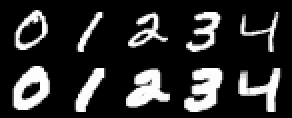
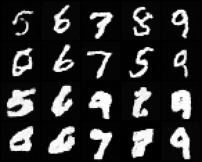

# Style LoRA

## ELI5 (Explain Like I'm 5)

- **The Big Idea:** The same tiny "sticky note" adapter that teaches a model a new *subject* can instead teach it a new *look*. Train it on images that share a style, and it learns the style itself — so you can then ask for things it never saw in that style and it renders them that way.
- **Analogy:** You show an artist thirty pictures all drawn with a thick marker. They do not memorize those thirty pictures; they pick up the *marker technique*. Now ask them to draw something new and it comes out in thick marker too. If instead they just re-drew the thirty pictures, they overfit — they learned the pictures, not the technique.
- **Example:** We train a LoRA on bold-stroke digits **0–4 only**, then ask for digits **5–9**. The 5–9 come out bold too — the adapter learned the *style*, not the specific digits.

## Key Insight

A style [LoRA](/shared/glossary/#lora) shows that the same low-rank [fine-tuning](/shared/glossary/#fine-tuning) trick used for *subjects* works just as well for a *look* — train on ~30 images sharing a coherent style (a painter's brushwork, a film's color grade) and the adapter learns the style without memorizing any single picture. Success is measured by [generalization](/shared/glossary/#generalization): the style must transfer to prompts that never appeared in the 30 images, proving the LoRA captured *how* things are rendered rather than *what* was in the training set. This is the line between a useful style adapter and an [overfit](/shared/glossary/#overfitting) one — the former restyles anything you ask for, the latter just regurgitates its training images.

## What's in this directory

| File | Role |
|------|------|
| `style_lora.py` | `bold_style` (the target look), then inject the [project-50 LoRA](../50-lora-fine-tune/README.md) into the class-conditional base and train it on styled digits 0-4 only |

The method — `LoRAConv2d` and `inject_lora` — is imported directly from the
[LoRA fine-tune](../50-lora-fine-tune/README.md) project; nothing about the
adapter changes when the target is a style instead of a subject. The base is the
shared [class-conditional DDPM](../28-class-conditional-ddpm/README.md).

```bash
# reuse the shared conditional base (also used by projects 51/52/55):
python ../51-dreambooth/train_cond_base.py --out checkpoints/cond_base.pt
python style_lora.py     # ~3 min
```

## The generalization test, by construction

The style (a bold "marker" render — every stroke thickened) is only ever shown
to the LoRA on **digits 0–4**. Digits **5–9** are held out of training entirely.
So if the model draws a bold 5–9 at the end, the adapter cannot be replaying
training images — it must have learned the *rendering*, decoupled from the
content. That is the whole point.

## Results

**The target style, on the training classes** (real digits 0–4, then their
bold-styled targets):



**The test that matters — held-out classes 5–9.** Top two rows: the frozen base
(its normal, thinner hand). Bottom two rows: the same classes with the style
LoRA. The 5–9 come out visibly bolder even though the adapter never saw a styled
5–9 — the style [generalized](/shared/glossary/#generalization) to unseen
content:



**Parameter accounting** (`outputs/params.txt`):

```
trainable style-LoRA params: 39,168 (rank 4)
trained on styled digits (0, 1, 2, 3, 4), tested on (5, 6, 7, 8, 9).
```

Same adapter, same size as the [subject LoRA](../50-lora-fine-tune/README.md) —
only the training target changed from "a bag" to "a way of drawing."

## Things to try

- Shrink the training classes from 0-4 to just 0-1 and see when generalization
  to 5-9 breaks — the data-diversity floor for learning a style vs memorizing it.
- Swap `bold_style` for a different look (invert, emboss, a stripe overlay) and
  confirm the pipeline is style-agnostic.
- Stack this style LoRA with the [subject LoRA](../50-lora-fine-tune/README.md)
  at sampling time (add both residuals) — the "style + subject" composition that
  makes LoRAs so practical to share and mix.
