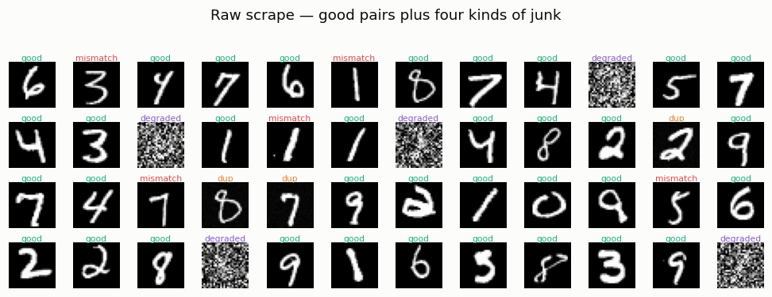
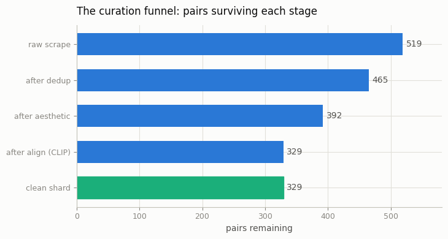
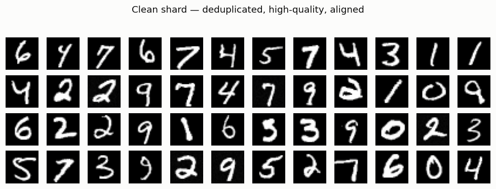

# Mini LAION Pipeline

## ELI5 (Explain Like I'm 5)

- **The Big Idea:** An image-generating AI learns from a giant pile of
  (picture, caption) pairs scraped off the web. But a raw web scrape is mostly
  garbage: the same picture uploaded a hundred times, captions that describe
  the *wrong* thing, blurry junk photos, and lazy captions like "IMG_2043".
  Before you train on it, you have to *clean* it — throw out the junk and
  rewrite the lazy captions. That cleaning pipeline is what this project builds.
- **Analogy:** Imagine you're making flashcards to study from. If your deck has
  the same card ten times (waste), cards where the picture and the answer don't
  match (poison), smudged unreadable cards (noise), and cards whose hint is just
  "thing" (useless), you'll study badly. So first you remove the repeats, toss
  the smudged ones, throw out the mismatched ones, and rewrite the vague hints
  into clear ones. *Then* you study.
- **Example:** We fake a 519-pair "web scrape" of handwritten digits — some
  clean, some duplicated, some mislabeled, some noise-corrupted — and run it
  through four filters. Out the other end comes a clean shard of ~330 pairs
  with every mislabeled and noisy pair gone and every caption rewritten from
  "a photo of the number seven" into "a bold, centered handwritten digit '7'".

## Key Insight

A modern [text-to-image](/shared/glossary/#text-to-image) model is only as good as the data it eats, and raw web scrapes like [LAION](/shared/glossary/#laion) are mostly noise — duplicates, mismatched captions, and junk images. This project walks the real production pipeline on a small shard: download the image URLs, drop near-duplicates with [deduplication](/shared/glossary/#deduplication), keep only images whose caption actually matches the picture using a [CLIP](/shared/glossary/#clip) similarity score, filter for visual appeal with an [aesthetic score](/shared/glossary/#aesthetic-score), and rewrite weak alt-text into rich descriptions using [synthetic captions](/shared/glossary/#synthetic-captions) from a small [VLM](/shared/glossary/#vlm). The lesson is that data engineering — not architecture — is where most of a generator's quality is won or lost.

## What's in this directory

| File | Role |
|------|------|
| `classifier.py` | A tiny MNIST CNN that stands in for the two big pretrained models a real pipeline needs: the CLIP caption-matcher and the VLM recaptioner |
| `pipeline.py` | Builds the toy scrape, runs the four filter stages, writes the funnel/grid figures and the caption rewrites |

```bash
python pipeline.py --data-dir data    # ~15s after the one-off classifier train
```

## The four kinds of junk, and the one stage that catches each

Real scrapes fail in a small number of characteristic ways. We inject each one
on purpose so you can watch the matching stage remove it:

| Junk kind | What it is | Caught by |
|-----------|-----------|-----------|
| **duplicate** | the same image re-uploaded with faint recompression noise | perceptual-hash **dedup** |
| **degraded** | heavy noise / washed-out contrast — visually unusable | **aesthetic** filter |
| **mismatch** | a clean image whose caption names the *wrong* digit | **align** (CLIP) filter |
| **good** | a clean image with a correct (but lazy) caption | kept, then **recaptioned** |



## How each stage works

**Dedup — a perceptual hash.** We shrink each image to 16×16, threshold at its
mean brightness, and read out a 256-bit fingerprint (`average_hash`). Two
re-uploads of the same picture land within a couple of bits of each other; two
genuinely different digits are far apart. Greedily keeping one image per
fingerprint cluster removes the redundant copies. (A coarse 8×8 hash over-merges
different digits of the same class — resolution matters.) Note perceptual
hashing only catches *pixel-level* re-uploads; cropped or shifted copies slip
through and need embedding-based dedup, which is a separate lesson.

**Aesthetic filter — a cheap quality proxy.** A learned aesthetic predictor is
expensive; here we score `contrast − 1.6 · total_variation`, which rewards
clean strokes and punishes the everywhere-high edge energy that is the
signature of noise. We set the cutoff at the 5th percentile of the *good*
images' scores, so almost every clean image passes and the noise-corrupted
ones fail.

**Align filter — the CLIP stand-in.** This is the key stage. A real pipeline
keeps a pair only if a [CLIP](/shared/glossary/#clip) model says the caption
matches the image. We use our classifier as that matcher: the alignment score
is `P(classifier predicts the caption's claimed digit | image)`. A caption that
says "seven" over a picture of a two scores near zero and is dropped — exactly
like a low CLIP similarity.

**Recaption — the VLM stand-in.** The surviving pairs still have lazy alt-text.
We rewrite each one from the classifier's own prediction plus two cheap image
statistics (stroke boldness, centering), turning `a photo of the number seven`
into `a bold, centered handwritten digit '7' in white on a black background`.
This is exactly the [synthetic-caption](/shared/glossary/#synthetic-captions)
trick behind DALL·E 3's prompt adherence, in miniature.

## Results

**The curation funnel.** Each stage shrinks the pool. Half a raw scrape is
routinely thrown away before a single training step:



**Composition before and after** (`outputs/composition.csv`) — every mismatch
and degraded pair is gone, and each duplicate cluster is collapsed to a single
representative:

```
stage,good,dup,mismatch,degraded,total
raw,360,54,60,45,519
clean,309,20,0,0,329
```

(The 20 "dup" survivors are clusters where dedup happened to keep the noised
copy instead of the original — still exactly one image per cluster, which is
all dedup promises.)

**The recaptioning rewrite** (`outputs/captions.md`):

| original alt-text | synthetic caption |
|---|---|
| a photo of the number seven | a bold, centered handwritten digit '7' in white on a black background |
| a photo of the number one | a thin, centered handwritten digit '1' in white on a black background |

**The clean shard** — deduplicated, high-quality, caption-aligned, ready to
train on:



## Things to try

- Loosen the align threshold from `0.5` toward `0.1` and watch mislabeled pairs
  leak back into the shard — the classic precision/recall knob of data
  filtering.
- Swap the 16×16 hash for 8×8 in `average_hash` and watch dedup start deleting
  distinct digits it wrongly thinks are duplicates.
- Feed the clean vs. raw shard into the [Caption ablation](../58-caption-ablation/README.md)
  project to measure how much the recaptioning actually buys you downstream.
