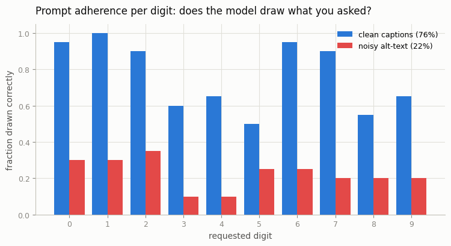
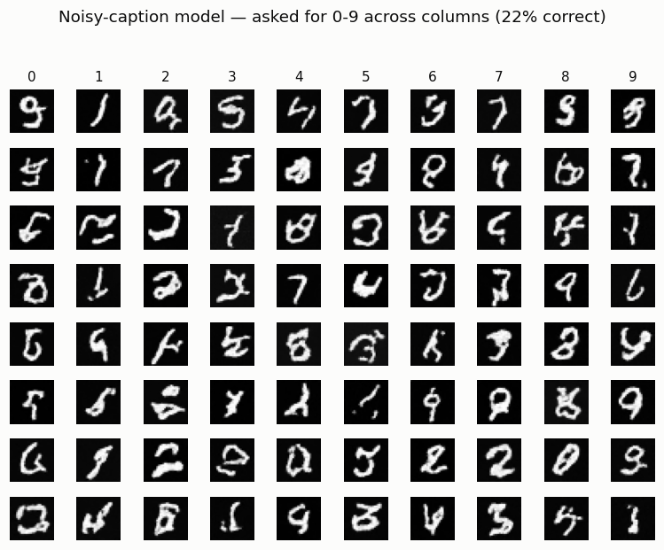

# Caption Ablation

## ELI5 (Explain Like I'm 5)

- **The Big Idea:** You teach a drawing AI by showing it millions of pictures,
  each with a caption. The AI learns "when the caption says X, draw something
  that looks like X." But if the captions are often *wrong* — the word says
  "seven" over a picture of a two — the AI gets confused about what every word
  means, and later it can't draw what you ask for. Clean captions in, obedient
  model out. Garbage captions in, disobedient model out.
- **Analogy:** Imagine learning a foreign language from flashcards where half
  the cards have the wrong translation on the back. You'd end up "knowing" a
  language where you can't reliably say the word you mean. The picture side of
  the card can be perfect, but if the word side lies, the connection you learn
  is broken.
- **Example:** We train two *identical* digit-drawing models. One gets correct
  captions; the other gets captions that are wrong half the time. Then we ask
  each to "draw a 7" a bunch of times and check what it actually drew. The
  clean model obeys ~77% of the time; the confused model, ~22% — barely better
  than drawing at random.

## Key Insight

This is a controlled [ablation](/shared/glossary/#ablation): train two otherwise-identical small [text-to-image](/shared/glossary/#stable-diffusion) models that differ in exactly one thing — one sees the original web alt-text, the other sees [synthetic captions](/shared/glossary/#synthetic-captions) rewritten by a [VLM](/shared/glossary/#vlm) — so any quality gap is caused by the captions alone. The recaptioned model will follow prompts noticeably better, which is the open-source confirmation of the trick behind [DALL·E 3](/shared/glossary/#dalle-3)'s compositional skill. It teaches the most counter-intuitive lesson in the field: improving the *captions* often beats improving the *model*.

## What's in this directory

| File | Role |
|------|------|
| `mnist_classifier.py` | A small CNN 'reader' that scores which digit a generated image actually shows — the automatic adherence judge. Reused by projects 63 and 65 |
| `ablation.py` | Trains the noisy-caption and clean-caption models, samples 0-9 from each, measures adherence, writes the figures |

```bash
python ablation.py --data-dir data      # ~9 min on CPU (two full trainings)
```

## The setup

Both models are the phase-5/9 [class-conditional DDPM](../28-class-conditional-ddpm/README.md)
(labels play the role of captions), trained identically for 1000 steps. The
*only* difference is the label stream:

- **clean-caption model** — every caption is correct (the recaptioned world).
- **noisy-caption model** — 50% of captions are replaced with a random *wrong*
  digit, mimicking the frequently-mismatched alt-text of a raw web scrape.

We then ask each model to draw every digit 0-9 (20 samples each), and the CNN
classifier reads back what was actually drawn. Adherence = fraction of samples
that match the requested digit.

## Results

**Prompt adherence, per digit.** The clean model draws what you ask ~77% of the
time; the noisy model manages ~22% — a model that mostly can't be steered:



```
model,overall_adherence
clean,0.765
noisy,0.225
```

**What the noisy model draws when asked for 0-9** (each column is one requested
digit). The columns are near-random — the caption barely controls the output,
because during training the word for each digit pointed at the wrong picture
half the time:



The clean model, by contrast, mostly fills each column with the requested digit
(`outputs/samples_clean.png`). Same architecture, same compute, same images —
only the captions differed.

## Why this is the whole ballgame

Nothing about the *images* changed between the two runs; the noisy model saw
exactly the same pixels. All that changed was the reliability of the text, and
that alone moved adherence from usable to useless. This is why teams spend
enormous effort on caption quality — deduplicating, filtering mismatches, and
above all *recaptioning* with a VLM — before they ever touch the model. The
[Mini LAION pipeline](../57-mini-laion-pipeline/README.md) project builds
exactly the cleaning-and-recaptioning stage that produces the "clean" column
here.

## Things to try

- Sweep `--noise` from `0.0` to `0.9` and plot adherence vs caption-noise —
  the curve is the quantitative version of "captions are the ballgame".
- Raise `--steps`; the clean model's adherence climbs toward 100%, while the
  noisy model's plateaus low no matter how long you train.
- Swap the mismatch scheme for *dropped* captions (map to a null token) instead
  of *wrong* ones, and see which failure mode hurts adherence more.
