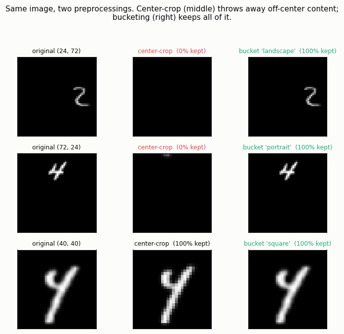
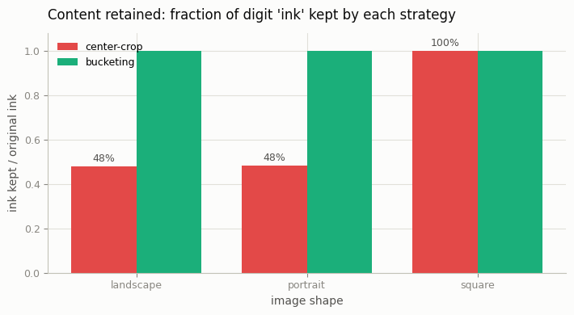

# Aspect-Ratio Bucketing

## ELI5 (Explain Like I'm 5)

- **The Big Idea:** Photos come in different shapes — tall, wide, square. The
  lazy way to feed them to an AI is to chop every photo down to a square so they
  all match. But chopping a wide photo to a square throws away the left and
  right edges, where half the picture might be. Instead, we sort photos into a
  few shape groups ("buckets") and shrink each one to fit its own shape without
  cutting anything off.
- **Analogy:** You're mailing photos and only have square envelopes. You *could*
  trim every photo into a square — but then Grandma standing on the left edge of
  the family photo gets cut off. The smarter fix is to keep a few envelope
  shapes (tall, wide, square) and put each photo in the envelope that fits it.
  Nothing gets trimmed.
- **Example:** We put handwritten digits on tall, wide, and square canvases in
  random positions. Square-cropping a wide canvas keeps only the middle strip —
  and when the digit sits off to the side, it's cut off *entirely* (0% left!).
  Bucketing keeps 100% of every digit, every time.

## Key Insight

Most training pipelines center-crop every image to a square, which throws away the edges of tall portraits and wide landscapes — so the model never learns to compose anything but squares. [Aspect-ratio bucketing](/shared/glossary/#aspect-ratio-bucketing) fixes this by sorting images into groups by shape and building each [batch](/shared/glossary/#batch) from a single group, since a batch must share one tensor [shape](/shared/glossary/#shape). After training this way the model generates correctly-framed portraits and landscapes on demand, and you can visibly see composition improve on non-square test prompts.

## What's in this directory

| File | Role |
|------|------|
| `bucketing.py` | Builds a variable-aspect dataset, implements both the center-crop and the bucketing preprocessors and the shape-homogeneous batch sampler, and measures content retention |

```bash
python bucketing.py --data-dir data      # ~10s on CPU
```

## The mechanics

**The problem batching creates.** Every image in a mini-batch must stack into
one tensor, so they must share a shape. Center-cropping to a fixed square is the
lazy way to guarantee that. Bucketing is the content-preserving way: pick a
small menu of shapes (here `24×72` landscape, `72×24` portrait, `40×40`
square), assign each image to its nearest-aspect bucket, resize the *whole*
image to that bucket, and draw each batch from a single bucket so the tensors
still stack.

```
bucket sizes: {'landscape': 200, 'portrait': 200, 'square': 200}
21 shape-homogeneous batches (vs. crop: all 600 images forced to one 28x28 shape)
```

## Results

**What center-crop discards.** Left: the original off-center digit on a
non-square canvas. Middle: the center square crop — for the wide and tall
canvases the digit is gone entirely. Right: bucketing, which keeps everything:



**Content retained, by shape.** Center-crop keeps only ~48% of a 3:1
landscape/portrait digit on average (and 0% when it sits at the far edge);
bucketing keeps 100% by construction. Square images are unaffected — they were
never cropped:



```
shape,crop_ink_kept,bucket_ink_kept
landscape,0.48,1.000
portrait,0.48,1.000
square,1.000,1.000
```

The retention number is measured at native resolution, *before* any resize, so
it reflects content lost to cropping alone — not the unavoidable detail loss of
downscaling. Cropping throws pixels away permanently; bucketing keeps them.

## Things to try

- Add more buckets (a 2:1 and a 1:2 tier) and watch each image route to a closer
  shape, shrinking the resize distortion further.
- Make the digit placement always edge-biased and rerun — center-crop retention
  collapses toward zero, the worst case bucketing was built to avoid.
- Feed the two preprocessings into any of the Phase-5 generators and compare how
  well each reproduces off-center composition.
