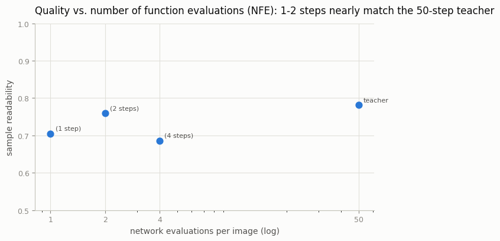
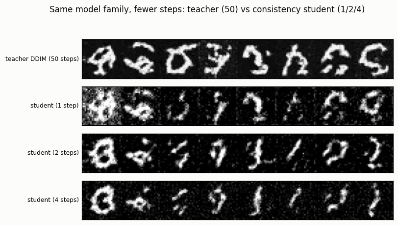

# Consistency Distillation

## ELI5 (Explain Like I'm 5)

- **The Big Idea:** A diffusion model makes a picture by taking ~50 tiny cleanup
  steps, noise → image, one small denoise at a time. That's slow. A *consistency*
  model learns a shortcut: from *any* noisy point it jumps straight to the final
  clean image in one leap. Train that shortcut once (by watching the slow model),
  and afterwards you get a picture in 1–4 steps instead of 50.
- **Analogy:** The slow model walks down a staircase one step at a time. The
  consistency student learns to *teleport* to the bottom from wherever it's
  standing. You pay for the teleporter once (training); every trip afterward is
  nearly instant.
- **Example:** We train a 50-step teacher on digits, then distill a student that
  produces a comparable-quality digit in a *single* network evaluation — its
  1-2 step outputs score almost as "readable" as the teacher's 50-step ones,
  at 25–50× less compute per image.

## Key Insight

A 50-step [Stable Diffusion](/shared/glossary/#stable-diffusion) model is accurate but slow; [consistency distillation](/shared/glossary/#distillation) trains a [consistency model](/shared/glossary/#consistency-model) student that reaches a comparable image in just 4 steps by learning to jump straight to the denoising trajectory's endpoint instead of crawling along it. The practical, latent-space version is the [LCM](/shared/glossary/#lcm), which is what makes near-interactive image generation possible. The headline lesson is that [distillation](/shared/glossary/#distillation) moves cost from inference to training — you pay once to train the student so every future image is ~10× cheaper, accepting a modest quality dip in return.

## What's in this directory

| File | Role |
|------|------|
| `consistency.py` | Trains the DDPM teacher, consistency-distills a student with a boundary-preserving EDM parameterization, and compares 1/2/4-step students to the 50-step teacher |

```bash
python consistency.py --data-dir data      # ~9 min on CPU
```

## How the distillation works

The student is a function `f(x_t, t)` trained to map any point on a denoising
trajectory to its endpoint `x_0`. The training signal per step:

1. Noise a real image to a high level `t_hi`.
2. Take **one** deterministic DDIM step down to `t_lo` using the frozen teacher.
3. Train the student so its `x_0` estimate at `t_hi` matches its estimate at
   `t_lo` — where the `t_lo` estimate comes from an **EMA "target" copy** of the
   student (the same self-teacher trick as consistency models and BYOL).

The parameterization is the EDM skip/out form (`f = c_skip·x + c_out·F_θ`),
which guarantees the boundary condition `f(x, t→0) = x`. That boundary is what
anchors the whole scheme: near zero noise the student must return the input
unchanged, and consistency propagates that truth up the trajectory. The student
is initialized from the teacher's weights, which makes it converge in a few
hundred steps.

Sampling is then 1 step (predict `x_0` from pure noise) or a few steps
(predict, re-noise to a *lower* level, predict again).

## Results

**Quality vs. compute.** The 1- and 2-step students land right next to the
50-step teacher on sample readability — at 25–50× fewer network evaluations
(NFE). That gap *is* the deal distillation offers: a one-time training cost for
permanently cheaper sampling:



```
sampler,nfe,readability
teacher DDIM (50 steps),50,0.781
student (1 step),1,0.705
student (2 steps),2,0.759
student (4 steps),4,0.686
```

**The samples, side by side.** Teacher (50 steps) on top, then the student at
1/2/4 steps. The student's few-step digits are of comparable fidelity to the
teacher's — the whole point of the method. (Everything here is low-fidelity by
frontier standards: a ~370k-param U-Net with `T=200` on CPU. What matters is
that the student *matches its own teacher* at a fraction of the steps, not the
absolute quality.)



Two honest wrinkles this toy setting exposes: the 2-step student slightly edges
the 1-step (a second pass cleans up what one leap misses), and pushing to 4
steps doesn't help further here — naive multistep re-noising has diminishing,
sometimes negative, returns once the student is already close. Production LCM
schedulers manage this carefully.

## Why this is the axis that matters now

Architecture is largely settled; the live competition is *latency*. Consistency
distillation (and its latent-space cousin, [LCM](/shared/glossary/#lcm)) is what
turned 10-second image generation into sub-second, interactive generation. The
[Adversarial Diffusion Distillation](../61-adversarial-diffusion-distillation/README.md)
project is the other main recipe — it adds a discriminator to sharpen the
extreme single-step case that a pure regression loss leaves soft.

## Things to try

- Raise `--distill-steps`; the 1-step student climbs toward the 2-step and
  teacher scores as the consistency constraint is better satisfied.
- Lower the EMA `target` decay (currently 0.95) and watch training destabilize —
  the target network's slow updates are what keep distillation from chasing its
  own tail.
- Distill from a cosine-schedule teacher instead of linear and compare the
  few-step gap.
