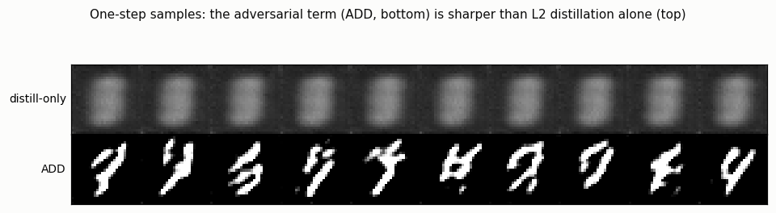
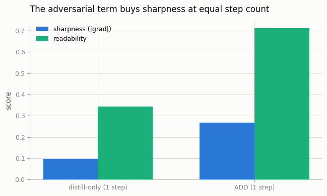

# Adversarial Diffusion Distillation

## ELI5 (Explain Like I'm 5)

- **The Big Idea:** We want an image model that draws a picture in *one* step
  instead of fifty. The obvious way — train the fast model to copy the slow
  model's answer — makes everything blurry, because "the average of all the
  pictures it might have drawn" is a gray smudge. ADD adds a second teacher: a
  *critic* that has seen real pictures and rejects anything blurry. Now the fast
  model has to draw something that both matches the slow model *and* looks real,
  so it stays sharp.
- **Analogy:** Imagine tracing a photo with your eyes closed, guided only by a
  friend saying "warmer / colder." You'll get the rough shape but a mushy
  drawing. Now add a second friend — an art critic — who says "that looks fake,
  sharpen it." Between the two, you produce something crisp instead of a blur.
  The critic is the GAN discriminator.
- **Example:** We distill two one-step digit generators from the same teacher.
  The plain one (copy-the-teacher only) produces gray blobs you can't read. The
  ADD one (copy + critic) produces sharp, recognizable digits — from a *single*
  network evaluation.

## Key Insight

Pure few-step distillation tends to produce blurry images, because regressing toward an average washes out fine detail. [Adversarial Diffusion Distillation (ADD)](/shared/glossary/#add-adversarial-diffusion-distillation) — the recipe behind [SDXL Turbo](/shared/glossary/#sdxl-turbo) — fixes this by adding a [GAN](/shared/glossary/#gans)-style [discriminator](/shared/glossary/#discriminator) that rejects any quick output which doesn't look real, forcing the 1–4-step student to stay sharp. Comparing it head-to-head with an [LCM](/shared/glossary/#lcm) shows the trade-off plainly: ADD's adversarial training is fiddlier to run but yields crisper few-step samples.

## What's in this directory

| File | Role |
|------|------|
| `add.py` | Trains a DDPM teacher, then distills two 1-step students — distill-only and ADD — that differ *only* in the loss, and compares their sharpness |

```bash
python add.py --data-dir data      # ~9 min on CPU
```

## The controlled comparison

Both students are the same network, distilled from the same teacher, sampling in
a single step. The *only* difference is the loss:

- **distill-only** — the student's one-step output is pulled toward the
  teacher's denoised estimate with an L2 term (a mini score-distillation). This
  is the [LCM](/shared/glossary/#lcm)-style objective in miniature.
- **ADD** — the same L2 distillation term **plus** a hinge-GAN discriminator
  that has seen real digits and penalizes the student for producing anything
  off the real-image manifold.

Isolating the adversarial term this way is the whole experiment: any difference
in sharpness is caused by the discriminator alone.

## Results

**The adversarial term rescues one-step generation.** Top row: distill-only
collapses to blurry gray blobs — the L2 loss averaged over every digit the
teacher might have produced. Bottom row: ADD, with the exact same distillation
term plus a discriminator, produces sharp, legible digits:



**Quantified.** Sharpness (mean gradient magnitude) and readability (a
classifier's confidence that the digit is legible) both jump with the
adversarial term:



```
student,sharpness,readability
distill-only (1 step),0.097,0.342
ADD (1 step),0.268,0.712
```

ADD is ~2.8× sharper and roughly doubles how often the output is a readable
digit — at *identical* step count and network size. The discriminator adds
nothing at inference time; it only shapes training.

## Why blur is the enemy, and adversary is the cure

A one-step model must map a whole cloud of noise to a single output. Minimizing
L2 to a target makes the safest bet — the *mean* of all plausible outputs — and
the mean of many sharp digits is a blur. A discriminator changes the incentive:
a blurry mean is trivially detectable as fake, so the student is forced to
commit to one sharp, real-looking digit. This is exactly the lesson the GAN era
taught (Phase 4), now recycled to make diffusion *fast*. The consistency /
[LCM](../60-consistency-distillation/README.md) route is the non-adversarial
alternative — simpler and more stable to train, but softer at the extreme of a
single step. Production 1-step models (SDXL Turbo) use ADD for precisely the
sharpness shown here.

## Things to try

- Set the adversarial weight to 0 and confirm ADD collapses back to the blurry
  distill-only result — the discriminator is doing all the sharpening.
- Push both students to 2 and 4 steps and watch the gap narrow: the adversarial
  term matters most at the hardest (single-step) setting.
- Swap the pixel discriminator for a feature-space one (à la real ADD, which
  discriminates in a frozen encoder's features) and see if training stabilizes.
