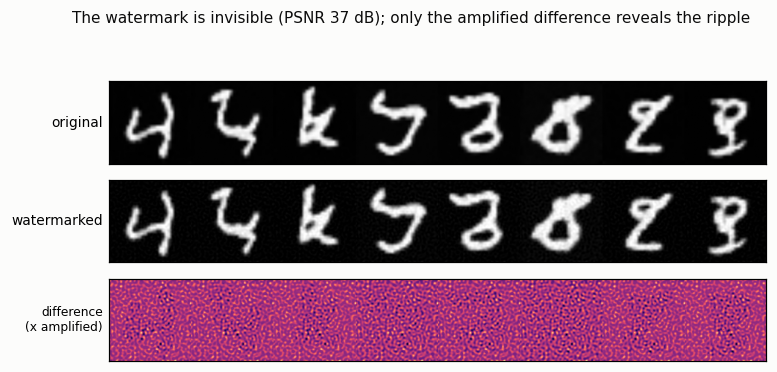
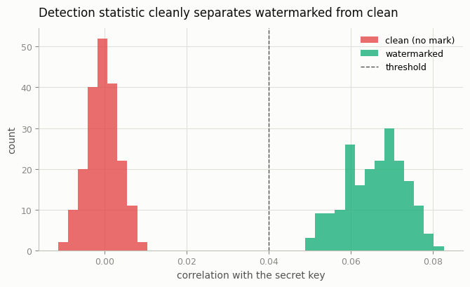
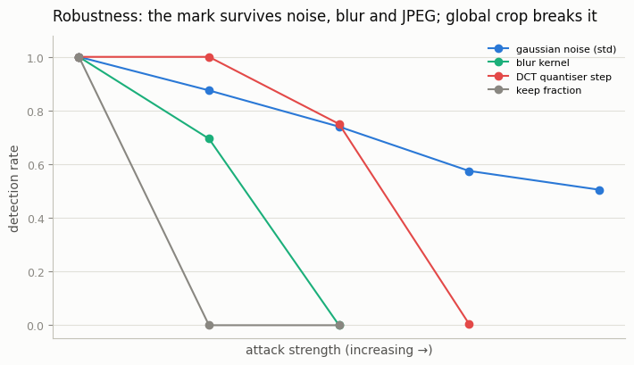

# Watermarking

## ELI5 (Explain Like I'm 5)

- **The Big Idea:** When an AI makes a picture, we want to secretly stamp it so
  that later anyone with the secret key can prove "a machine made this" — but the
  stamp has to be *invisible*, so it can't change how the picture looks. We hide
  the stamp in the parts of the image your eye barely notices (fine, high-detail
  ripples), then check for it with a matching key.
- **Analogy:** It's like the invisible-ink mark on paper money. You can't see it
  in normal light, and it doesn't change how the bill looks or spends — but shine
  the right light (the secret key) and the mark glows. And just like a bill that's
  been through the wash, the mark has to survive some rough handling (blurring,
  compression) to be useful.
- **Example:** We generate handwritten digits, hide a secret pattern in their
  high-frequency detail, and build a detector. Watermarked and original images
  look *identical* (37 dB — imperceptible), yet the detector flags 100% of
  watermarked images and 0% of clean ones. Then we attack the images and watch
  the mark survive noise and JPEG but die under a heavy crop.

## Key Insight

As AI images flood the internet, being able to prove an image was machine-generated becomes a safety requirement, and [watermarking](/shared/glossary/#watermarking) embeds an invisible, detectable signal that says "made by AI" without changing how the picture looks. In this project you add such a mark to your generator's outputs — either stamped into the pixels afterward or baked into the sampling process like [SynthID](/shared/glossary/#synthid) — then build a detector and confirm it flags your images while leaving real photos alone. The core tension you will feel is robustness vs invisibility: a mark strong enough to survive cropping and JPEG compression is harder to keep imperceptible.

## What's in this directory

| File | Role |
|------|------|
| `watermark.py` | Generates images with the phase-5 DDPM, embeds a DCT spread-spectrum mark, runs the detector, and sweeps four attacks |

```bash
python watermark.py --data-dir data      # ~4 min (mostly the one-off generator train)
```

## How the watermark works

This is a **spread-spectrum watermark in the frequency domain** (the Cox et al.
recipe every production scheme descends from):

1. **A secret key** — a fixed pseudo-random pattern of `+1/-1` signs over a band
   of *mid-frequency* DCT coefficients. Mid-frequency is the sweet spot: too low
   and the mark is visible, too high and blur/JPEG erase it.
2. **Embed** — take the image's 2-D DCT, add `alpha × sign` to the band, invert
   the DCT. The energy is spread thinly across ~1,800 coefficients, so no single
   pixel changes much.
3. **Detect** — take the (possibly attacked) image's DCT and correlate the band
   with the secret signs. A watermarked image scores `≈ alpha`; a clean image's
   coefficients are uncorrelated with the key and score `≈ 0`.

One practical note the code makes concrete: the generated digit is upscaled to
112×112 before marking. A 28×28 thumbnail simply doesn't have enough
low-energy high-frequency coefficients to hide an invisible mark in — the host
image's own spectrum drowns it. Real images are large and smooth, which is
exactly what makes invisible watermarking possible.

## Results

**Invisible, and cleanly detectable.** Watermarked and original are
indistinguishable at 37 dB PSNR; only the ×-amplified difference shows the
hidden ripple:



The detector's statistic puts the two populations in different zip codes —
**TPR 100%, FPR 0%**:



```
psnr_db,37.4
TPR,1.000
FPR,0.000
stat_watermarked,0.066
stat_clean,-0.000
```

**Robustness vs. the attack.** The mark degrades gracefully under additive
noise and JPEG-style quantization, weakens under blur (which attacks exactly the
high frequencies it lives in), and **breaks under a crop** — because cropping
and resizing desynchronize the global DCT, shifting every coefficient. That crop
fragility is the textbook weakness of non-synchronized transform-domain
watermarks; production systems add a synchronization template or spatial
redundancy (or, like SynthID, bake the mark into sampling) to survive it:



```
noise (std) 0.1->88%  0.2->74%  0.3->57%
blur kernel  3->70%   5->0%
jpeg quant   0.1->100% 0.2->75% 0.4->0%
crop keep    0.9->0%
```

## Robustness vs. invisibility, made concrete

Raise `--alpha` and rerun: detection under noise and blur improves, but PSNR
drops and the ripple starts to show. That single knob *is* the central tension
the Key Insight describes — there is no free lunch between a mark you can't see
and a mark you can't remove.

## Things to try

- Sweep `--alpha` (e.g. 0.04, 0.08, 0.16) and plot PSNR vs. blur-robustness —
  the invisibility/robustness frontier as an explicit curve.
- Add a synchronization step (detect the crop by searching over scales) and
  watch crop-robustness recover — the fix real systems use.
- Contrast with an *in-sampling* watermark (bias the initial noise) for a
  SynthID-style scheme that survives geometric edits by construction.
