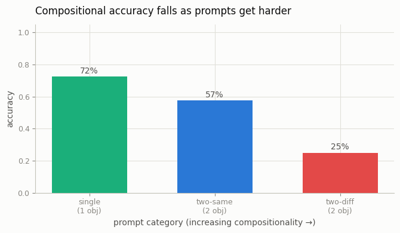
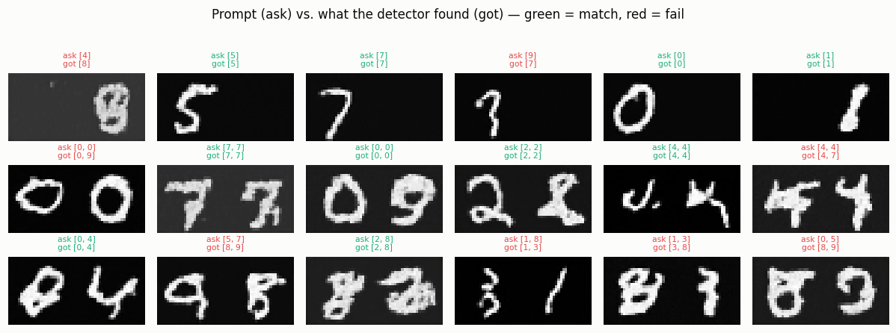

# GenEval Run

## ELI5 (Explain Like I'm 5)

- **The Big Idea:** A pretty picture isn't the same as a *correct* picture. If
  you ask for "two red apples and a green pear" and the model paints three
  apples, it made a lovely wrong picture. GenEval ignores prettiness and checks
  the boring stuff: the right *things*, in the right *number*, in the right
  *places*. And it turns out models get much worse at this as you ask for more
  things at once.
- **Analogy:** It's a spelling test, not an art class. "Draw one 5" is an easy
  word; "draw a 5 and a 7" is a longer word; "draw two 3s" needs you to count.
  A student who nails single letters still flubs longer words — and we grade by
  checking each letter, not by how nice the handwriting looks.
- **Example:** We train a tiny model that paints one or two digits on a wide
  canvas, then quiz it. A robot grader (a digit classifier) checks each answer.
  Single digit: 72% right. Two of the same digit: 57%. Two *different* digits:
  25%. The harder the request, the more it falls apart — the exact shape of the
  real GenEval curve.

## Key Insight

Pretty pictures aren't the same as *correct* pictures, and [GenEval](/shared/glossary/#geneval) measures the difference by checking, with an object detector, whether a generated image actually contains the right number, color, and arrangement of objects the prompt asked for. Running an open [text-to-image](/shared/glossary/#stable-diffusion) model through this [benchmark](/shared/glossary/#benchmark) surfaces its real weaknesses — miscounting, swapped attributes, ignored spatial relations — that beauty metrics like [FID](/shared/glossary/#fid) never reveal. The takeaway is that compositional adherence is a separate axis from raw image quality, and you must measure it on purpose.

## What's in this directory

| File | Role |
|------|------|
| `compose_model.py` | The `TwoSlotUNet` — a 28×56 generator conditioned on an *unordered* pair of digit tokens, so the model must place and count on its own |
| `geneval.py` | Trains the generator, runs the categorized prompt suite, applies the detector, scores each category, writes figures |

```bash
python geneval.py --data-dir data      # ~8 min on CPU
```

## The benchmark

The generator paints up to two digits into the two halves of a wide canvas. It
is conditioned on an *order-agnostic* sum of two class embeddings (`{a,b}` looks
the same as `{b,a}`), so — like a real text-to-image model given "a cat and a
dog" — it has to decide placement and count for itself. That freedom is exactly
what makes composition fail. The "object detector" is project 58's MNIST
classifier applied to each half, with a low-ink half counted as empty.

Three prompt categories of rising difficulty:

| Category | Prompt | Success |
|----------|--------|---------|
| **single** | `{c}` | exactly one object, class `c` |
| **two-same** (counting) | `{c, c}` | two objects, both `c` |
| **two-diff** (binding) | `{a, b}` | both classes present |

## Results

**Accuracy falls as prompts get more compositional** — the signature GenEval
gradient. Getting one thing right is easy; getting two *different* things right
is nearly three times harder here:



```
category,accuracy,n
single,0.725,40
two-same,0.575,40
two-diff,0.250,40
```

**What success and failure look like** (green = detector matched the prompt,
red = mismatch). The failures are the *real* GenEval failure modes in miniature
— a missing object, a merged blob where two should be, or the wrong digit
substituted in one slot:



Typical failures logged by the run:

```
two-same: asked [0, 0], got [0, 9]     # counting slipped: drew a different second digit
two-diff: asked [5, 7], got [8, 9]     # both objects wrong — binding collapse
single:   asked [4],    got [8]        # even single-object generation isn't perfect
```

## Why the gradient is the whole point

A single global "quality" number would hide all of this. By *categorizing* the
prompts and checking structure with a detector, GenEval exposes precisely where
a model breaks — counting and multi-object binding — which is where commercial
models still differentiate. The lesson mirrors the [human-correlated eval](../64-human-correlated-eval/README.md)
project's: the metric you choose decides what you can even see.

## Things to try

- Raise `--steps`; single-object accuracy climbs toward 100% but the two-object
  gap stays wide — composition is a harder problem than fidelity, not just an
  undertrained one.
- Add a "position" category (require a specific left/right order) by switching
  the model to *ordered* slot embeddings, and watch a new failure mode appear.
- Swap the detector's ink threshold and watch counting accuracy move — a
  reminder that the *grader* is itself a modeling choice.
