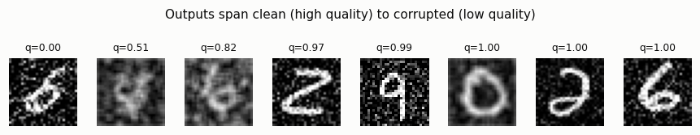
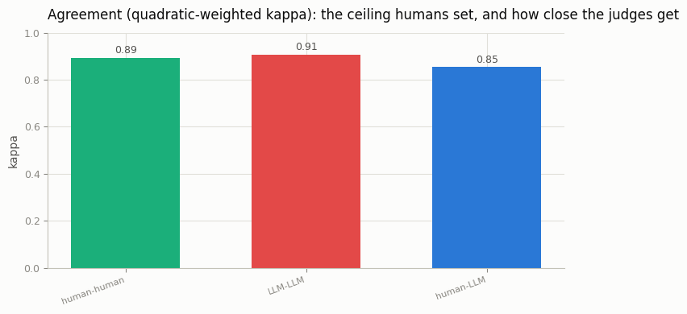
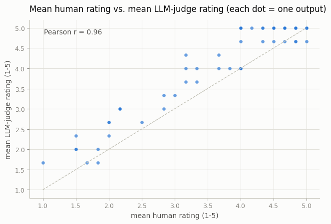

# Human-Correlated Eval

## ELI5 (Explain Like I'm 5)

- **The Big Idea:** To know if an image AI is any good, the real test is: do
  *people* like its pictures? But asking people is slow and expensive, so we'd
  love a robot judge (another AI, or a math score) to do it for us. A robot
  judge is only useful if it agrees with people — so before trusting it, you
  have to *measure* how well it agrees. This project is the measuring.
- **Analogy:** A cheap home thermometer is only worth using if it reads close to
  a real medical thermometer. You'd check it against the real one first. Here
  the "real thermometer" is a panel of humans, and we're checking how closely
  the robot judges read against them — and catching that one judge always reads
  a couple of degrees high.
- **Example:** We make 120 pictures of varying quality, then have a panel of
  simulated humans and simulated robot judges score them all 1-5. We find the
  humans agree with each other well (that's the ceiling), the LLM judge agrees
  *decently* but is systematically too generous, and the simple automatic score
  agrees *worst* of all — exactly the pecking order the field keeps rediscovering.

## Key Insight

Automatic graders are cheap but only trustworthy if they agree with people, so this project pits an [LLM-as-judge](/shared/glossary/#llm-as-judge) against real human ratings on the same 100 outputs and measures how often they agree. Collecting 3 human and 3 model ratings per image (rather than one of each) averages out individual noise, giving a more stable estimate of the true agreement. The lesson is methodological: never trust an automatic metric until you have shown it correlates with human judgment — the metric is only a *proxy*, and a proxy that disagrees with people is worthless.

## An honest caveat

There are no real humans or GPT-4V on a CPU, so **the raters here are
simulated** — each is a noisy, optionally-biased observer of a hidden "true
quality" (how confidently a strong classifier reads the intended digit in a
deliberately-corrupted image). What is *not* faked is the analysis: the kappa
and correlation code is exactly what you would run on a real rating study. Treat
this as a working harness you could point at real ratings tomorrow.

## What's in this directory

| File | Role |
|------|------|
| `eval_agreement.py` | Builds graded outputs, simulates a human panel + LLM judges + an automatic score, and computes the agreement statistics and figures |

```bash
python eval_agreement.py --data-dir data      # ~30s on CPU
```

## The two questions every eval must answer

**1. Do raters within a group agree?** If your humans can't agree with each
other, no external judge can be expected to match them — inter-rater agreement
sets the *ceiling*. We measure it with **quadratic-weighted Cohen's kappa**, the
standard coefficient for ordinal 1-5 ratings (1 = perfect, 0 = chance).

**2. Does the cheap judge track the humans?** We correlate each judge against
the human consensus with **Spearman rank correlation**, and compare it to the
split-half human ceiling — the best score any external judge could hope for.

## Results

**The graded outputs** span clean (high quality) to heavily corrupted, so there
is a real signal for raters to track:



**Agreement within and across groups** (quadratic-weighted kappa). The LLM
judges are *more self-consistent* than humans (lower simulated noise), but agree
with humans slightly less well than humans agree with each other — the hallmark
of a judge that is precise but biased:



```
pair,quadratic_weighted_kappa
human-human,0.892
LLM-LLM,0.907
human-LLM,0.853
```

**Correlation with the human consensus** (Spearman). The pecking order is the
whole lesson — the human ceiling is highest, the LLM judge is a decent proxy,
and the simple AutoScore trails both:

```
human-human (ceiling),0.754
LLM-judge,0.586
AutoScore,0.472
```

**Correlation is not agreement.** The mean LLM rating correlates strongly with
the mean human rating (Pearson ≈ 0.96) yet sits *systematically above* the
diagonal — the judge ranks images correctly but marks everything too high. A
metric can track human *ordering* while being badly *miscalibrated*, which is
why you report both a correlation and a bias:



## Things to try

- Push the LLM leniency `bias` up and watch the scatter lift off the diagonal
  while the correlation barely moves — a vivid "correlation ≠ agreement" demo.
- Add a fourth "adversarial" judge that only looks at brightness; its
  correlation collapses, showing what a *bad* proxy looks like.
- Replace the simulated ratings with a CSV of real human + LLM scores — the
  statistics functions take any two arrays and need no other changes.
