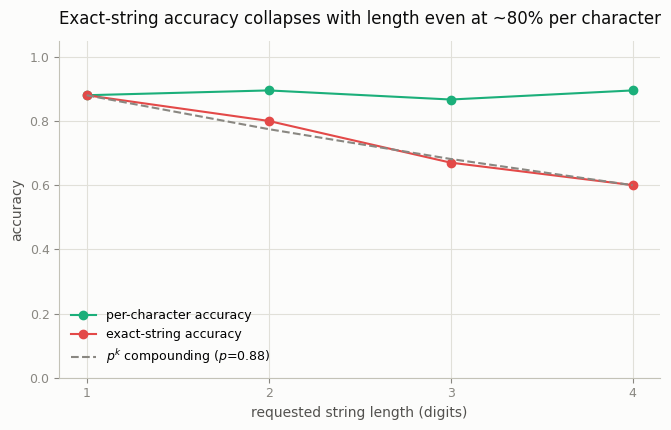
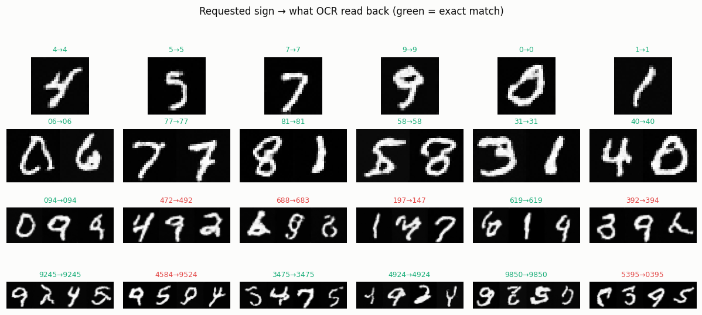

# Text-Rendering Probe

## ELI5 (Explain Like I'm 5)

- **The Big Idea:** AI image models are famously bad at drawing readable words —
  a sign that should say "OPEN" comes out "OPNE" or worse. Part of the reason is
  just *math*: if the model draws each letter right 9 times out of 10, then a
  4-letter word needs four lucky letters in a row, and the chance of getting the
  *whole* word right shrinks fast. This project measures that shrinking.
- **Analogy:** It's like flipping a coin that lands heads 90% of the time. One
  flip? Usually heads. But four heads *in a row*? Only about 66% of the time.
  Every extra letter is another flip you have to win, so long words are much
  more likely to have at least one wrong letter.
- **Example:** We build a model that draws single digits well (~88% correct),
  then ask it to draw digit "strings" of length 1 to 4 and read them back. One
  digit: 88% perfect. Four digits: only 60% perfect — even though each
  individual digit is still ~88%. The word gets harder purely because it's
  longer.

## Key Insight

[Text rendering](/shared/glossary/#text-rendering) — drawing legible, correctly-spelled words inside an image — was for years generation's most embarrassing failure, because a model that only matches overall image statistics learns the *shape* of letters but not that their exact order matters. This project builds a targeted probe: 200 prompts of the form "a sign that says '…'", run through open models, scoring how often the text comes out spelled right. Isolating one specific capability lets you rank models on it directly, and reveals how much newer models like [Flux](/shared/glossary/#flux) have closed a gap that older [Stable Diffusion](/shared/glossary/#stable-diffusion) models could not.

## What's in this directory

| File | Role |
|------|------|
| `probe.py` | Trains a single-digit renderer, generates digit-string "signs" of length 1-4, OCRs them with project 58's classifier, and plots accuracy vs. length |

```bash
python probe.py --data-dir data      # ~7 min on CPU
```

## What we measure, and the honest simplification

We isolate **one** of the two forces that make text rendering hard: the
*multiplicative compounding of per-character errors*. Each character is drawn by
an independent single-digit class-conditional DDPM (per-character accuracy
~88%), and `k` of them are laid side by side into a "sign". A string counts as
correct only if the OCR reads back *every* character correctly.

This deliberately sets aside the *other* force — the joint-rendering failures
(cramped spacing, letters bleeding together, wrong letter order) that real
models add on top. In other words, the curve below is the *best case*: even a
model whose characters are independent and 88%-reliable hits a wall on long
strings. Real models sit below this line.

## Results

**The multiplicative wall.** Per-character accuracy stays flat (~88%), but
exact-string accuracy falls with length and tracks the `p^k` prediction almost
exactly — the signature of independent errors compounding:



```
length,exact_accuracy,per_char_accuracy
1,0.88,0.88
2,0.80,0.90
3,0.67,0.87
4,0.60,0.90
```

At `p = 0.88`, the compounding prediction is `0.88, 0.77, 0.68, 0.60` for
lengths 1-4 — within a couple of points of the measured curve. Nothing about the
model got worse for longer strings; there were simply more independent chances
to slip.

**What that looks like.** Requested sign → what OCR read back (green = every
character correct). The failures are single-character slips inside otherwise-fine
strings — exactly what dooms long text:



## Why this is the right way to probe a capability

A single aggregate quality score would never surface this. By constructing
prompts that isolate *one* capability (spelling a string of a known length) and
grading with an automatic reader, the probe turns a vague complaint ("models are
bad at text") into a quantitative law you can track across models — the same
philosophy as the [GenEval](../63-geneval-run/README.md) harness for
composition. Real progress on text rendering (Imagen 3, Flux, Ideogram) came
from attacking exactly this measured gap with character-aware conditioning and
targeted data.

## Things to try

- Raise `--steps` to push per-character accuracy toward 95% and watch the whole
  curve lift — but the *4-digit* number still lags the 1-digit number by the
  same compounding factor.
- Extend `MAXLEN` past 4 to watch exact-string accuracy head toward zero — the
  reason long paragraphs of rendered text were hopeless for years.
- Replace independent rendering with a joint multi-slot model (see the
  [GenEval](../63-geneval-run/README.md) two-slot generator) to add the
  *second* failure force and watch the curve drop below `p^k`.
