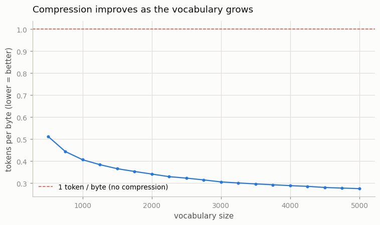
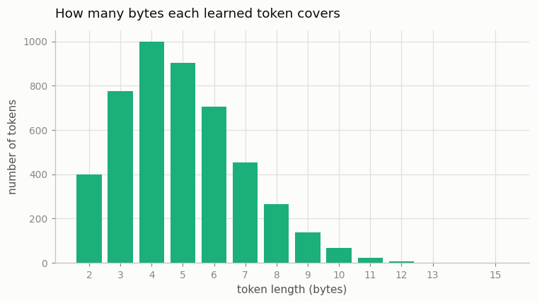

# Train a BPE from Scratch

---

> A tokenizer is just a list of "merge these two symbols" rules, learned from data.

---

## ELI5 (Explain Like I'm 5)

- **The Big Idea:** A model can't read letters — it reads numbers. A tokenizer is
  the phone book that turns text into numbers. BPE builds that phone book by a
  dead-simple rule: look at all the text, find the two neighbors that sit next to
  each other most often, glue them into a new symbol, and repeat a few thousand
  times. Do it on English and it "discovers" `th`, then `the`, then ` the` — the
  common chunks of the language, no dictionary required.
- **Analogy:** It's like inventing shorthand. You notice you keep writing "the",
  so you invent one squiggle for it. Then you notice " and" is common, so that
  gets a squiggle too. After a few thousand squiggles, whole words fit in one
  mark and your writing is 4× shorter — but you can still spell out any rare word
  letter by letter, so you're never stuck.
- **Example:** We feed 1 MB of Shakespeare to our from-scratch BPE and ask for a
  5,000-symbol shorthand. It learns ` the`, `he`, `in`… and compresses the text
  to **3.65 bytes per token** — and because it can always fall back to raw bytes,
  it reconstructs the original text *exactly*.

## Key Insight

[Byte-Pair Encoding (BPE)](/shared/glossary/#bpe) builds a [vocabulary](/shared/glossary/#vocabulary) by starting from raw bytes and repeatedly merging the most frequent adjacent pair into a new symbol. The ordered list of merges it learns *is* the [tokenizer](/shared/glossary/#tokenizer).

## Why This Matters

Almost every modern LLM — GPT, Llama, Mistral — tokenizes text with a BPE variant. Building one by hand, then saving and reloading it, makes concrete how raw text turns into the integer IDs a model actually reads.

## What's in this directory

| File | Role |
|------|------|
| `bpe.py` | An efficient, from-scratch byte-level BPE: trainer, encoder/decoder, JSON serialization, and the figures |
| `plot_style.py` | Shared chart styling (reused by projects 02 and 03) |

```bash
python bpe.py --corpus data/corpus.txt      # ~1 min on CPU
```

The corpus is ~1 MB of text (this run used tiny-shakespeare). Any UTF-8 text file works.

## How it's built (and why the naive version is too slow)

The textbook BPE — rescan the entire token stream to recount pairs after *every*
merge — is `O(merges × corpus)`, which is minutes-to-hours for 5,000 merges on
1 MB. The real algorithm, which this project implements, is the one every
production trainer uses:

1. **Pre-tokenize** into words with a GPT-2-style rule (a word plus its optional
   single leading space, so `" the"` stays one unit — the root of the
   "leading-space" quirk). Count how often each unique word appears.
2. **Run BPE over the *unique* words**, weighted by frequency. There are far
   fewer unique words than characters, so this is enormously cheaper.
3. **Update pair counts incrementally** — when a merge fires, only the words that
   contained that pair are touched, not the whole corpus.

Result: a **5,000-token vocabulary trained in ~40 seconds** on a CPU.

## Results

**Compression improves with vocabulary size** — and with diminishing returns.
More merges means longer common chunks get their own token, so fewer tokens per
byte, flattening out past a few thousand:



**What the learned tokens look like.** The first merges are exactly the most
common English fragments — `' t'`, `'he'`, `' a'`, `'in'`, `'re'`, and soon
`' the'` — and the learned tokens span 2–15 bytes each:



```
metric,value
corpus_bytes,1115394
vocab_size,5000
probe_tokens_per_byte,0.2740      ← 3.65 bytes per token
train_seconds,~40
```

**Byte-exact round-trips.** The tokenizer encodes a held-out passage, decodes it
back, and gets the original bytes *exactly* — then it's serialized to
`tokenizer.json`, reloaded, and produces the identical token IDs. That
save/reload cycle is the whole tokenizer: a list of merge rules.

## Why byte-level BPE never fails

Starting from the 256 raw bytes (not characters or words) guarantees there is no
such thing as an out-of-vocabulary token — *any* string, in any language, with
any emoji or control character, decomposes into bytes the tokenizer already
knows. That's the property that made byte-level BPE the GPT-2/3/4 family's choice,
and it's why our decoder can reconstruct arbitrary text losslessly. The merges on
top are pure compression; the byte fallback is the safety net.

## Things to try

- Train at vocab 1,000 vs 20,000 and watch the compression curve and the token
  lengths shift — the vocab-size/parameters trade-off from the guide, made real.
- Print the tokenization of `"Paris"` vs `" Paris"` and confirm they differ — the
  leading-space pathology, straight from your own merges.
- Swap in a multilingual corpus and watch the same 5,000 merges spend most of
  their budget on whatever language dominates the data.
