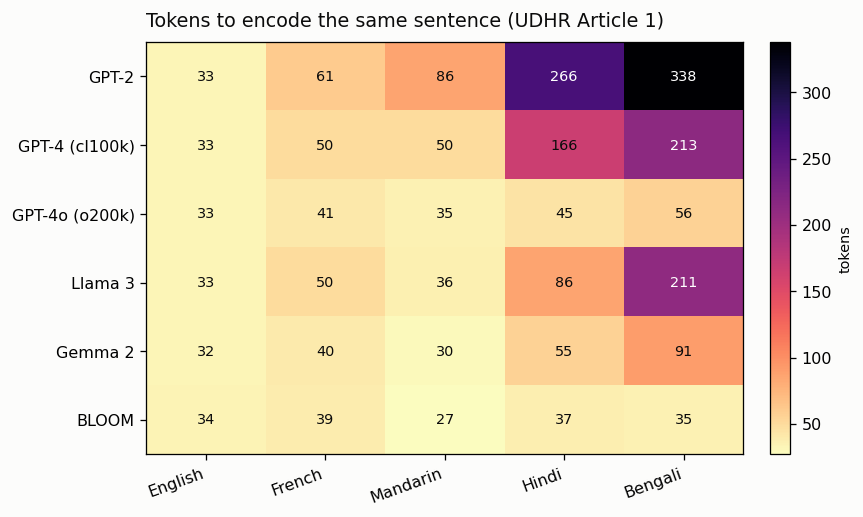
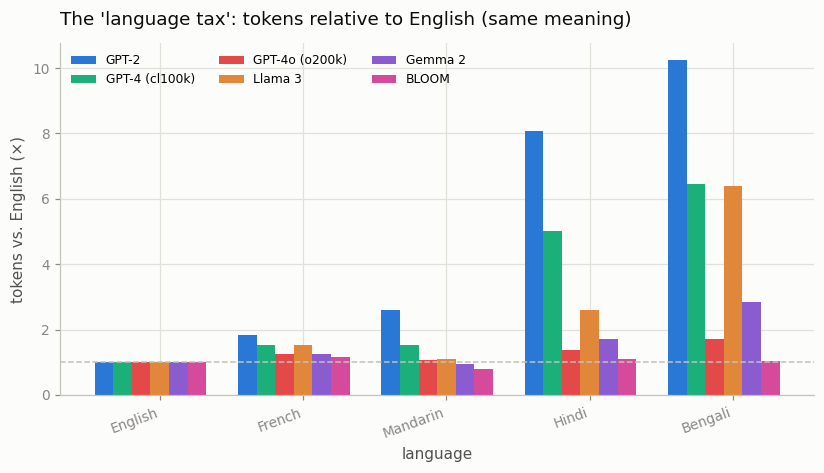

# Tokenizer Compression Study

---

> The same sentence costs many more tokens in some languages than others — and you pay per token.

---

## ELI5 (Explain Like I'm 5)

- **The Big Idea:** LLMs charge by the token, and a tokenizer trained mostly on
  English has memorized lots of English chunks but almost no Hindi or Bengali
  ones. So when it meets Bengali, it has to spell everything out in tiny pieces —
  the *same sentence* becomes many more tokens. Same meaning, higher bill,
  slower reply, less room in the context window.
- **Analogy:** Imagine a vending machine that only takes exact change and only
  stocks English "coins." Pay in English and you drop one coin per word. Pay in
  Bengali and you're forced to use pennies — hundreds of them — for the identical
  purchase. A machine that also stocks Bengali coins lets you pay in a handful.
- **Example:** We tokenize *the exact same sentence* (UN Human Rights Article 1)
  in five languages with six real tokenizers. English costs ~33 tokens
  everywhere. Bengali costs **338 tokens with GPT-2** but only **35 with [BLOOM](/shared/glossary/#bloom)** —
  a 10× gap for identical content, and pure luck-of-the-tokenizer.

## Key Insight

A [tokenizer](/shared/glossary/#tokenizer) trained mostly on English splits other languages into far more pieces, so identical meaning takes more tokens. Measuring [tokens per byte](/shared/glossary/#tokens-per-byte) across languages exposes this hidden imbalance.

## Why This Matters

More tokens means higher cost, slower replies, and a smaller effective [context window](/shared/glossary/#context-window) — which is why non-English users often get a worse, pricier experience from the very same model.

## What's in this directory

| File | Role |
|------|------|
| `compression.py` | Tokenizes UDHR Article 1 in 5 languages with 6 tokenizers and plots the counts and the "language tax" |

```bash
python compression.py      # ~1 min on CPU (tokenizers download + cache on first run)
```

Tokenizers compared: **GPT-2**, **GPT-4** (`cl100k_base`), **GPT-4o** (`o200k_base`)
via `tiktoken`; **Llama 3**, **Gemma 2**, and **BLOOM** via `transformers`.

## Results

**Tokens to encode the identical sentence.** English is ~33 tokens for everyone;
the story is entirely in the other columns. GPT-2's row runs off the scale for
non-Latin scripts (Bengali = 338), while BLOOM — trained on 46 languages with a
250k vocab — stays near English cost everywhere:



**The "language tax."** Divide each cell by that tokenizer's English cost and you
get the multiplier a non-English user pays for the same meaning. GPT-2 charges a
Bengali user **10×**; a good multilingual tokenizer charges ~1×:



```
average tax vs English (across the six tokenizers)
English   1.00×
French    1.42×
Mandarin  1.33×
Hindi     3.31×
Bengali   4.78×
```

## Two things worth noticing

- **Bigger, newer, more multilingual vocabularies close the gap.** Going GPT-2 →
  GPT-4 → GPT-4o, OpenAI's own tokenizer improved Hindi from 266 → 166 → **45**
  tokens. The `o200k` vocabulary (200k entries) was deliberately built to be less
  English-biased, and it shows.
- **Script matters more than "difficulty."** Mandarin is often *cheaper* than
  French for the big multilingual tokenizers (each character carries a lot of
  meaning), while the Brahmic scripts (Hindi, Bengali) are the most expensive —
  they combine many Unicode code points per visible character, which an
  English-first tokenizer shreds into bytes.

## Why this is a fairness and cost problem, not a curiosity

Per-token pricing means a Bengali user can literally pay 5–10× more than an
English user for the same conversation with the same model, get slower responses,
and fit far less into the context window — all decided by a tokenizer trained
before they showed up. This is one of the most concrete equity issues in
deployed LLMs, and it's invisible unless you measure it exactly as here.

## Things to try

- Add `xlm-roberta-base` (SentencePiece, 250k, 100 languages) and a code snippet
  as a sixth "language" — code has its own tokenization economics.
- Report tokens-per-*character* instead of per-sentence to separate script
  density from translation length.
- Compute the dollar cost of a 128k-token context filled with each language at a
  real API's per-token price — the tax in money.
