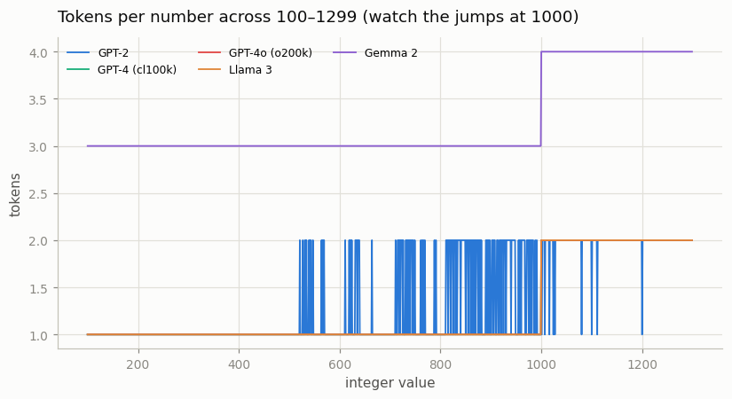
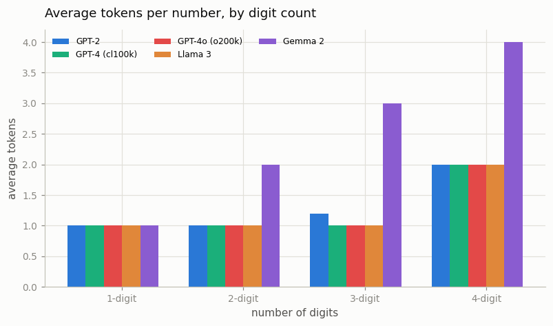

# Numeral Tokenization Audit

---

> If "1234" is four tokens in one model and one in another, arithmetic gets harder for free.

---

## ELI5 (Explain Like I'm 5)

- **The Big Idea:** To add two numbers, a model needs to see their digits lined
  up. But tokenizers chop numbers in wildly different ways: some glue "1234" into
  a single token, some split it "123"+"4", and one gives every digit its own
  token. If the *same* three digits get bundled differently depending on the
  number around them, the model can never learn a clean "line up the columns and
  carry" rule — so it fluffs simple sums.
- **Analogy:** Imagine doing long addition, but a gremlin randomly staples some
  of your digits together into blobs before you start — sometimes "45" is one
  blob, sometimes it's "4" and "5". You'd struggle to add, not because you can't
  do math, but because the columns won't line up. Different tokenizers are
  different gremlins.
- **Example:** We count tokens for every integer 0–9999 across five tokenizers.
  **Gemma 2** gives every digit its own token (perfectly regular). **GPT-4/Llama 3**
  bundle 1–3 digits. **GPT-2** is a mess — the *same* 3-digit number is sometimes
  1 token, sometimes 2, with no pattern.

## Key Insight

[Tokenizers](/shared/glossary/#tokenizer) disagree on how to split numbers: some keep multi-digit chunks together, others break every digit apart. How digits are grouped directly shapes how hard arithmetic is for the model.

## Why This Matters

Early LLMs were notoriously bad at math partly because of inconsistent numeral tokenization. Auditing it reveals a concrete, fixable reason a model can fail at even simple sums.

## What's in this directory

| File | Role |
|------|------|
| `numerals.py` | Counts tokens for 0–9999 across five tokenizers, charts the patterns, and dumps the exact digit-grouping for example numbers |

```bash
python numerals.py      # ~1 min on CPU (tokenizers cached from project 02)
```

## Results

**Tokens per number, 100–1299.** Three completely different philosophies are
visible at a glance:



- **Gemma 2** (purple): a clean staircase — *one token per digit*, always. 3
  tokens for 3-digit numbers, jumping to 4 at 1000. Maximally regular.
- **GPT-4 / GPT-4o / Llama 3** (overlapping flat lines): 1 token up to 999, then
  2 — they bundle numbers into ≤3-digit chunks.
- **GPT-2** (blue): a jagged mess, flickering between 1 and 2 tokens with *no
  pattern* — the same digit sequence tokenizes differently depending on context.

**Averaged by digit count**, and with a consistency score (how many distinct
token-counts a tokenizer produces for the 900 three-digit numbers):



```
tokenizer        1d    2d    3d    4d   distinct token-counts for 3-digit numbers
GPT-2          1.00  1.00  1.20  1.99   2   ← inconsistent
GPT-4 (cl100k) 1.00  1.00  1.00  2.00   1
GPT-4o (o200k) 1.00  1.00  1.00  2.00   1
Llama 3        1.00  1.00  1.00  2.00   1
Gemma 2        1.00  2.00  3.00  4.00   1   ← one token per digit
```

**The exact split of `31415`:**

```
GPT-2 / GPT-4 / GPT-4o / Llama 3   ->  ['314', '15']      (left-to-right 3-digit chunks)
Gemma 2                            ->  ['3','1','4','1','5']  (per-digit)
```

## The consistency/efficiency trade-off

There are two things a good numeral tokenization wants, and they fight:

- **Efficiency** — fewer tokens per number (cheaper, more fits in context). GPT-4
  and Llama 3 win here by bundling up to 3 digits.
- **Consistency** — the same digit in the same position always tokenizes the same
  way, so the model can learn a single place-value algorithm. **Per-digit
  tokenization (Gemma 2) is maximally consistent** and is exactly why several
  modern models switched to it to improve arithmetic; **GPT-2's irregular merges
  are the worst case** and a documented reason early GPT models struggled with
  math.

Digit-chunking (GPT-4/Llama) is a middle ground — consistent *within* a chunk
length, but "1,234,567" still gets carved at comma-free 3-digit boundaries that
don't line up for column addition. That's why the research trend is toward
per-digit, despite the token cost.

## Things to try

- Encode `" 1234"` (leading space) vs `"1234"` and watch the split change — the
  space quirk from [project 02](../02-tokenizer-compression-study/README.md)
  contaminates numbers too.
- Reverse the digits before tokenizing (a trick some papers use) and see whether
  the chunk boundaries become addition-friendly.
- Ask a small model to add two 4-digit numbers under each tokenizer's grouping —
  the per-digit one is measurably easier for it.
