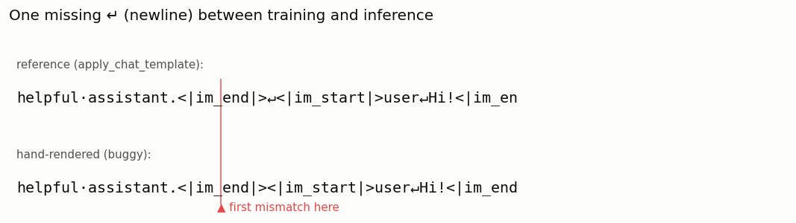

# Chat-Template Debugger

---

> If your training tokens and inference tokens differ by one space, the model quietly gets worse.

---

## ELI5 (Explain Like I'm 5)

- **The Big Idea:** A chat model was fine-tuned to expect messages wrapped in an
  *exact* pattern of special markers and newlines — role headers like
  `<|im_start|>`, an end marker `<|im_end|>`, and newlines in a fixed order. It
  learned to answer *that* pattern. If your code rebuilds the pattern with even
  one newline missing, the model sees something subtly unfamiliar and answers
  worse — with no error message to warn you. The only way to be sure is to
  compare your bytes against the model's own renderer, exactly.
- **Analogy:** It's a password with invisible characters. "hunter2" and
  "hunter2·" (trailing space) look identical to you, but the system rejects the
  second. A chat template is a password made of newlines and special tokens; get
  one whitespace wrong and you don't get an error — you just quietly get a worse
  model.
- **Example:** We hand-write a ChatML renderer that forgets the newline after
  `<|im_end|>`, then byte-compare it to Qwen's official template. The mismatch
  appears at **byte 57**, changes **4 tokens**, and makes the model see
  `<|im_start|>` exactly where it was trained to see a newline. One character.

## Key Insight

A [chat template](/shared/glossary/#chat-template) wraps each turn in [special tokens](/shared/glossary/#special-tokens) (system, user, assistant). The model was fine-tuned on one exact byte pattern; rendering it by hand and byte-comparing surfaces any mismatch.

## Why This Matters

A single off-by-one space between training and inference is one of the most common — and hardest to spot — causes of a fine-tuned model silently underperforming.

## What's in this directory

| File | Role |
|------|------|
| `chat_debug.py` | Renders ChatML by hand (buggy + fixed), byte-compares against `apply_chat_template`, and pinpoints the token that changes |

```bash
python chat_debug.py      # ~30s on CPU (downloads the Qwen2.5 tokenizer only, no model weights)
```

## The bug, caught red-handed

ChatML wraps every turn as `<|im_start|>{role}\n{content}<|im_end|>\n`. Our
hand-rolled renderer makes one very common mistake — it forgets the `\n` **after**
`<|im_end|>`, so the turns run together. Byte-comparing against the model's own
`apply_chat_template` finds it instantly:



```
reference length: 196 chars | buggy length: 192 chars
first byte mismatch at index 57:
  reference[51:67] = '_end|>↵<|im_star'      ← ↵ is the newline
  buggy    [51:67] = '_end|><|im_start'      ← it's gone

token counts: reference 41 vs buggy 37 (off by 4)
first differing token at position 10:
  reference id 198 ('\n')  vs  buggy id 151644 ('<|im_start|>')
```

That last line is the whole problem in miniature: at position 10 the model was
trained to see a **newline token**, and the buggy serving code feeds it the
**`<|im_start|>` special token** instead. The model never errors — it just
generates from an input it has never seen in training, and quality quietly drops.

## The fix, verified byte-for-byte

The same script also contains the *correct* renderer, and asserts it is
**byte-identical** to `apply_chat_template`:

```
fixed hand-render matches reference byte-for-byte? True
```

That assertion is the entire lesson: the only acceptable bar for template code is
byte-exact equality with what the model was trained on. "Looks right" is not a
test; `==` on the raw string is.

## Why you should almost never hand-render templates

Every model family uses a *different* exact pattern — Llama 3's
`<|start_header_id|>role<|end_header_id|>\n\n…<|eot_id|>`, Gemma's `<start_of_turn>`,
Mistral's `[INST]…[/INST]` — and each hides its own whitespace landmines
(double newlines, leading spaces, BOS-token placement). The practical rule the
guide draws is: **call `apply_chat_template`, don't reinvent it** — and when you
must (a new serving stack, a non-Python runtime), gate it behind a byte-equality
test against the reference, exactly like the assertion here.

## Things to try

- Introduce a *different* bug — a trailing space after the role, or a missing
  `add_generation_prompt` — and watch where the first-mismatch byte moves.
- Swap `MODEL` to a Llama-3 or Gemma chat model and discover that your ChatML
  renderer is now wrong *everywhere* — each family's template is incompatible.
- Feed both renders to the actual model and compare the replies to feel the
  "silent degradation" the byte diff predicts.
