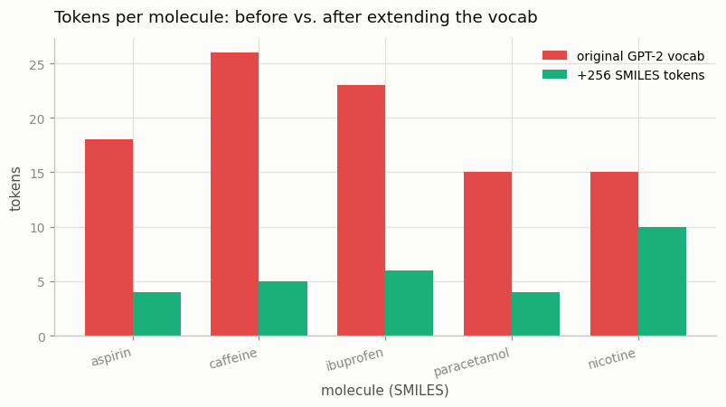

# Custom Vocab Extension

---

> Teaching a model a new "alphabet" means adding tokens and growing its [embedding](/shared/glossary/#embedding) table to match.

---

## ELI5 (Explain Like I'm 5)

- **The Big Idea:** GPT-2's vocabulary knows English, not chemistry, so a molecule
  written as SMILES (`CC(=O)Oc1ccccc1C(=O)O` = aspirin) gets spelled out one
  character at a time — wasteful. We can teach it chemistry "words" by adding 256
  SMILES tokens. But every token ID needs a vector, so we must also grow the
  model's embedding table by 256 rows. The trick is to do it *without* disturbing
  the English the model already knows.
- **Analogy:** It's bolting 256 new keys onto a keyboard. The old keys keep
  working exactly as before (your English typing is untouched), and the new keys
  each need a wire connected to the computer (the new embedding rows). But the new
  keys are blank — the model has no idea what they *mean* yet until you train it.
- **Example:** We add 256 SMILES fragments to GPT-2. Aspirin drops from **18
  tokens to 4**, caffeine from **26 to 5**. And the model's English generation is
  **byte-identical** before and after the resize — we grew the vocabulary without
  breaking a thing.

## Key Insight

Adding tokens to a [tokenizer](/shared/glossary/#tokenizer) requires resizing the model's [embedding matrix](/shared/glossary/#embedding-matrix) so every new ID gets a vector. Those new rows start untrained, so the model must learn what they mean.

## Why This Matters

Specialized notations — like the SMILES strings that describe molecules — often tokenize poorly out of the box. Extending the [vocabulary](/shared/glossary/#vocabulary) cleanly, without breaking the model's existing English, is a practical fine-tuning skill.

## What's in this directory

| File | Role |
|------|------|
| `extend.py` | Mines 256 SMILES fragments, adds them to GPT-2's tokenizer, resizes the embeddings, and verifies compression + unbroken English |

```bash
python extend.py      # ~2 min on CPU (downloads GPT-2, 124M)
```

## The three steps

1. **Mine domain tokens.** Count the most frequent 2–6 character substrings across
   a small corpus of real drug SMILES, and keep the top 256 that GPT-2 doesn't
   already have (`C(=O)`, `c1ccccc1`, `(=O)O`, …).
2. **Add them to the tokenizer.** `tokenizer.add_tokens(new_tokens)` — vocab grows
   from 50,257 to 50,513.
3. **Resize the model.** `model.resize_token_embeddings(len(tokenizer))` adds 256
   rows to the input embedding *and* the tied output projection — here
   `256 × 768 = 196,608` new parameters. The existing 50,257 rows are copied over
   untouched; the new rows are random.

## Results

**SMILES compresses dramatically** once the model has chemistry fragments —
roughly 4–6× fewer tokens per molecule:



```
vocab 50257 -> 50513  (added 256)
embedding matrix 50257×768 -> 50513×768  (+196,608 params)

molecule      before -> after
aspirin          18  ->   4
caffeine         26  ->   5
ibuprofen        23  ->   6
paracetamol      15  ->   4
nicotine         15  ->  10
```

**English generation is byte-identical before and after the resize** — the whole
point of doing the surgery carefully:

```
prompt: 'The capital of France is'
  before: 'The capital of France is the capital of the French Republic, and ...'
  after : 'The capital of France is the capital of the French Republic, and ...'
  identical: True
```

## The catch: new rows are blank

Resizing is *plumbing*, not *learning*. The 256 new embedding rows are random, so
while the tokenizer now packs aspirin into 4 tokens, the model has no idea what
those 4 tokens *mean* — feed it chemistry and it will produce garbage until those
rows are trained (continued pretraining on SMILES, covered in a later phase). The
reason English is untouched is precisely that the existing rows were preserved
*and* the English prompts never invoke the new IDs. A common refinement is to
initialize each new row as the average of the existing embeddings (a gentler
starting point than pure noise) so fine-tuning converges faster.

## Why "don't break the English" is the hard part

It's easy to add tokens; the skill is doing it without regressing what already
works. If you resize incorrectly (e.g., reinitialize the whole matrix, or forget
to resize the tied output head), the model's English silently degrades — the same
class of "silent regression" bug as the chat-template mismatch in
[project 04](../04-chat-template-debugger/README.md). Verifying byte-identical
generation before/after is the cheap test that catches it.

## Things to try

- Initialize the new rows with the mean of the existing embeddings and confirm
  English generation is *still* identical (the new IDs are never selected either
  way) — then note it would fine-tune faster.
- Add a `<|mol|>…<|/mol|>` pair of special tokens and check they survive a
  save/reload of the tokenizer.
- Fine-tune the 256 new rows (freeze everything else) on the SMILES corpus and
  watch the model start to produce valid-looking chemistry.
