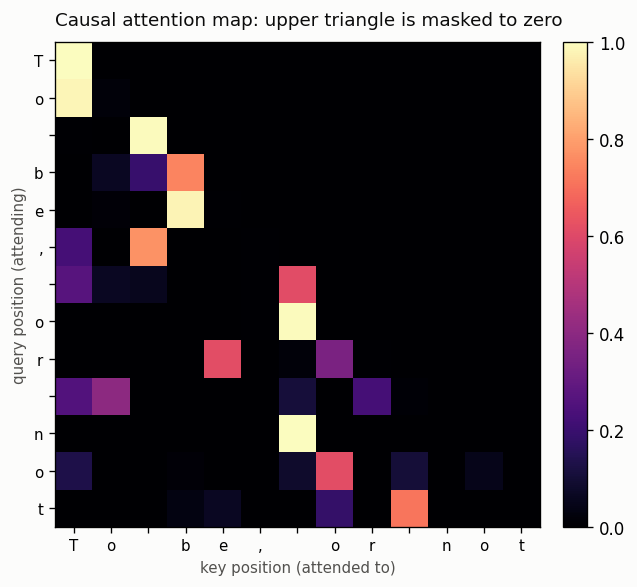
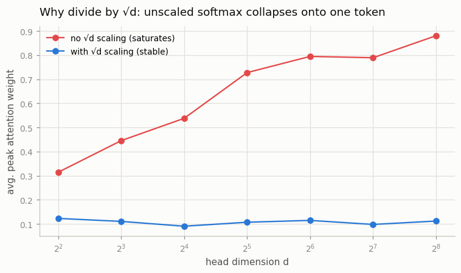

# Single Attention Head

---

> Attention is a weighted average where each token decides how much to listen to every earlier token.

---

## ELI5 (Explain Like I'm 5)

- **The Big Idea:** Every token asks a question ("what am I looking for?" — its
  *query*) and every token wears a label ("here's what I am" — its *key*). A token
  looks at all the earlier tokens, sees whose label best matches its question,
  and pulls in a blend of their content (*values*), weighted by how good the
  match is. That blend is attention. A *causal mask* just forbids peeking at
  tokens that come later.
- **Analogy:** It's a room where everyone holds up a name tag (key) and you hold a
  "who do I need?" note (query). You listen loudest to the people whose tag best
  matches your note, and you ignore anyone standing behind you in line (the mask).
- **Example:** We implement the whole thing in a few lines, then check it matches
  PyTorch's optimized `F.scaled_dot_product_attention` to **5×10⁻⁷** — proof the
  hand-written formula is exactly what production kernels compute.

## Key Insight

A single [attention](/shared/glossary/#attention) [head](/shared/glossary/#heads) computes `softmax(QKᵀ/√d)·V`: it scores how well each token's query matches every token's key, turns those scores into weights with [softmax](/shared/glossary/#softmax), and mixes the values accordingly. A [causal mask](/shared/glossary/#causal-mask) hides future positions so a token can only attend to itself and what came before.

## Why This Matters

This one operation is the heart of every [transformer](/shared/glossary/#transformer). Building it by hand and checking it against PyTorch's [`F.scaled_dot_product_attention`](/shared/glossary/#fscaled_dot_product_attention) turns the formula every modern LLM relies on from a mystery into something you can write from memory.

## What's in this directory

| File | Role |
|------|------|
| `attention.py` | From-scratch scaled dot-product attention, a PyTorch equivalence check, and both figures |

```bash
python attention.py      # ~20s on CPU
```

## The whole operation, in a few lines

```python
scores  = q @ k.transpose(-2, -1) / d**0.5      # match every query to every key
scores  = scores.masked_fill(future_mask, -inf) # forbid attending to the future
weights = softmax(scores, dim=-1)               # normalize into a distribution
out     = weights @ v                           # weighted average of the values
```

Run against random inputs, this reproduces PyTorch's fused kernel exactly:

```
causal=False  max|mine - F.sdpa| = 5.07e-07  OK
causal=True   max|mine - F.sdpa| = 4.47e-07  OK
```

## Results

**The causal attention map.** Each row is a token deciding how much to attend to
each column. The upper triangle is masked to zero — a token can only look at
itself and earlier tokens, never the future:



**Why the `/√d`.** Dot products of two random `d`-dimensional vectors have
variance ≈ `d`, so without the scale the logits blow up as the head gets wider,
softmax saturates onto a single token, and gradients vanish. Dividing by `√d`
keeps the softmax spread out at every width:



```
at d=256:  peak attention weight  0.88 (unscaled)  vs  0.11 (scaled)
```

Without scaling, a width-256 head dumps ~88% of its attention on one token before
training even starts — the softmax is saturated and can barely learn. The `√d`
keeps it at a healthy ~11%.

## Why this is the whole ballgame

Everything else in the architecture — multiple heads, RoPE, GQA, the MLP — is
scaffolding around *this* operation. Attention is the only place in a transformer
where information moves *between* positions; the MLP just processes each position
in isolation. Once you can write `softmax(QKᵀ/√d)V` from memory and know why every
symbol is there, the transformer stops being a black box.

## Things to try

- Remove the causal mask and watch the map fill its upper triangle — that's an
  encoder (BERT-style) attention pattern.
- Feed the same token at two positions and confirm that, without any positional
  info, they produce identical queries — the motivation for
  [RoPE](../10-rope-from-scratch/README.md).
- Scale by `1/d` instead of `1/√d` and watch the softmax *under*-sharpen — the
  exponent really is `1/2`.
