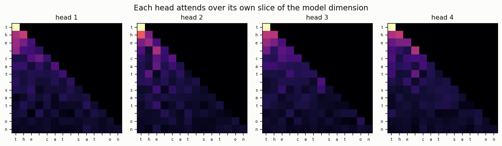
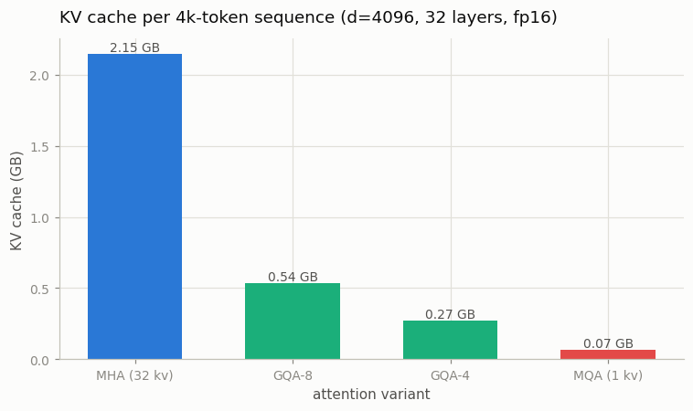

# Multi-Head Attention

---

> Run attention many times in parallel, each head free to focus on a different kind of relationship.

---

## ELI5 (Explain Like I'm 5)

- **The Big Idea:** One attention head can only track one kind of relationship at
  a time. So we run several in parallel — each gets its own slice of the vectors,
  does its own attention, and they specialize (one head tracks the verb, another
  the subject, another punctuation). Then we glue their outputs together and mix
  them once more. **GQA** is a money-saving tweak: let several question-heads
  *share* one set of keys/values, so there's much less to remember during
  generation.
- **Analogy:** Instead of one reader skimming a page for everything, you hand the
  page to eight specialists — a grammar checker, a fact checker, a tone
  checker… — who all read at once and then compare notes. GQA is those eight
  specialists sharing a few photocopies instead of each making their own.
- **Example:** We copy the weights out of PyTorch's `nn.MultiheadAttention` into
  our from-scratch version and get **bit-identical** outputs (diff = 0.0). Then we
  show the payoff of GQA: a Llama-7B-shaped KV cache shrinks from **2.15 GB to
  0.07 GB** (32×) going from MHA to MQA.

## Key Insight

Multi-head attention splits the model dimension into several [heads](/shared/glossary/#heads), runs [attention](/shared/glossary/#attention) in each one independently, then concatenates the results and projects them back. [Grouped-Query Attention (GQA)](/shared/glossary/#gqa) is a small twist: several query heads share one set of keys and values to shrink the [KV cache](/shared/glossary/#kv-cache).

## Why This Matters

Every production transformer uses multi-head attention, and nearly every model since 2024 uses GQA to serve faster. Verifying your version against `nn.MultiheadAttention` confirms you have the [tensor](/shared/glossary/#tensor) [reshapes](/shared/glossary/#reshape) exactly right — the part that is easy to get subtly wrong.

## What's in this directory

| File | Role |
|------|------|
| `mha.py` | `CausalMHA` with a GQA knob, an exact equivalence check vs PyTorch, and both figures |

```bash
python mha.py      # ~20s on CPU
```

## Getting the reshapes exactly right

Multi-head attention is 90% bookkeeping: reshape `(B, T, d)` into
`(B, heads, T, d_head)`, attend, then reshape back. One transpose in the wrong
place produces plausible-looking garbage. The only way to be sure is to check
against a known-correct implementation — so we copy `nn.MultiheadAttention`'s
`in_proj`/`out_proj` weights into our module and compare:

```
max|mine - nn.MultiheadAttention| = 0.00e+00  OK
```

Bit-for-bit identical: our `.view(...).transpose(...)` dance is exactly PyTorch's.

## Results

**Each head runs in parallel over its own subspace.** The four maps below share
the causal triangle but weight it differently — during training these specialize
into distinct roles (previous-token heads, syntactic heads, and so on):



**GQA is the cheapest speedup in modern serving.** During generation every past
token's keys and values must be cached; that cache, not the weights, is what caps
how many users a GPU can serve. Sharing KV heads shrinks it directly:



```
config      n_kv_heads   KV cache (4k ctx)   shrink
MHA             32           2.15 GB           1×
GQA-8            8           0.54 GB           4×
GQA-4            4           0.27 GB           8×
MQA              1           0.07 GB          32×
```

## The trade-off GQA is buying

Fewer KV heads means less cache, faster serving, and longer feasible context —
but the query heads now share coarser keys/values, which costs a little quality.
MQA (1 KV head) is the extreme and can hurt noticeably; **GQA is the sweet spot**
(Llama 2 70B onward, and nearly every model since 2024 uses GQA-8 or GQA-4),
recovering most of MHA's quality at a fraction of the cache. Project
[11](../11-gqa-ablation/README.md) trains matched models to *measure* that
quality cost instead of asserting it.

## Things to try

- Set `n_kv_heads=2` and confirm `repeat_interleave` broadcasts the 2 KV heads
  across all query heads without changing output shape.
- Time generation with a growing KV cache under MHA vs MQA — the cache, not the
  matmuls, is what slows long-context decoding.
- Copy weights the *wrong* way (swap two heads) and watch the equivalence check
  fail — the reshape really is that unforgiving.
