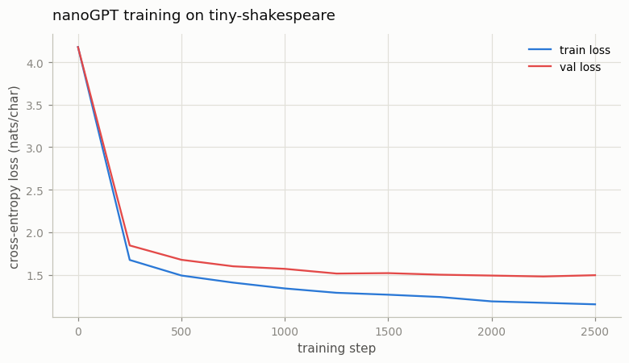

# nanoGPT Reproduction

---

> The smallest honest GPT is a few hundred lines — small enough to hold in your head, real enough to write Shakespeare.

---

## ELI5 (Explain Like I'm 5)

- **The Big Idea:** A GPT is not a mysterious brain — it's a stack of the two
  operations you already built (attention to mix tokens, an MLP to think about
  each token), wrapped with an embedding table at the bottom and a "which letter
  is next?" classifier at the top. Train that on a file of Shakespeare, one
  character at a time, and it slowly learns his spelling, his punctuation, and
  even his `SPEAKER:` play format — from nothing but next-letter guessing.
- **Analogy:** It's the world's most sophisticated autocomplete, learned from
  scratch. Show it millions of little "here are 128 characters, guess the 129th"
  puzzles, and to get good at the game it has no choice but to internalize how
  English (and Shakespeare) actually works.
- **Example:** Our 0.79M-parameter model, trained for ~13 minutes on a CPU,
  reaches a validation loss of **1.49 nats/char** and generates lines like
  *"KING RICHARD III: Ay, that the blood of yourself…"* — complete with character
  names and verse structure it was never explicitly taught.

## Key Insight

nanoGPT is a minimal but complete decoder-only GPT: token and position [embeddings](/shared/glossary/#embedding), a stack of [transformer](/shared/glossary/#transformer) blocks, and a final linear head that predicts the next token. Typing it out yourself, training on a tiny Shakespeare file, and [sampling](/shared/glossary/#sampling) text exercises the whole loop end to end.

## Why This Matters

Most "magic" disappears once you have trained a real GPT from scratch. nanoGPT is the cleanest reference for that experience — every later optimization ([GQA](/shared/glossary/#gqa), [RoPE](/shared/glossary/#rope), [MoE](/shared/glossary/#moe)) is a small change to this same skeleton.

## What's in this directory

| File | Role |
|------|------|
| `model.py` | The GPT skeleton — RMSNorm, RoPE attention (GQA/MoE knobs), SwiGLU, weight-tied head — **plus the shared data pipeline and training loop** |
| `train.py` | Trains on tiny-shakespeare, samples text, plots the loss curve |

```bash
python train.py --corpus data/corpus.txt --steps 2500      # ~10 min on CPU
```

`model.py` is the **shared skeleton for the rest of Phase 2**: projects
[09](../09-pre-norm-vs-post-norm/README.md) (norm placement),
[11](../11-gqa-ablation/README.md) (GQA), [12](../12-mini-moe/README.md) (MoE), and
[13](../13-long-context-extension/README.md) (context extension) all import this
`GPT` and flip exactly one knob.

## The whole model is two operations in a loop

```
tokens → embedding → [ x = x + Attn(Norm(x));  x = x + MLP(Norm(x)) ] × N → Norm → Linear → logits
```

Ours is a *modern* nanoGPT: **RMSNorm** (not LayerNorm), **RoPE** positions (not
learned), **SwiGLU** MLP (not GELU), and a **weight-tied** output head — the Llama
recipe, shrunk to 0.79M parameters and 4 layers so it trains on a laptop CPU. The
attention and RoPE are exactly the pieces verified in projects
[06](../06-single-attention-head/README.md), [07](../07-multi-head-attention/README.md),
and [10](../10-rope-from-scratch/README.md), now assembled into a whole.

## Results

**It trains cleanly.** Character-level cross-entropy falls from 4.17 (random over
65 characters) to **1.49** on held-out text, with only a small train/val gap:



```
0.79M params · vocab 65 · final train loss 1.152 · final val loss 1.494
```

**And it writes Shakespeare.** Sampled from the trained model (temperature 0.8),
starting from a single newline:

```
POMPEY:
I am in the stirring spirits the heaven
Which gratis pures the servants by this butt,
To do your grace he had committed by him:

DUKE OF AUMERLE:
The Watchman! where I come, he hath done not the dust
Of the court of thy choice? ...
```

Not one word of that is real Shakespeare, yet the *format* is unmistakable —
capitalized speaker names, colons, line breaks, blank lines between speeches, and
plausible early-modern diction. A megabyte of text and a next-character objective
taught the model all of it.

## Why this is the reference point for everything after

Every "advanced" LLM idea in this guide is a small diff against this file. GQA
changes how many K/V heads the attention makes. MoE swaps the MLP for a router
plus experts. RoPE (already here) changes how positions enter attention. Pre-norm
(already here) is one line about *where* the norm goes. Having trained the whole
loop once — and watched the loss fall and the samples sharpen — every later
optimization reads as a targeted tweak rather than a new mystery. That is exactly
why nanoGPT is the canonical first GPT.

## Things to try

- Raise `n_layer`/`n_embd` and watch val loss drop (and CPU time climb) — a
  hand-run scaling law, previewing Phase 4.
- Sample at temperature 0.5 vs 1.1 — low is repetitive and safe, high is
  creative and misspelled, the same knob as every chat UI.
- Flip `Config(pos="learned")` and retrain — learned absolute positions work too,
  but can't extend past the training length the way RoPE can in
  [project 13](../13-long-context-extension/README.md).
