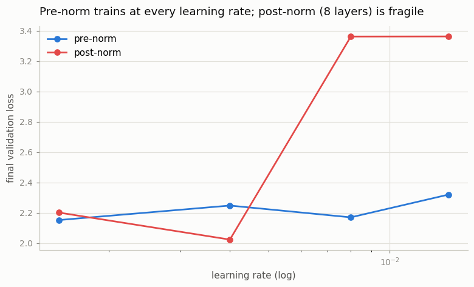
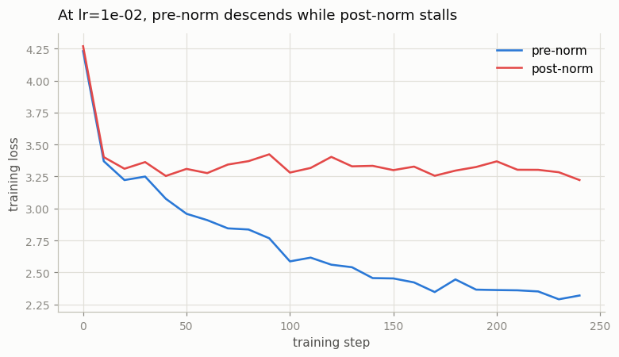

# Pre-Norm vs Post-Norm

---

> Where you place the [normalization](/shared/glossary/#normalization) decides whether training is smooth or blows up.

---

## ELI5 (Explain Like I'm 5)

- **The Big Idea:** Every transformer block adds its work back onto a running
  "residual" total. *Where* you put the normalization matters enormously.
  Pre-norm normalizes the *input* to each block and leaves the running total
  untouched — a clean highway that gradients flow down easily. Post-norm
  normalizes *after* adding, squeezing the highway at every block; stack enough
  blocks and the learning signal gets choked, so training stalls unless you tiptoe
  with a tiny learning rate.
- **Analogy:** Pre-norm is a straight express lane with a checkpoint on each
  *on-ramp* — traffic flows. Post-norm puts a checkpoint on the *main road* at
  every exit; a few are fine, but stack eight and the highway jams. Pre-norm is
  why modern skyscraper-deep models train at all.
- **Example:** We train an 8-layer model both ways across four learning rates.
  Pre-norm lands at ~2.2 loss *at every learning rate*. Post-norm matches it at
  low LR but **collapses to 3.36** (barely learning) once the LR gets aggressive —
  fragile exactly where pre-norm is robust.

## Key Insight

Pre-norm puts the normalization step *inside* each [residual](/shared/glossary/#residual-connection) branch (`x = x + Attn(Norm(x))`), while post-norm normalizes *after* the residual is added. Pre-norm trains stably even without [learning-rate](/shared/glossary/#learning-rate) [warmup](/shared/glossary/#warmup); post-norm often needs warmup and can diverge without it.

## Why This Matters

Every modern [transformer](/shared/glossary/#transformer) is pre-norm for exactly this reason. Training two otherwise-identical models, with and without warmup, turns an abstract design rule into something you have watched succeed and fail with your own eyes.

## What's in this directory

| File | Role |
|------|------|
| `norm_ablation.py` | Trains 8-layer pre- and post-norm models across a learning-rate sweep and plots the robustness gap |

```bash
python norm_ablation.py --corpus data/corpus.txt      # ~7 min on CPU
```

Only one line differs between the two models — inside the block from project 08:

```python
if norm == "pre":                        # modern: clean residual highway
    x = x + attn(norm1(x)); x = x + mlp(norm2(x))
else:                                     # original 2017 Transformer
    x = norm1(x + attn(x)); x = norm2(x + mlp(x))
```

## Results

**Pre-norm is robust; post-norm is fragile.** Sweeping the learning rate at a
fixed 8-layer depth, pre-norm sits near 2.2 loss *everywhere*. Post-norm keeps up
at gentle learning rates, then falls off a cliff once the LR gets aggressive:



```
learning_rate   pre-norm   post-norm
1.5e-03           2.152      2.201     both fine
4.0e-03           2.248      2.023     both fine
8.0e-03           2.170      3.361     post-norm collapses
1.4e-02           2.320      3.362     post-norm collapses
```

**Watching one collapse happen.** At the most aggressive learning rate, pre-norm
descends steadily while post-norm flat-lines near its starting loss — its deep
residual path has strangled the gradient signal:



## Why pre-norm won (and a note on warmup)

In a post-norm stack, each block re-normalizes the *sum* of the residual and the
new sublayer output, so signal (and gradient) magnitude compounds through depth;
past a modest depth it either explodes or, as here, gets suppressed, and the model
can't learn unless the learning rate is small. Pre-norm's normalization sits on
the *branch*, leaving an un-normalized residual path from input to output that
gradients traverse cleanly at any depth — which is why **every modern transformer
(GPT, Llama, Mistral, Qwen) is pre-norm**.

The classic remedy for post-norm was a learning-rate **warmup** (ramp the LR up
slowly). Warmup tames the *early-training* instability of the original LayerNorm
Transformer, but it does not fix the depth-driven signal suppression you see
above — that's an architectural problem, and the architectural fix (pre-norm) is
what the field adopted. The honest lesson: don't nurse a fragile design with
scheduling tricks when a one-line placement change removes the fragility.

## Things to try

- Drop the depth to 2–4 layers and watch the gap vanish — post-norm is fine when
  shallow, which is why it worked in 2017's 6-layer translation models.
- Add a warmup schedule to the post-norm runs and confirm it helps early but
  doesn't rescue the high-LR collapse at this depth.
- Crank the depth to 16 and watch post-norm fail even at moderate learning rates —
  fragility grows with depth.
