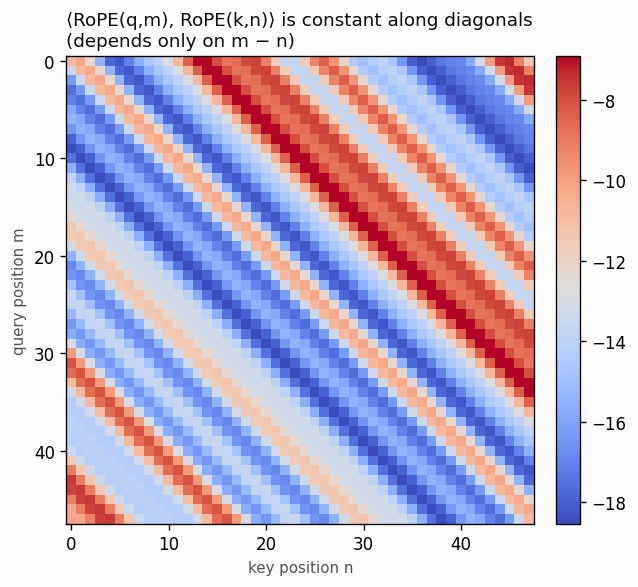
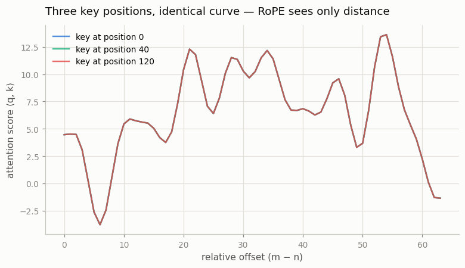

# RoPE from Scratch

---

> Encode position by spinning each token's vectors — and the angle between two tokens becomes their distance.

---

## ELI5 (Explain Like I'm 5)

- **The Big Idea:** A transformer has no built-in sense of order — shuffle the
  words and attention gives the same answer. RoPE fixes that by *spinning* each
  token's query and key vectors by an angle set by its position. Token 5 is
  rotated more than token 2. Then, when two tokens compare, only the *difference*
  in their spins survives the dot product — so the model automatically feels how
  far apart they are, not where they sit absolutely.
- **Analogy:** Give everyone in line a clock, and advance the hands one tick per
  step down the line. When two people compare clocks, all that matters is the gap
  between their times — the same 3-tick gap looks identical whether they're near
  the front or the back. That gap is relative position.
- **Example:** We rotate a fixed pair of vectors at many positions and compute
  their attention score. Same distance apart → **identical score every time**
  (agreement to ~10⁻⁶), whether the tokens are at positions 5 and 3 or 100 and 98.

## Key Insight

[RoPE](/shared/glossary/#rope) encodes a token's position by *rotating* its query and key vectors by an angle proportional to that position. Because rotations compose, the [attention](/shared/glossary/#attention) score between two tokens ends up depending only on their relative distance, not their absolute positions.

## Why This Matters

RoPE is the default positional scheme in Llama, Mistral, Qwen, and DeepSeek. Implementing it — including the [half-rotation](/shared/glossary/#half-rotation) trick — and confirming that `⟨q, k⟩` depends only on relative position makes the most widely used position embedding concrete rather than magical.

## What's in this directory

| File | Role |
|------|------|
| `rope.py` | RoPE with the half-rotation trick, the relative-position proof, and both figures |

```bash
python rope.py      # ~15s on CPU
```

## The half-rotation trick

A true 2D rotation mixes dimensions in pairs. RoPE implements this cheaply by
pairing dimension `i` with dimension `i + d/2` and using `rotate_half`:

```python
def rotate_half(x):                       # [x1, x2] -> [-x2, x1]
    x1, x2 = x[..., :d//2], x[..., d//2:]
    return cat([-x2, x1], dim=-1)

x_rotated = x * cos + rotate_half(x) * sin   # rotate every pair by its angle
```

Each pair spins at its own frequency (fast for early dims, slow for late dims),
exactly like the hands of a set of clocks running at different speeds.

## Results

**The dot product is Toeplitz** — constant along every diagonal. That banding *is*
the relative-position property: `⟨RoPE(q,m), RoPE(k,n)⟩` depends only on `m − n`,
so equal offsets (same diagonal) give equal scores:



**Three positions, one curve.** We fix the content and place the key at positions
0, 40, and 120, sweeping the offset. The three curves land *exactly* on top of
each other — RoPE genuinely cannot tell absolute position, only distance:



```
offset  2:  scores [-11.2493, -11.2493, -11.2493]   spread 1.9e-06
offset 20:  scores [ -8.9628,  -8.9628,  -8.9628]   spread 7.6e-06
max spread across absolute positions (same offset): 7.6e-06  → relative only
```

## Why "relative, and it extrapolates" is the whole point

Because RoPE bakes position into the *rotation* rather than adding a learned
per-position vector, it (a) needs no extra parameters, (b) gives every layer the
relative-distance signal for free, and (c) is *stretchable* — you can rescale the
angles after training to handle longer sequences than you trained on. That last
property is exactly what [project 13](../13-long-context-extension/README.md)
exploits to turn a short-context model into a long-context one without retraining.

## Things to try

- Change `base` from 10000 to 500000 (the Llama-3 long-context value) and watch
  the diagonals widen — lower frequencies reach further before wrapping.
- Shrink all the angles by a constant factor (position interpolation) and confirm
  the relative property still holds — the trick behind context extension.
- Rotate `q` and `k` by the *same* absolute angle and confirm their score is
  unchanged — a rotation applied to both cancels in the dot product.
