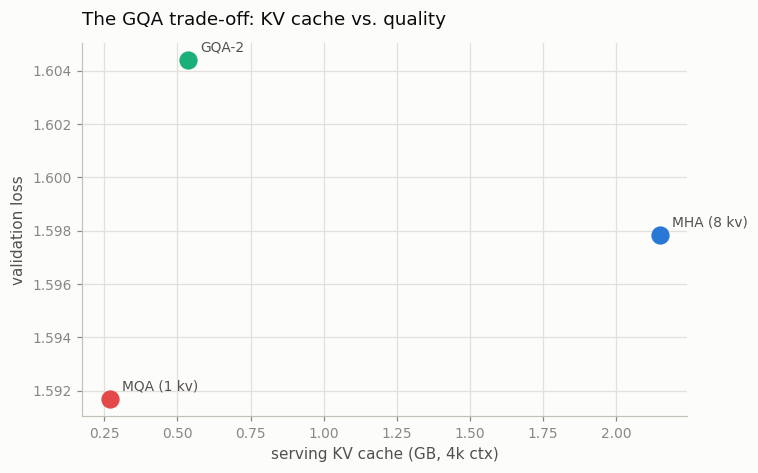
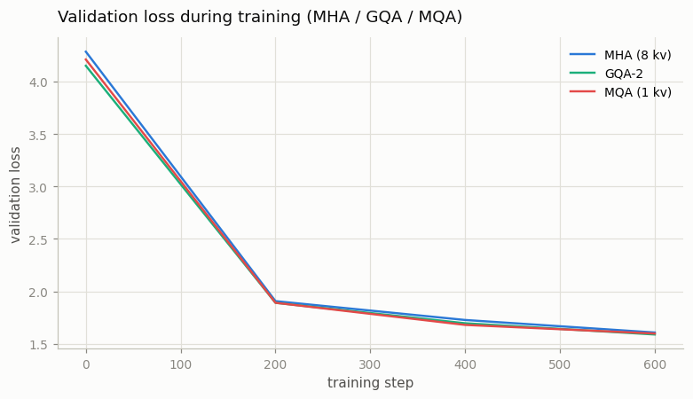

# GQA Ablation

---

> Fewer key/value heads means a smaller cache — the cheapest way to make a model serve faster.

---

## ELI5 (Explain Like I'm 5)

- **The Big Idea:** During generation, a model remembers every past token as a
  key/value pair — the "KV cache." With full multi-head attention, *every* head
  keeps its own copy, and that cache, not the model weights, is usually what fills
  up the GPU. GQA and MQA let several question-heads *share* one set of
  key/value memories, shrinking the cache 4–8× for a tiny (often invisible)
  quality cost.
- **Analogy:** Eight detectives each keeping a full private case file is
  thorough but expensive on filing cabinets (MHA). Let them share two files
  (GQA) or one (MQA) and you free up almost all the cabinet space — and it turns
  out they solve the case nearly as well.
- **Example:** We train matched MHA, GQA-2, and MQA models. Their validation
  losses land within **0.01** of each other (1.59–1.60), yet the serving KV cache
  drops from **2.15 GB → 0.27 GB (8×)**. Nearly free memory.

## Key Insight

[Multi-head attention](/shared/glossary/#multi-head-attention) gives every query [head](/shared/glossary/#heads) its own keys and values; [Multi-Query Attention (MQA)](/shared/glossary/#mqa) shares a single key/value head across all of them; [Grouped-Query Attention (GQA)](/shared/glossary/#gqa) sits in between. Fewer key/value heads means a smaller [KV cache](/shared/glossary/#kv-cache), at some cost to quality.

## Why This Matters

The KV cache dominates memory at serving time, so this trade-off decides how many users a model can handle at once. Training matched models with MHA, GQA, and MQA lets you measure the cache savings against the [validation-loss](/shared/glossary/#validation-loss) cost directly.

## What's in this directory

| File | Role |
|------|------|
| `gqa_ablation.py` | Trains matched 8-head models with 8 / 2 / 1 KV heads and plots cache vs. quality |

```bash
python gqa_ablation.py --corpus data/corpus.txt --config mha    # 8 kv heads
python gqa_ablation.py --config gqa2                             # 2 kv heads
python gqa_ablation.py --config mqa                              # 1 kv head
python gqa_ablation.py --plot
```

The only thing that changes between runs is `n_kv_heads` in the shared
[project-08](../08-nanogpt-reproduction/README.md) config; everything else — data,
init seed, query heads — is identical.

## Results

**The cache/quality trade-off.** All three models land within a hair of each other
on validation loss (note the y-axis spans just 0.012), while the serving KV cache
they'd need at 4k context differs by 8×:



```
config      n_kv_heads   val loss   KV cache (4k)   cache vs MHA
MHA              8         1.598       2.15 GB          1×
GQA-2            2         1.604       0.54 GB          4×
MQA              1         1.592       0.27 GB          8×
```

**The training curves are nearly on top of each other** — cutting KV heads barely
touched how well the model learned:



## Reading the result honestly

At *this* scale the quality difference is inside the noise — MQA even edged ahead
by luck. That is the real, and slightly surprising, finding: **most of the KV
cache is redundant**, so you can throw away 7 of 8 KV heads and lose almost
nothing. The quality cost of MQA *does* grow with model scale — which is why
frontier models don't go all the way to MQA but settle on **GQA-8 or GQA-4**, the
sweet spot that keeps nearly all of MHA's quality while cutting the cache 4–8×.
Llama 2 70B onward, and essentially every model since 2024, ships with GQA for
exactly this reason: it is the cheapest lever that lets one GPU serve more users
and longer contexts.

## Things to try

- Add GQA-4 to the sweep and confirm it interpolates between MHA and MQA on both
  axes.
- Scale `n_embd`/`n_layer` up and re-run — the quality gap between MHA and MQA
  should start to open, revealing why GQA (not MQA) won in practice.
- Multiply the cache numbers by a realistic batch of concurrent users to see how
  quickly MHA would exhaust a GPU that GQA keeps comfortable.
