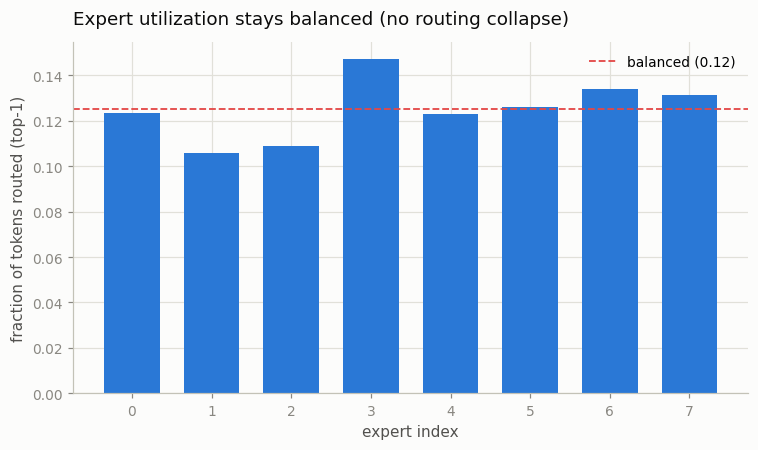
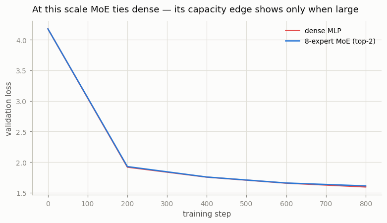

# Mini-MoE

---

> Keep many [expert](/shared/glossary/#expert) networks on hand, but pay to run only the few each token actually needs.

---

## ELI5 (Explain Like I'm 5)

- **The Big Idea:** Instead of one MLP that every token goes through, a
  Mixture-of-Experts keeps *eight* MLP "experts" and a little router that sends
  each token to just the best two. The model now holds many more parameters
  (more knowledge), but any single token only ever touches two experts, so the
  cost per token barely changes. The hard part isn't the experts — it's stopping
  the router from playing favorites and leaving most experts to rot.
- **Analogy:** A hospital with eight specialists and a triage nurse. Each patient
  sees only the two specialists they need, so care is fast *and* deep. The danger
  is a lazy triage nurse who sends everyone to the same two doctors while the
  rest sit idle — "routing collapse." A good incentive (the load-balancing loss)
  keeps all eight busy.
- **Example:** We bolt an 8-expert top-2 MoE onto nanoGPT. The router stays
  beautifully balanced — every expert handles **11–15%** of tokens (ideal 12.5%),
  no collapse. The model holds **5.7× more parameters** than the dense baseline
  while each token still touches only two experts.

## Key Insight

A [Mixture-of-Experts (MoE)](/shared/glossary/#moe) replaces one [MLP](/shared/glossary/#mlp) with several "expert" MLPs plus a router that sends each token to only the top few experts. Total parameters grow large while the compute spent per token stays fixed.

## Why This Matters

MoE is how models like Mixtral and DeepSeek-V3 reach huge parameter counts affordably. Adding an 8-expert top-2 layer to nanoGPT — and watching whether the router spreads tokens evenly across experts — exposes the central challenge of MoE: keeping routing balanced.

## What's in this directory

| File | Role |
|------|------|
| `moe_ablation.py` | Trains a dense baseline and an 8-expert top-2 MoE, then plots loss and expert utilization |

```bash
python moe_ablation.py --corpus data/corpus.txt --config dense
python moe_ablation.py --config moe
python moe_ablation.py --plot
```

The MoE swaps the `SwiGLU` MLP in the [project-08](../08-nanogpt-reproduction/README.md)
block for a router + 8 experts, and adds a Switch-Transformer **load-balancing
loss** (`0.01 × aux`) to the training objective.

## Results

**The router stays balanced — no collapse.** This is the whole game. With the
load-balancing loss, all eight experts receive a near-equal share of tokens
(11–15%, ideal 12.5%). Remove that loss and a few experts would hog everything
while the rest never train:



**Loss: a tie at this scale.** The MoE holds 5.7× the parameters but, trained
briefly at char scale, only matches the dense model — its extra capacity has
nothing to bite on yet:



```
config   total params   active/token   val loss
dense       0.59M          0.59M         1.602
moe         3.34M          0.99M         1.604
```

## Reading this honestly

Two lessons, and the second is the important one:

1. **MoE's capacity is only worth it at scale.** Here the sparse model has
   5.7× the parameters yet ties the dense baseline — a tiny model on a megabyte
   of text simply doesn't need the extra experts, and a few hundred steps isn't
   long enough for the router to specialize. The win (Mixtral, DeepSeek-V3, Qwen3)
   appears at billions of parameters, where you *cannot* afford to run all the
   weights per token and MoE's "big brain, small bill" becomes decisive.
2. **Balanced routing is the make-or-break engineering problem**, and it is fully
   visible even at this toy scale. Without the auxiliary loss, softmax routing
   collapses onto a handful of experts and the rest are dead weight — the single
   most common way MoE training fails. The flat utilization bars above are the
   proof that the fix works.

## Things to try

- Set the load-balancing weight to 0 and re-run — watch the utilization bars go
  lopsided as a few experts capture most tokens (routing collapse).
- Switch to top-1 routing (Switch Transformer style) and compare balance and loss.
- Scale `n_embd` and the number of experts up together and look for the loss gap
  over the dense baseline to finally open.
