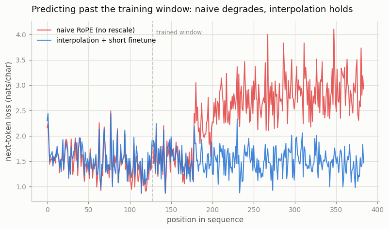

# Long-Context Extension

---

> A model trained on short text can often be stretched to long text by rescaling how it counts position.

---

## ELI5 (Explain Like I'm 5)

- **The Big Idea:** Our model learned to read 128 tokens at a time. Feed it 384
  and it falls apart past position 128 — it has never seen those RoPE "clock
  angles." Position interpolation is a clever cheat: *squeeze* the position
  numbers so 384 positions map back into the 0–128 range the model knows. That
  squeeze distorts distances, so we give it a short fine-tune to adjust — and now
  it reads 3× longer text almost as well as its original window.
- **Analogy:** You trained to read a 1-foot ruler. To read a 3-foot ruler, you
  don't relearn from scratch — you relabel it so 3 feet still "feels" like 1 foot
  (interpolation), then take a few practice reads to recalibrate your eye
  (fine-tune). Cheap, fast, and it works.
- **Example:** Past its 128-token training window, our model's loss balloons
  (perplexity **12.2**) with naive extension. Position interpolation plus a
  250-step fine-tune keeps it flat at perplexity **4.5** — essentially its
  in-window quality, all the way out to 384 tokens.

## Key Insight

A model trained at a 4k [context window](/shared/glossary/#context-window) can be extended to longer inputs by rescaling its [RoPE](/shared/glossary/#rope) angles — via [position interpolation](/shared/glossary/#position-interpolation) or [YaRN](/shared/glossary/#yarn) — usually with little or no retraining.

## Why This Matters

Pretraining at long context is expensive, so most long-context models are extended after the fact. Testing the result with a [needle-in-a-haystack](/shared/glossary/#needle-in-a-haystack) probe shows whether the model truly uses the new length or just tolerates it.

## What's in this directory

| File | Role |
|------|------|
| `long_context.py` | Loads the trained project-08 model, evaluates naive extension vs. position-interpolation-plus-finetune, and plots per-position loss |

```bash
python long_context.py --corpus data/corpus.txt      # ~4 min on CPU
```

It reuses the [project-08](../08-nanogpt-reproduction/README.md) checkpoint (trained
at a 128-token window) and the `rope_scale` knob added to its RoPE — position
interpolation is literally `scale = train_len / eval_len`.

## Results

**Naive extension breaks past the training window; interpolation holds.** Every
position gets its next-token loss measured out to 384 tokens (3× the 128-token
training window). Inside the window both are fine (~1.5); past it, naive RoPE
climbs steeply while interpolation-plus-finetune stays flat:



```
beyond the 128-token window:
  naive RoPE                     loss 2.500   (perplexity 12.2)
  interpolation + short finetune loss 1.507   (perplexity  4.5)
```

This is the needle-in-a-haystack question in miniature: *can the model still
predict correctly deep into a sequence longer than it trained on?* Naive: no —
quality collapses. Interpolated + briefly tuned: yes — it reads the long
sequence about as well as its native window.

## Why a rescale (plus a nudge) is enough

RoPE encodes position as a *rotation angle* (project 10), and angles can be
smoothly rescaled. Position interpolation multiplies every position index by
`train_len / eval_len`, so a length-384 sequence produces only the rotation
angles the model already saw at length 128 — no unseen extrapolation. The catch:
squeezing positions also squeezes every *relative* distance, so the model needs a
**short fine-tune** (here 250 steps) to recalibrate — exactly what the original
Position Interpolation paper does, and what YaRN refines with a smarter,
frequency-dependent rescale. The economics are the whole point: pretraining at
long context is enormously expensive, so nearly every long-context model
(Llama, Mistral, Qwen at 128k) is a shorter-context model *extended* this way.

## Things to try

- Push `--eval-len` to 512 or 768 and watch how far interpolation stretches
  before it, too, needs a bigger fine-tune.
- Skip the fine-tune (evaluate with the scale but no training) and confirm
  interpolation *alone* hurts — the relative-distance squeeze must be learned.
- Implement YaRN's frequency-dependent scaling (rescale low frequencies less than
  high ones) and compare against plain interpolation at the same eval length.
