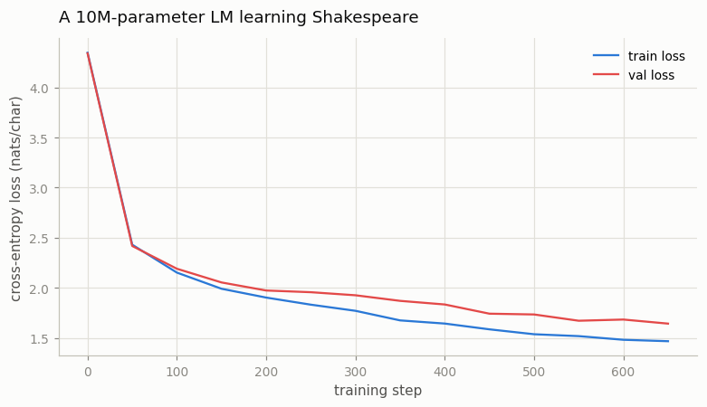

# Train a 10M-Parameter LM

---

> The whole training loop fits on one screen — train it until none of it feels like magic.

---

## ELI5 (Explain Like I'm 5)

- **The Big Idea:** Take the nanoGPT you built in project 08 and make it bigger —
  same skeleton, 10 million parameters instead of one. Then show it one puzzle,
  millions of times: "here are 128 characters of Shakespeare, guess the 129th."
  Every guess it gets wrong, it nudges its numbers a little. That nudge loop —
  guess, measure the miss, nudge — *is* pretraining, all the way up to the
  frontier. Nothing else is added; it's just made enormous.
- **Analogy:** Learning to write by covering the next word in a book and trying
  to fill it in, over and over, for a million pages. You never memorize the book;
  you absorb how the language flows.
- **Example:** Our 10.6M model, trained ~13 minutes on a CPU, drops from a loss of
  **4.35** (random guessing over 65 characters) to **1.64**, and starts writing
  lines like *"CAPULET: It sad, had do love is gentleman…"* — the words are
  invented, but the play format is unmistakable.

## Key Insight

A 10-million-[parameter](/shared/glossary/#parameters) [language model](/shared/glossary/#llm) trained on a tiny Shakespeare file is the smallest honest [pretraining](/shared/glossary/#pretraining) run. The model is too small to be useful, which is the point: it is small enough to read every line of the loop and watch the [next-token-prediction](/shared/glossary/#next-token-prediction) objective at work.

## Why This Matters

Watching your own [loss](/shared/glossary/#loss-function) curve fall, on your own machine, removes the mystery from the whole field. Every billion-dollar training run is this same loop — forward pass, loss, backward pass, optimizer step — scaled up.

## What's in this directory

| File | Role |
|------|------|
| `train.py` | Builds a ~10.6M GPT, trains it on tiny-shakespeare with the full loop spelled out, plots the loss curve, and samples text |

```bash
python train.py --corpus data/corpus.txt --steps 650      # ~13 min on CPU
python train.py --corpus data/corpus.txt --steps 450      # ~9 min, slightly higher loss
```

It reuses the GPT skeleton (`model.py`) from
[project 08](../08-nanogpt-reproduction/README.md) — this is the *same* nanoGPT,
scaled from 0.79M to 10.6M parameters (6 layers, `d=384`) by changing three numbers
in the `Config`. A genuine 10M model is meaningfully slower on a CPU than the 3M
nanoGPT, which is itself the first lesson in scaling.

## The entire objective is six lines

The heart of `train.py` is the loop below — the same one inside every pretraining
codebase, minus the distributed plumbing:

```python
x, y = data.batch("train", batch)     # (B, T) inputs, (B, T) targets shifted by one
logits, loss = model(x, y)            # teacher forcing: the model sees the TRUE previous chars
opt.zero_grad(); loss.backward()      # cross-entropy on every position, in one pass
clip_grad_norm_(model.parameters(), 1.0)
opt.step()                            # AdamW, with a warmup+cosine learning rate
```

`loss` is `F.cross_entropy(logits, next_tokens)` — nothing more. Because of
[teacher forcing](/shared/glossary/#teacher-forcing) and the
[causal mask](/shared/glossary/#causal-mask), all 128 next-token predictions in
a sequence are scored in a single forward pass, which is what makes training
parallel across positions.

## Results

**The loss falls log-linearly and the train/val gap stays small** — a healthy
run. Character-level cross-entropy drops from 4.35 (uniform over 65 characters)
to 1.64 on held-out text:



```
10.62M params · vocab 65 · 650 steps · final train loss 1.468 · final val loss 1.643
```

**And it writes (nonsense) Shakespeare.** Sampled at temperature 0.8 from a single
newline:

```
KING EDWARD IV:
When your will poor all gainst herself.
I do for your doubtle to beat issultites reversand,
I'll die me say to the high this fellow it.

CAPULET:
It sad, had do love is gentleman: then I
Shame I doth not, I will sins he weed? whose
gue in the fool of the sleasing from my hasting grave:
```

Not one word is real, yet the *structure* — capitalized speaker names, colons,
line breaks, blank lines between speeches, early-modern diction — was learned from
nothing but next-character prediction on a single megabyte of text.

## Why a 10M model isn't much better than a 3M one here

Project 08's 0.79M model reached ~1.49 val loss with 2500 steps; our 10.6M model
reaches 1.64 with 650 steps. Bigger did **not** win — because on a fixed CPU time
budget a larger model runs *fewer* steps, and tiny-shakespeare is easy enough that
a small model trained longer beats a big model trained briefly. That tension —
model size vs. tokens seen under a fixed compute budget — is exactly what
[scaling laws](/shared/glossary/#scaling-laws) formalize, and it is the subject of
[project 21](../21-reproduce-a-mini-chinchilla-plot/README.md). Here the lesson is
narrower and more important: **the loop is the loop at every scale.**

## Things to try

- Run `--steps 1500` and watch val loss keep falling toward ~1.4 — the 10M model
  *does* eventually beat the 3M one, it just needs the tokens.
- Print `model` and count parameters by hand: `12 · n_layer · n_embd²` is the
  rule-of-thumb for a transformer's non-embedding parameters.
- Sample at temperature 0.5 vs 1.1 — low is repetitive and correctly spelled, high
  is inventive and misspelled. Same knob as every chat UI's "temperature."
