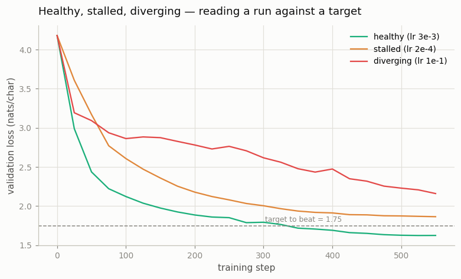

# Train a 100M-Parameter LM

---

> Ten times bigger, real web text, and a number to beat — the first run that feels like the real thing.

---

## ELI5 (Explain Like I'm 5)

- **The Big Idea:** A real training run has a *number to beat* — a validation loss
  you decide up front. The hard skill is not waiting eight hours to see if you got
  there; it's looking at the loss curve after a few minutes and *predicting*
  whether the run is healthy (on track), stalled (crawling, will miss), or
  diverging (bouncing around, hopeless). We train the same model three times,
  changing only one dial — the learning rate — and race all three at a target line.
- **Analogy:** Three runners and a finish line. One paces perfectly and crosses
  it; one jogs so gently they never arrive in time; one sprints wildly, trips, and
  staggers nowhere near the line. You can call the winner from the first lap.
- **Example:** Our target is **1.75**. The well-tuned run (lr 3e-3) crosses it by
  step 200 and finishes at **1.625**. The too-timid run (lr 2e-4) stalls at
  **1.864** and never gets there; the too-hot run (lr 1e-1) thrashes at **2.160**.
  Same model, same data, same budget — the learning rate decided everything.

## Key Insight

Scaling to 100 million [parameters](/shared/glossary/#parameters) and training on a slice of real web text (OpenWebText) is the first [pretraining](/shared/glossary/#pretraining) run that behaves like a production one. The concrete goal — push [validation loss](/shared/glossary/#validation-loss) below 3.5 — turns "is it working?" into a measurable target.

## Why This Matters

Real data, a real GPU, and a fixed time budget force the skill every practitioner needs: reading a [loss](/shared/glossary/#loss-function) curve to judge whether a run is healthy, stalled, or diverging — long before it finishes.

## Honest downscale

The guide's milestone — 100M parameters on OpenWebText, pushed below 3.5
validation loss — is an 8-hour A100 job. **The recipe is hardware-independent; the
numbers are not.** So this project runs the same experiment 10x smaller on a CPU:
a 2.7M character-level model, tiny-shakespeare instead of OpenWebText, and a
char-level target of **1.75 nats/char** instead of 3.5 (the two loss scales are
not comparable — one is per character, the other per BPE token). What transfers
exactly is the *skill*: set a target, then read the curve to judge whether you
will hit it.

## What's in this directory

| File | Role |
|------|------|
| `run_health.py` | Trains the same 2.7M model three times (only the peak LR changes) and races all three against a validation target |

```bash
python run_health.py --lr healthy    # 3e-3, warmup+cosine   (~7 min)
python run_health.py --lr low        # 2e-4, too small        (~7 min)
python run_health.py --lr high        # 1e-1, too large        (~7 min)
python run_health.py --plot          # the target figure
```

Reuses the GPT skeleton (`model.py`) from
[project 08](../08-nanogpt-reproduction/README.md); only the peak learning rate
differs between the three runs.

## Results

**Only the well-tuned run clears the bar.** All three start from the same loss;
the learning rate alone decides where they end up relative to the target line:



```
run       peak lr   final val   beat target 1.75?
healthy   3e-3      1.625       yes  (crossed at step 200)
stalled   2e-4      1.864       no   (descending far too slowly)
diverging 1e-1      2.160       no   (unstable, loss inflated)
```

The shapes are the whole lesson, and each is diagnosable within the first ~100
steps:

- **Healthy** — a smooth, log-linear descent that comfortably passes the target.
  This is what a run you should let finish looks like.
- **Stalled** — the LR is so small the model *is* learning, just far too slowly to
  hit the target in budget. The curve is smooth but almost flat; the fix is a
  bigger LR (or more steps), not more patience.
- **Diverging** — the LR is so large that updates overshoot; the loss is high and
  jittery and never settles. Left alone it wastes the entire run. The fix is a
  smaller LR, warmup, and gradient clipping (see
  [project 19](../19-loss-spike-forensics/README.md)).

## Reading a curve is the real skill

At production scale a single run can cost more than a car, and you cannot afford
to discover at hour eight that the LR was wrong. The value of this toy is that the
three failure signatures — healthy, stalled, diverging — look *exactly the same*
at 2.7M parameters on a CPU as they do at 100B on a cluster. Learn to name them
here, cheaply, and you will recognize them there, expensively. Everything else in
scaling — bigger `N`, more tokens `D`, better data — only matters once the run is
healthy enough to finish.

## Things to try

- Move `VAL_TARGET` to 1.60 and watch even the healthy run miss — a target is only
  meaningful relative to the compute you have.
- Add a fourth run at lr 3e-2 to find the edge between "healthy" and "diverging";
  the transition is surprisingly sharp.
- Swap the cosine schedule for constant (see
  [project 18](../18-lr-schedule-sweep/README.md)) at the healthy LR and see how
  much of the final descent came from the decay.
