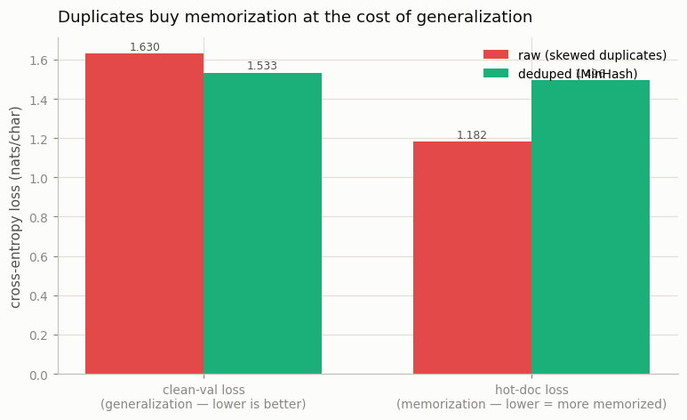

# Dedup Ablation

---

> Same model, same compute — the only difference is whether you removed the duplicates first.

---

## ELI5 (Explain Like I'm 5)

- **The Big Idea:** Real web data has some pages copied hundreds of times and
  most pages just once. If you train on it as-is, the model spends most of its
  effort memorizing the few over-copied pages and barely studies everything else —
  so it does worse on new text. We recreate that on purpose (copy a handful of
  documents 30 times), then use a clever fingerprinting trick called **MinHash** to
  find and delete the copies, and train two identical models to see the difference.
- **Analogy:** Studying for an exam from a stack of flashcards where 60% of the
  cards are duplicates of the same five facts. You'll ace those five and flunk the
  rest. Removing the duplicates lets you study the whole syllabus in the same time.
- **Example:** The model trained on the raw, duplicate-heavy crawl **memorizes**
  the over-copied documents (loss **1.18** on them) but generalizes *worse* to
  held-out text (**1.630**). Deduping first flips both: it no longer over-memorizes
  the hot docs (**1.50**) and generalizes **better** (**1.533**).

## Key Insight

An [ablation](/shared/glossary/#ablation) trains two identical 100M models that differ in one thing only: one sees raw web data, the other sees the same data after [deduplication](/shared/glossary/#deduplication) (here [MinHash](/shared/glossary/#minhash) near-duplicate removal). Comparing their [downstream](/shared/glossary/#downstream) scores isolates exactly what dedup buys you.

## Why This Matters

Removing duplicate documents is one of the highest-return moves in [pretraining](/shared/glossary/#pretraining) — duplicates waste compute and let the model memorize instead of generalize. Measuring the gain yourself shows why data cleaning, not architecture, dominates modern training.

## What's in this directory

| File | Role |
|------|------|
| `dedup_ablation.py` | Builds a skewed "crawl", removes near-duplicates with a from-scratch **MinHash + LSH**, trains two identical ~1.9M models, and evaluates generalization and memorization |

```bash
python dedup_ablation.py --run       # build corpora, train both models, evaluate  (~4 min)
python dedup_ablation.py --plot      # the figure
```

Reuses the GPT skeleton (`model.py`) from
[project 08](../08-nanogpt-reproduction/README.md). Both models are identical
(4 layers, `d=128`) and train for the same number of steps — the *only* difference
is the corpus.

## The experiment

We split tiny-shakespeare into ~740 documents, hold out 15% as clean validation,
then manufacture a realistic pathology: pick a small **hot** subset (5% of docs)
and duplicate each one **30 times** with a light per-copy perturbation (so the
copies are *near*- not exact-duplicates, exactly what a real crawl contains).

```
632 unique docs → 31 hot docs ×30 copies → raw crawl of 1562 docs
                  (59% of the crawl is now duplicate content)
```

**MinHash + LSH dedup, implemented from scratch** (`dedup()` in the script):

1. Shingle each document into 5-word sequences.
2. Hash the shingles under 64 independent hash functions; keep the **minimum** per
   function — that 64-number *signature* approximates Jaccard similarity.
3. Band the signature into 16 bands and bucket by band, so only documents that
   collide in some band are ever compared (LSH — the trick that makes dedup scale).
4. Union-find the confirmed near-duplicates and keep one representative each.

It recovers the truth almost exactly: **634 documents kept** vs. 632 genuinely
unique — 928 of the 930 duplicate copies removed.

## Results

**Duplicates buy memorization at the cost of generalization.** Trained for the
same number of steps, the raw-crawl model spends most of them on the hot docs:



```
corpus     clean-val loss   hot-doc loss
raw        1.630            1.182   ← memorized the over-copied docs, generalizes worse
deduped    1.533            1.496   ← treats every doc equally, generalizes better
```

Read the two bars together:

- **Hot-doc loss** (memorization): the raw model drives it down to 1.18 — it has
  *memorized* the handful of over-represented documents. The deduped model, which
  saw each hot doc only once, sits at 1.50, the same as any other document.
- **Clean-val loss** (generalization): despite — in fact *because of* — that
  memorization, the raw model is **worse** on held-out text (1.630 vs 1.533). The
  compute it poured into the hot docs was compute it did not spend learning the
  long tail.

That is the entire case for deduplication in one picture: duplicates don't add
information, they *reweight* the data distribution toward whatever happens to be
copied most, and the model faithfully overfits to it.

## Why this is one of the highest-ROI moves in pretraining

Dedup costs a single pass of MinHash and gives back both better generalization and
less memorization — the latter also matters for privacy (memorized training data
can be regurgitated). At real scale the skew is far worse than our 30x: some web
documents appear tens of thousands of times, and near-dedup (MinHash, as here, or
suffix-array methods) is standard in every serious pipeline — FineWeb, RefinedWeb,
The Pile, Dolma. The lesson generalizes past text: **cleaning the data distribution
beats tweaking the architecture.**

## Things to try

- Raise `DUP_TIMES` to 100 and watch the raw model's hot-doc loss crater while its
  clean-val loss climbs further — the pathology scales with the skew.
- Lower the LSH `thresh` and watch precision/recall of the dedup trade off: too
  loose merges distinct documents, too tight misses real near-duplicates.
- Replace the near-duplicate perturbation with exact copies and confirm MinHash
  still catches them (a signature match is a superset of exact match).
