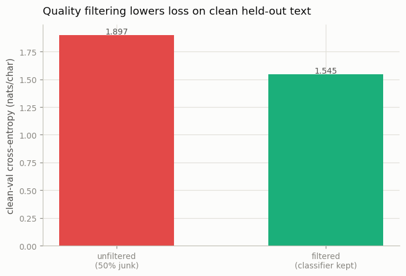

# Quality-Filter Ablation

---

> Let a classifier throw away the junk, then ask: did keeping only the "good" text actually help?

---

## ELI5 (Explain Like I'm 5)

- **The Big Idea:** The open web is half treasure, half garbage — keyboard mashing,
  spam, tag soup. Instead of training on all of it, you build a little classifier
  that scores each document "good" or "junk" and keep only the good. Does that
  actually make a better model? We build a half-junk corpus, filter it, and train
  two identical models to find out.
- **Analogy:** Studying from a library where half the "books" are pages of random
  letters. You'll waste half your study time on nonsense. A librarian who quietly
  removes the garbage books lets you spend all your time on the real ones.
- **Example:** Our classifier tells good Shakespeare from synthetic junk perfectly
  (100% accuracy — the junk is deliberately obvious). Trained on the raw 50%-junk
  mix, the model reaches **1.897** on clean held-out text. Trained on the *filtered*
  corpus, it reaches **1.545** — a big jump, from spending every step on real text.

## Key Insight

This [ablation](/shared/glossary/#ablation) repeats the dedup experiment with a different lever — a [quality filter](/shared/glossary/#quality-filter), a classifier that keeps only educational-looking text. Two identical models, one trained on filtered data and one without, reveal the filter's true effect.

## Why This Matters

Aggressive quality filtering (as in [FineWeb-Edu](/shared/glossary/#fineweb-edu)) is one of the biggest drivers of modern model quality, but "quality" is a judgment call baked into a classifier. Running the ablation teaches you to trust measured downstream gains over intuition about what "good data" means.

## What's in this directory

| File | Role |
|------|------|
| `quality_filter.py` | Builds a half-junk corpus, trains a from-scratch logistic-regression quality classifier on cheap surface features, filters, and trains two identical ~1.9M models |

```bash
python quality_filter.py --run       # build corpus, train classifier + both LMs  (~4 min)
python quality_filter.py --plot      # the figure
```

Reuses the GPT skeleton (`model.py`) from
[project 08](../08-nanogpt-reproduction/README.md); both models are identical and
train for the same number of steps — only the corpus differs.

## The classifier

Half of the "crawl" is tiny-shakespeare, half is synthetic junk of four kinds:
character noise, repeated keyboard mash, single-word spam, and markup/SEO tag
soup. The quality classifier (a **logistic regression, implemented from scratch**)
scores each document from six cheap surface features — fraction of letters, junk-
symbol density, mean word length, lexical diversity, most-frequent-character share,
and uppercase ratio — exactly the flavor of signal a FineWeb-Edu classifier learns,
only simpler.

```
classifier: accuracy 1.00 | precision 1.00 | recall 1.00
corpus: 1580 docs (50% junk)  →  filtered to 790 docs
```

The 100% accuracy is a feature of the *toy*: synthetic junk is trivially separable.
Real quality classification is far harder and much more subjective — which is
exactly why measuring the downstream effect, rather than trusting the classifier's
confidence, matters.

## Results

**Filtering the junk out is worth ~0.35 nats/char on clean held-out text.** Both
models trained for the same number of steps; the only difference is that the
unfiltered model spent half of them modeling gibberish:



```
corpus        clean-val loss
unfiltered    1.897     ← half the gradient steps spent on junk
filtered      1.545     ← every step spent on real text
```

The unfiltered model isn't "broken" — it fits the junk perfectly well (junk is
easy: random noise and repetition have low entropy). The problem is *opportunity
cost*: at a fixed compute budget, every step spent learning the statistics of tag
soup is a step not spent learning English, and it shows on held-out clean text.

## Why quality filtering is one of the biggest levers in modern pretraining

FineWeb-Edu's headline result was that an aggressive educational-quality filter let
a model match or beat one trained on far more unfiltered tokens — data quality
substituting for data quantity. This toy reproduces the mechanism: the filtered
model reaches a loss the unfiltered one cannot, on identical compute. The catch the
project also teaches: "quality" is *defined by the classifier*. Ours is trivially
right because the junk is synthetic; a real classifier encodes real, contestable
judgments about what counts as good text — which is why you always validate a
filter by its measured downstream gain, never by how confident it sounds.

## Things to try

- Make the junk subtler (light typos, mild repetition) and watch classifier
  accuracy — and the downstream gap — both shrink toward the hard, realistic regime.
- Filter at different thresholds (keep the top 30% vs. top 70% by score) and plot
  clean-val loss vs. how much data you threw away — there is a sweet spot.
- Combine with [dedup](../16-dedup-ablation/README.md): filter *then* dedup, and
  see whether the two data-cleaning gains stack.
