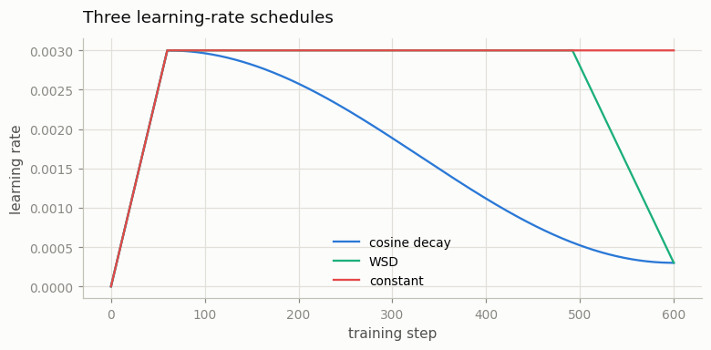
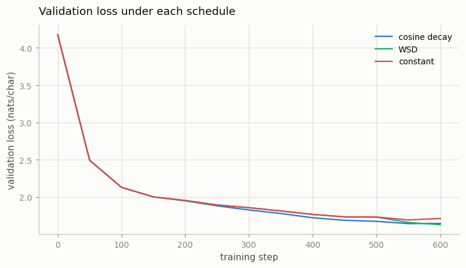

# LR Schedule Sweep

---

> The learning rate is one number that changes over training — how you change it quietly decides where you land.

---

## ELI5 (Explain Like I'm 5)

- **The Big Idea:** The learning rate is how big a step the model takes each update.
  You don't keep it fixed — you *warm it up* (small steps first, so the fresh model
  doesn't lurch), then *decay it* (small steps at the end, to settle into a good
  spot). We try three ways of decaying it on the identical model and see which
  lands lowest.
- **Analogy:** Parking a car. You approach at a steady speed (warmup done), then
  ease off the gas as you near the spot (decay). Slam it in "constant" full-speed
  and you overshoot the space; coast in gently and you land dead center.
- **Example:** All three schedules share the same warmup and peak. The two that
  **decay** — cosine (**1.647**) and WSD (**1.630**) — finish clearly below the one
  that stays flat (**constant, 1.714**). WSD spends almost the whole run at full
  speed, then drops the rate in a short tail — and that late plunge wins by a hair.

## Key Insight

A [sweep](/shared/glossary/#sweep) trains the same model under different learning-rate schedules — [cosine decay](/shared/glossary/#cosine-decay), [WSD](/shared/glossary/#wsd), and constant — and compares final [validation loss](/shared/glossary/#validation-loss) and downstream scores. The schedule controls how the [learning rate](/shared/glossary/#learning-rate) rises during [warmup](/shared/glossary/#warmup) and falls afterward.

## Why This Matters

The schedule is one of the cheapest hyperparameters to get wrong and one of the highest-leverage to get right. Seeing the curves side by side builds intuition for why nearly every large run warms up then decays, and when the newer WSD recipe wins.

## What's in this directory

| File | Role |
|------|------|
| `lr_sweep.py` | Trains the identical ~1.9M model three times — cosine, WSD, constant — and plots both the schedules and the validation loss they produce |

```bash
python lr_sweep.py --sched cosine     # ~3 min each
python lr_sweep.py --sched wsd
python lr_sweep.py --sched constant
python lr_sweep.py --plot
```

Reuses the GPT skeleton (`model.py`) from
[project 08](../08-nanogpt-reproduction/README.md). Every run is identical except
the learning-rate schedule; all three share the same warmup (60 steps), peak
(3e-3), and step budget.

## The three schedules



- **Cosine decay** — warm up, then follow a half-cosine down to 10% of peak. The
  default for a decade of LLM training; the LR is always gently falling.
- **WSD (Warmup-Stable-Decay)** — warm up, hold at peak for most of the run, then
  decay sharply in a short tail (here the last 20%). Because the "stable" phase is
  a flat line, you can stop and resume without re-warming — which is why WSD is the
  modern choice for continued pretraining.
- **Constant** — warm up, then never decay. The control.

## Results

**Both decaying schedules beat the constant one; WSD edges cosine.**



```
schedule    final val loss
WSD         1.630     ← best (the short decay tail does a lot of work)
cosine      1.647
constant    1.714     ← never annealed; leaves ~0.08 nats on the table
```

The mechanism is visible in the curves. Through the middle of training, WSD (held
at peak LR) actually tracks *above* cosine — a high, constant LR keeps bouncing
around the loss basin. Then WSD's decay tail kicks in and the loss drops sharply
past cosine's. That final annealing — taking smaller and smaller steps so the
model settles into the bottom of the basin instead of skating over it — is where
a decaying schedule earns its ~0.08 nats/char over the constant run.

## Why nearly every large run decays (and when WSD wins)

A high LR explores; a low LR exploits. You want to explore early (the loss surface
is far from any minimum) and exploit late (settle in). Cosine bakes that trade-off
into a smooth curve. WSD makes the *stable* phase a flat line, which buys a
practical superpower: you can **checkpoint mid-run and continue training later
without re-warming**, because you never left the peak. That is exactly what
[continued pretraining](../20-continued-pretraining/README.md) needs, and why WSD
has become the recipe of choice for models that are trained in stages. At this toy
scale the two decaying schedules are within a whisker of each other; the reason to
prefer WSD is operational, not a fraction of a nat.

## Things to try

- Extend the WSD decay tail from 20% to 40% and see whether a longer anneal helps
  or whether the extra low-LR steps are wasted.
- Lengthen every run to 2000 steps: the gap between decaying and constant *widens*,
  because the constant run's late-training bouncing compounds.
- Add a second cosine run that decays to 0 instead of 10% of peak and compare —
  most recipes stop at ~10% for a reason.
