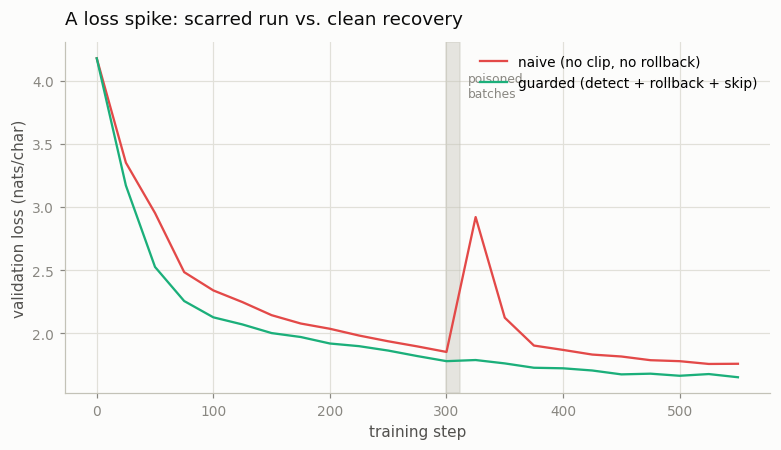
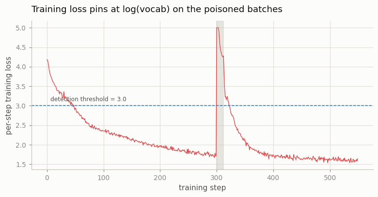

# Loss-Spike Forensics

---

> Make the loss explode on purpose, then practice the recovery you will need at 3 a.m.

---

## ELI5 (Explain Like I'm 5)

- **The Big Idea:** Sometimes during training a bad batch of data sends the loss
  shooting up and scrambles the model's weights. If you do nothing, that damage can
  linger for the rest of the run. The professional move is a reflex:
  **detect** the spike, **roll back** to your last good save, **skip** the bad
  batch, and **resume**. We trigger a spike on purpose and compare doing nothing
  vs. doing the reflex.
- **Analogy:** Writing an essay in a document with autosave. You paste in a chunk
  of garbage and it corrupts the formatting. One writer keeps typing on the broken
  document (naive); the other hits *undo to last save*, skips the bad paste, and
  carries on clean (guarded).
- **Example:** At step 300 we feed 12 batches of pure random text. The naive run's
  validation loss jumps from 1.85 to **2.92** and never fully heals (ends 1.759).
  The guarded run sees the training loss pin at **7.6** (way past its trip wire of
  3.0), rolls back to its step-300 checkpoint, skips the poison, and its curve
  doesn't even flinch — ending at **1.653**.

## Key Insight

This project deliberately triggers a [loss spike](/shared/glossary/#loss-spike) — with a too-large learning rate or a poisoned batch — then diagnoses it, fixes the cause, and resumes training from the last [checkpoint](/shared/glossary/#checkpoint). It is [forensics](/shared/glossary/#forensics) applied to a training run.

## Why This Matters

Real [pretraining](/shared/glossary/#pretraining) runs spike, and a [frontier run](/shared/glossary/#frontier-run) that cannot recover cleanly wastes days of GPU time. Rehearsing the detect-rollback-skip-resume loop on a toy model builds the muscle memory that protects expensive runs.

## What's in this directory

| File | Role |
|------|------|
| `spike_forensics.py` | Trains the same model twice through an injected spike — once with no defenses, once with the detect→rollback→skip→resume loop — and plots both |

```bash
python spike_forensics.py --run      # train both, record loss + interventions  (~4 min)
python spike_forensics.py --plot     # the two figures
```

Reuses the GPT skeleton (`model.py`) from
[project 08](../08-nanogpt-reproduction/README.md). Both runs are identical until
the spike; the only difference is how each responds.

## The recovery loop

At step 300 we inject a burst of 12 **poisoned batches** — uniform-random tokens.
A random-token batch is the perfect test signal: its loss pins near `log(vocab)`
*regardless of the current weights*, so it is impossible to miss.

- **naive** — no gradient clipping, no detection. It trains straight through the
  poison; the unclipped gradients scramble the weights.
- **guarded** — the full kit: clip the gradient, watch the per-step training loss,
  and when it crosses a threshold (here 3.0), **roll back** to the last checkpoint,
  **skip** past the poisoned region, and **resume**. Checkpoints are taken every 50
  steps into memory.

## Results

**Same spike, two fates.** The naive run is scarred; the guarded run rolls back and
never feels it.



```
run       final val   intervention
naive     1.759       none — trained through the poison, loss still elevated
guarded   1.653       1  — detected at step 300, rolled back, skipped the burst
```

The validation curve tells the story: right after the poison the naive run spikes
to **2.92** and, with only 250 steps left, limps back to 1.759 — a permanent scar
on the run. The guarded run's curve doesn't move: it detected the very first
poisoned batch, restored the step-300 checkpoint, and skipped ahead, so the poison
never touched its weights.

The detector watches one number — the per-step training loss — which pins near
`log(65) ≈ 4.2` and above during the poison, far past the trip wire:



```
peak training loss during poison: 7.59   (healthy steps sit near 1.5)
detection threshold:              3.00
```

## Why rehearse this on a toy

At frontier scale a single run costs more than a house and lasts weeks; loss spikes
are *expected*, not exceptional (the OPT-175B and BLOOM training logs are famous for
them). The teams that finish are the ones with the reflex wired in: automatic
grad-norm/loss monitors, frequent checkpoints, and tooling that rolls back and skips
a bad shard without a human awake. The mechanics are identical to this toy —
checkpoint, watch a scalar, roll back on a trip — only the checkpoint is terabytes
and the pager goes off at 3 a.m. Building the muscle memory here, where a mistake
costs four minutes, is the whole point.

## Things to try

- Remove the rollback but keep the gradient clipping and re-run: clipping *alone*
  softens the spike but still leaves a scar — rollback is what fully erases it.
- Move the spike to step 500 (near the end) and watch the naive run finish far worse
  — less time to heal means a bigger permanent scar.
- Lower the detection threshold toward the healthy loss and watch false positives
  begin to roll back good steps: too twitchy a detector wastes progress too.
