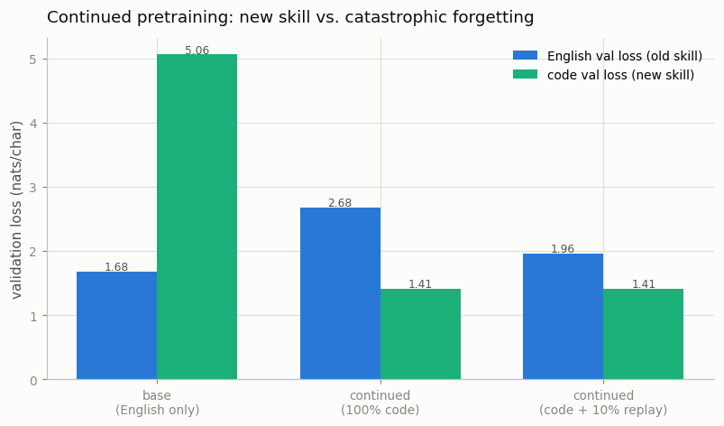

# Continued Pretraining

---

> Pick up an existing model and keep teaching it — without making it forget what it already knew.

---

## ELI5 (Explain Like I'm 5)

- **The Big Idea:** Training a model from scratch is expensive, so usually you take
  one that already knows a lot and *keep* training it on your special data. The
  danger: if you only show it the new stuff, it gets great at that and quietly
  *forgets* the old stuff — like cramming for a chemistry exam and blanking on the
  history you knew last week. The fix is simple: while teaching the new material,
  keep sprinkling in a little of the old ("replay").
- **Analogy:** Moving to a new country and speaking only the new language for a
  year — you become fluent, but your first language rusts. Call home once a week
  (replay) and you keep both.
- **Example:** We pretrain a model on Shakespeare (English loss **1.68**, but it's
  clueless about code — loss **5.06**). Continue training it on Python: it *learns
  code* (5.06 → **1.41**) but *forgets English* (1.68 → **2.68**). Mixing in just
  10% Shakespeare during that training keeps the code gain (**1.41**) while
  cutting the forgetting by ~70% (English only rises to **1.96**).

## Key Insight

[Continued pretraining](/shared/glossary/#continued-pretraining) takes an open base model and trains it further on a specialized corpus (say, 1B tokens of medical or legal text). The experiment measures both the new capability gained and how much of the original ability is lost to [catastrophic forgetting](/shared/glossary/#catastrophic-forgetting).

## Why This Matters

Most teams will never pretrain from scratch, but many will adapt an existing model to their domain. Adding knowledge without erasing the base model's general skills is the practical core of [pretraining](/shared/glossary/#pretraining) work outside the frontier labs.

## What's in this directory

| File | Role |
|------|------|
| `continued_pretrain.py` | Pretrains a base LM on English, continues it on Python two ways (naive and with replay), and measures capability gained vs. forgetting |

```bash
python continued_pretrain.py --run       # base + two continuations + evaluation  (~6 min)
python continued_pretrain.py --plot      # the figure
```

Reuses the GPT skeleton (`model.py`) from
[project 08](../08-nanogpt-reproduction/README.md). The Python corpus is read
straight from the local standard library (`/usr/lib/python3*`), so nothing is
downloaded. English and code share **one character vocabulary**, so the two
validation losses are directly comparable.

## The experiment

Two genuinely different domains, one shared tokenizer:

1. **Base** — pretrain from scratch on tiny-shakespeare (English).
2. **Naive continue** — take the base and train it further on 100% Python code.
3. **Replay continue** — take the base and train it on Python, but mix **10%**
   Shakespeare back into every batch.

All three are evaluated on the same held-out English *and* held-out code, so we can
watch both the skill gained and the skill lost.

## Results

**You can add a skill, but the naive way quietly erases the old one — and replay
mostly prevents it.**



```
model                     English val   code val
base (English only)       1.678         5.063     ← fluent English, clueless at code
continued (100% code)     2.681         1.411     ← learned code, FORGOT English
continued (code + replay) 1.962         1.413     ← learned code, kept most English
```

Read it as a ledger:

- **Capability gained** — both continuations slash code loss from 5.06 to ~1.41.
  Continued pretraining works: the model genuinely learned a new domain.
- **Catastrophic forgetting** — the naive run paid for it by letting English loss
  balloon from 1.68 to **2.68**. The weights that encoded English got overwritten
  by code, because the model never saw English again.
- **Replay is cheap and effective** — reserving just 10% of each batch for the
  original data holds English at **1.96** (a +0.28 regression instead of +1.00,
  roughly 70% less forgetting) at **no cost to the code gain** (1.413 vs 1.411).

## Why this is the shape of most real adaptation work

Almost nobody pretrains a frontier model; almost everybody adapts one. Domain
adaptation (medical, legal, code, a new language), and even the "mid-training"
anneal that frontier labs run before post-training, is continued pretraining, and
it lives or dies on this exact trade-off. Replay is the first-line defense; the
others you will meet later are parameter-efficient tuning
([LoRA](../30-lora-qlora/README.md), which freezes the base weights so there is
less to forget) and rehearsal on a frozen copy's outputs. The mechanism to
internalize: **a network only protects what it keeps seeing.** Stop showing it a
skill and gradient descent will happily spend those weights on whatever you *are*
showing it.

## Things to try

- Sweep the replay fraction over `{0, 5, 10, 25}`% and plot forgetting vs. code gain
  — there is a knee where a little replay buys most of the protection.
- Lower the continuation learning rate and watch forgetting shrink (small steps
  disturb the base weights less) — at the cost of slower code learning.
- Freeze the token embeddings during continuation and see how much of the
  forgetting was in the embedding table vs. the transformer blocks.
