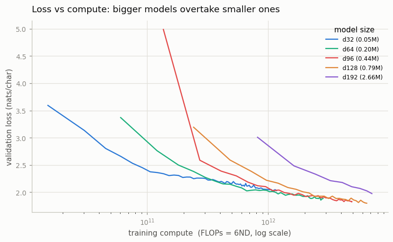
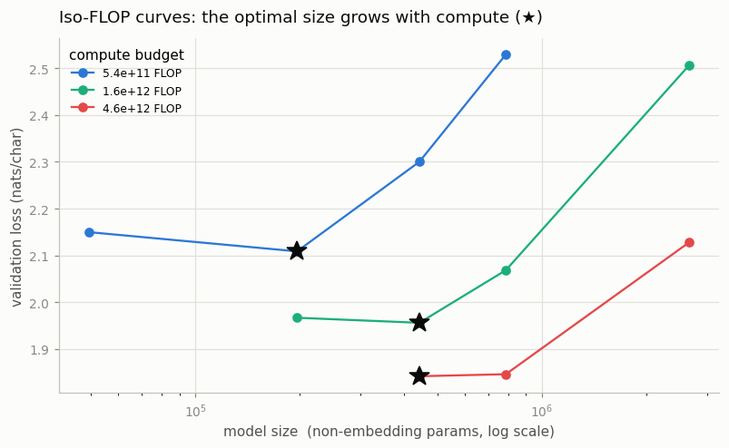

# Reproduce a Mini-Chinchilla Plot

---

> Train seven small models and watch the scaling law draw its own curve.

---

## ELI5 (Explain Like I'm 5)

- **The Big Idea:** For a fixed compute budget there's a "just right" model size:
  too small and it doesn't have the capacity to use the compute; too big and it
  runs out of steps before it learns anything. We train five sizes, each under the
  same time budget, and watch a U-shaped curve appear — and the bottom of that U
  (the best size) slides toward *bigger* models as we spend more compute. That
  sliding bottom is the whole Chinchilla result.
- **Analogy:** Cooking with a fixed amount of gas. A tiny pot heats fast but can't
  hold the meal; a huge pot never comes to a boil before the gas runs out. There's
  a right-sized pot — and if you're given more gas, the right pot gets bigger.
- **Example:** With a small compute budget (`5.5e11` FLOPs) the best of our models
  is the 0.2M-parameter one; give it ~8× more compute (`4.6e12`) and the winner
  grows to 0.44M. Optimal size climbing with compute — `N ∝ √C` — is exactly what
  Chinchilla found at the billion-parameter scale.

## Key Insight

[Scaling laws](/shared/glossary/#scaling-laws) say a model's [loss](/shared/glossary/#loss-function) falls in a smooth, predictable way as you add [parameters](/shared/glossary/#parameters), data, and compute. Training seven models from 10M to 500M parameters — each given the right number of tokens for its size — and plotting their [iso](/shared/glossary/#iso)-[FLOP](/shared/glossary/#flops) loss curves reproduces the [Chinchilla](/shared/glossary/#chinchilla) result in miniature: for a fixed compute budget, there is one model size that wins.

## Why This Matters

Seeing the curve emerge from your own runs makes scaling laws believable. They are what let a lab predict a giant model's loss from a handful of small ones — the forecast that justifies betting millions of dollars on a single training run.

## What's in this directory

| File | Role |
|------|------|
| `chinchilla.py` | Trains five model sizes under a fixed wall-clock budget, logs loss vs compute, and extracts iso-FLOP U-curves and their optima |

```bash
python chinchilla.py --run --budget-sec 100     # ~9 min on CPU (5 sizes)
python chinchilla.py --plot
```

Reuses the GPT skeleton (`model.py`) from
[project 08](../08-nanogpt-reproduction/README.md). The guide's target is seven
models from 10M–500M on a GPU; on a CPU we shrink to **five** sizes (0.05M–2.7M),
but the method — Chinchilla's "Approach 1", reading iso-FLOP slices off training
curves — is identical, and 4× cheaper than a full size×budget grid because each
size is trained only once.

## The method

Each model is given the *same wall-clock budget* (100s), so small models take many
steps and big models take few. We log validation loss against cumulative compute,
`FLOPs = 6ND` (from [project 22](../22-compute-calculator/README.md)). Then:

- **loss vs compute** — plot every model's curve on a shared FLOP axis;
- **iso-FLOP slices** — read each model's loss at a few fixed FLOP budgets, giving
  loss-vs-size U-curves whose minimum is the compute-optimal size for that budget.

## Results

**On the FLOP axis, the size curves cross.** A small model is ahead at low compute
(it learns fast) but plateaus; a bigger model starts behind and overtakes it once
there's enough compute to train it. The lower envelope of all curves is the
compute-optimal frontier:



**Slicing at fixed budgets gives U-curves whose minima march right.** Each ★ marks
the best model size for that compute budget — and it moves to larger models as the
budget grows:



```
compute budget      compute-optimal size
5.5e11 FLOP         0.197M params  (d64)
1.6e12 FLOP         0.443M params  (d96)
4.6e12 FLOP         0.443M params  (d96)

per-model final loss (each after ~100s):
d32  0.049M → 2.034     d128 0.787M → 1.798
d64  0.197M → 1.886     d192 2.657M → 1.975  (under-trained: only 220 steps)
d96  0.443M → 1.829
```

The `d192` point is the lesson in one number: it is the *biggest* model yet has a
*worse* final loss than `d128`, because in a fixed budget it managed only 220 steps
and never got trained. Bigger is not better — *compute-optimal* is better.

## Why a lab bets millions on this curve

The frontier here is drawn from five toy runs, but the shape is the same one
Chinchilla measured across three orders of magnitude: for a fixed compute `C`, the
optimal model size grows like `√C` and the optimal token count grows like `√C` too
(so the ratio `D/N` stays roughly constant — famously ~20 tokens/param for
BPE-tokenized data). That regularity is what lets a lab train a handful of small
models, fit the power law, and *predict* the loss of a model that would cost
millions to train — before spending a cent on it. The corollary bites in both
directions: the original GPT-3 was, by Chinchilla's accounting, far too big for its
token budget (under-trained), and Chinchilla itself was a *smaller* model than
Gopher that beat it by being trained on the right amount of data.

## Things to try

- Increase `--budget-sec` and watch the optimal size at the top budget grow — more
  compute, bigger optimum, every time.
- Add a `d256`/`d384` size: at these budgets it lands on the under-trained arm, but
  with a larger budget it becomes the winner, extending the frontier right.
- Read each model's `D/N` (tokens ÷ params) at its optimum and see how close the
  ratio is to constant — the character-level optimum differs from the BPE ~20, and
  finding your own is the point.
