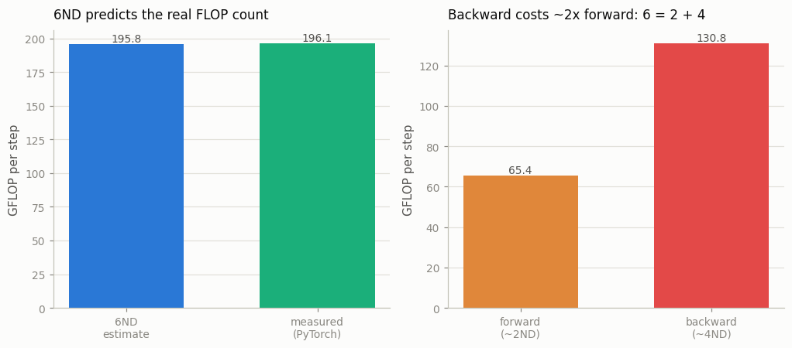

# Compute Calculator

---

> Six times parameters times tokens — the whole cost of a training run on the back of an envelope.

---

## ELI5 (Explain Like I'm 5)

- **The Big Idea:** You can predict how much arithmetic a training run needs before
  you run it, with one tiny formula: `6 × N × D`, where `N` is the number of model
  parameters and `D` is the number of tokens you'll train on. This project checks
  that envelope estimate against what a real run *actually* does — counted by
  PyTorch and timed by a stopwatch.
- **Analogy:** Estimating a road trip's fuel as *distance × your car's average
  consumption*. It's a one-line guess, but it's shockingly accurate — accurate
  enough to decide whether you can afford the trip before you turn the key.
- **Example:** Our 10.6M-parameter model on 3,072 tokens/step should cost
  `6ND = 195.8 GFLOP`. PyTorch's counter measures **196.1 GFLOP** — a 0.2% miss.
  The forward pass is **65 GFLOP** (`≈ 2ND`) and the backward **131 GFLOP**
  (`≈ 4ND`): that 2-to-4 split is literally where the "6" comes from.

## Key Insight

A forward-and-backward pass over a dense [transformer](/shared/glossary/#transformer) with `N` [parameters](/shared/glossary/#parameters) on `D` tokens costs roughly `6 N D` [FLOPs](/shared/glossary/#flops). This project implements that one formula and checks its prediction against a real run's measured wall-time and FLOPs.

## Why This Matters

Being able to estimate training compute in your head turns a vague worry ("can I afford this run?") into simple arithmetic. It is the first sanity check you do before committing a single GPU-hour.

## What's in this directory

| File | Role |
|------|------|
| `compute_calculator.py` | Implements `6ND`, validates it against PyTorch's `FlopCounterMode`, splits forward vs backward, and converts wall-time into achieved FLOP/s and MFU |

```bash
python compute_calculator.py      # ~1 min on CPU
```

Reuses the GPT skeleton (`model.py`) from
[project 08](../08-nanogpt-reproduction/README.md).

## Where the "6" comes from

```
forward pass    ≈ 2 N D    each parameter is one multiply-add (2 FLOPs) per token
backward pass   ≈ 4 N D    grad-w and grad-x each cost about as much as the forward
                ---------
total           ≈ 6 N D
```

`N` here is the **non-embedding** parameter count — the weights that participate in
matmuls at every position. The embedding lookup is a gather, not a matmul, so it
doesn't enter the `6ND` matmul budget.

## Results

**The envelope is nearly exact.** PyTorch's FLOP counter agrees with `6ND` to
within a fraction of a percent, and the measured forward/backward split is exactly
the `2:4` the derivation predicts:



```
model: 10.62M non-embedding params · 3072 tokens/step
6ND estimate      195.8 GFLOP
measured total    196.1 GFLOP   (ratio 1.002)
  forward          65.4 GFLOP   (~2ND → 1.00x)
  backward         131.0 GFLOP  (~4ND → 1.00x)
```

**And the same run, timed, gives an MFU.** Dividing measured FLOPs by the step's
wall-time gives an *achieved* throughput; dividing that by this machine's measured
dense-matmul peak gives [MFU](/shared/glossary/#mfu) — the fraction of the hardware's
raw arithmetic you actually captured:

```
step time          1041 ms
achieved            188 GFLOP/s
CPU matmul peak     547 GFLOP/s
MFU                34.4 %
```

34% MFU on a laptop CPU is unremarkable — Python overhead, attention's non-matmul
work, and cache misses all eat into it. On a well-tuned GPU cluster the same number
is the headline metric: 40-55% MFU is considered excellent, and the multi-node
[project 27](../27-multi-node-training/README.md) is entirely about defending it.

## Why this is the first thing you compute

`6ND` turns "can I afford this?" into arithmetic you can do in your head. A 7B model
on 2T tokens is `6 × 7e9 × 2e12 ≈ 8.4e22` FLOPs; a GPU that sustains `4e14` FLOP/s
(≈40% of an H100's BF16 peak) needs `8.4e22 / 4e14 ≈ 2.1e8` seconds of *single-GPU*
time — about 6.7 GPU-years, i.e. a ~1,000-GPU cluster for a few days. Every capacity
plan, budget, and Chinchilla-style trade-off (see
[project 21](../21-reproduce-a-mini-chinchilla-plot/README.md)) starts from this one
multiplication.

## Things to try

- Change `n_embd` and confirm measured FLOPs scale as `N` (≈ `d²` per layer), and
  that the `6ND` prediction tracks it every time.
- Add activation checkpointing (see [project 24](../24-activation-checkpointing-study/README.md))
  and watch measured FLOPs rise above `6ND` — recomputation is extra forward passes
  the envelope doesn't count.
- Compute the FLOPs for a real model you use (`N` from its config, `D` from its
  token budget) and sanity-check the reported training cost against `6ND`.
