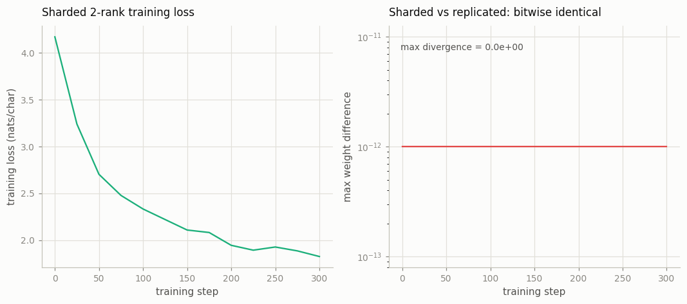

# FSDP from Scratch (Toy)

---

> Split the model across two GPUs by hand, and the magic of sharded training disappears.

---

## ELI5 (Explain Like I'm 5)

- **The Big Idea:** A big model plus its optimizer state can be too large to fit on
  one device. FSDP splits the model into slices and gives each worker just one
  slice to *own*. Every step the workers briefly **all-gather** the full weights to
  do the math, average their gradients, then each worker updates only *its* slice.
  We build that by hand and prove it gives the *exact same numbers* as the ordinary
  (everyone-holds-everything) way.
- **Analogy:** Four friends assembling one giant IKEA wardrobe. Instead of each
  keeping a full copy of the instructions and all the screws, each keeps one
  chapter and its screws. They lay everything out together to build (all-gather),
  then each files away only their own chapter and hardware — a quarter of the
  clutter each, same wardrobe.
- **Example:** Sharding our model across 2 ranks cuts each rank's master weights
  from **3.18 MB to 1.59 MB** (half). And the sharded run's weights match a fully
  replicated run's **to the bit** — max divergence **0.00** — because sharding only
  *partitions* the identical update.

## Key Insight

[FSDP](/shared/glossary/#fsdp) (Fully Sharded Data Parallel) splits a model's [weights](/shared/glossary/#weights), [gradients](/shared/glossary/#gradients), and [optimizer state](/shared/glossary/#optimizer-state) across GPUs so no single GPU has to hold the whole thing. Building a toy version by hand on 2 GPUs — and checking it reaches the same result as plain [data parallelism](/shared/glossary/#data-parallelism) — shows exactly what the library does for you.

## Why This Matters

[AdamW](/shared/glossary/#adamw)'s [optimizer state](/shared/glossary/#optimizer-state) alone is several times the size of the model, so large models do not fit on one GPU. Sharding with FSDP (and its cousin [ZeRO](/shared/glossary/#zero)) is what makes training beyond a few billion parameters possible at all.

## What's in this directory

| File | Role |
|------|------|
| `fsdp_toy.py` | Hand-rolled whole-model sharding over gloo ranks (all-gather → compute → reduce → per-shard update), with a replicated reference that proves bitwise equivalence |

```bash
torchrun --nproc_per_node=2 fsdp_toy.py     # shard across 2 ranks (CPU processes)
python fsdp_toy.py --plot
```

Reuses the GPT skeleton (`model.py`) from
[project 08](../08-nanogpt-reproduction/README.md). We use CPU processes over the
gloo backend as stand-in "GPUs", and shard the *whole* model at once — a toy
simplification; real FSDP shards layer-by-layer so the gathered full copy is only
ever one layer.

## The four operations, by hand

```
each step, on every rank:
  1. all-gather   — reconstruct the full weights from every rank's shard
  2. forward/backward on this rank's slice of the batch  (data parallelism)
  3. all-reduce   — average the gradients across ranks
  4. update       — each rank steps the optimizer on ONLY its shard
```

Steps 2–3 are ordinary data parallelism; steps 1 and 4 are the FSDP part. The whole
thing is ~40 lines using `all_gather`, `all_reduce`, and
`parameters_to_vector` / `vector_to_parameters`.

## Results

**Half the memory per rank, identical math.** Sharding halves each rank's master
weights (and, in a real run, its AdamW state too — the bigger prize, since Adam's
state is ~2× the weights). Against a replicated reference fed the identical averaged
gradient, the sharded weights never diverge — because AdamW is elementwise, so
"who owns which element" cannot change the result:



```
world size                          2
total params                        0.795M
sharded master / rank               1.59 MB   (half)
replicated master / rank            3.18 MB
max sharded-vs-replicated divergence  0.00e+00   ← bitwise identical
```

The right panel is the proof: the maximum difference between the sharded and the
fully-replicated weights stays at exactly zero for the whole run. FSDP is not an
approximation of data parallelism — it *is* data parallelism, with the redundant
copies deleted.

## Why sharding is what unlocks large models

Count the memory a dense model needs to train in mixed precision: ~2 bytes/param
for the bf16 weights, ~2 for the bf16 gradient, and for AdamW ~12 more (fp32 master
weight + fp32 momentum + fp32 variance) — roughly **16 bytes per parameter**. A 7B
model is ~112 GB of state before a single activation, which does not fit on an 80 GB
card. [FSDP](/shared/glossary/#fsdp) / [ZeRO](/shared/glossary/#zero) shard all of
it across `N` ranks, so each holds `1/N`, and 7B — or 70B, or 400B — suddenly fits.
The cost is the communication (the all-gather/all-reduce traffic that
[project 27](../27-multi-node-training/README.md) measures); the payoff is that the
model fits at all.

## Things to try

- Run `--nproc_per_node=4` and watch each rank's shard drop to a quarter — the
  memory saving is exactly `1/world`.
- Shard *layer-by-layer* instead of the whole model at once, gathering each block's
  weights just before its forward and freeing them after — that's the real FSDP,
  and it keeps the peak "unsharded" copy tiny.
- Add the AdamW optimizer state to the memory tally and confirm sharding it is the
  bigger win: fp32 momentum + variance are ~8 bytes/param vs the 2-byte bf16 weight.
