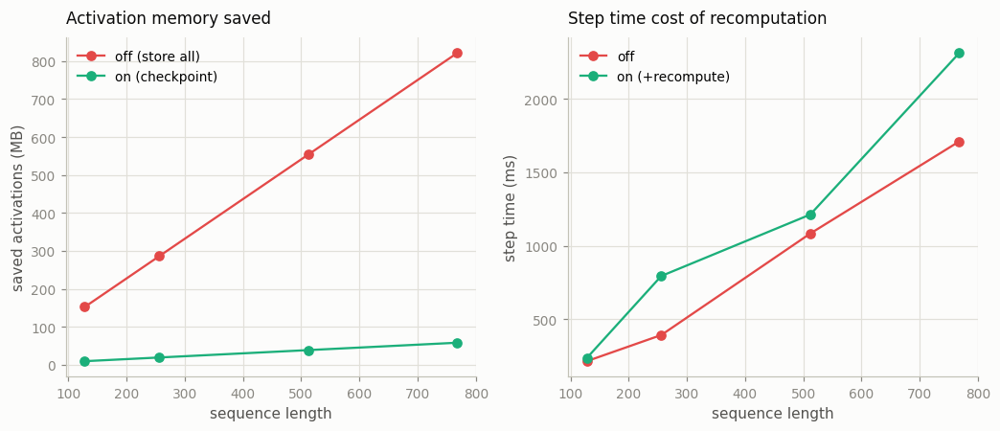

# Activation Checkpointing Study

---

> Throw activations away on the way forward, recompute them on the way back — trade compute for memory.

---

## ELI5 (Explain Like I'm 5)

- **The Big Idea:** During the forward pass a model stashes every intermediate
  result so the backward pass can reuse them — and those stashed "activations" eat
  a *lot* of memory. Activation checkpointing throws almost all of them away and
  simply recomputes them when the backward pass needs them. You pay a little extra
  compute to get a lot of memory back.
- **Analogy:** Solving a long math problem. You could keep every scratch line on
  the desk (fast to check your work, but the desk overflows), or keep only the
  answer to each section and redo a section's scratch work if you need it (a tidy
  desk, a little repeated effort).
- **Example:** At 768-token sequences our model stashes **821 MB** of activations
  normally, but only **58 MB** with checkpointing — a **14× reduction** — for a
  modest bump in step time. That freed memory is what lets you fit a longer context
  or a bigger batch on the same card.

## Key Insight

[Activation checkpointing](/shared/glossary/#activation-checkpointing) discards the intermediate [activations](/shared/glossary/#activations) saved during the forward pass and recomputes them during the [backward pass](/shared/glossary/#backward-pass). This study runs the same model with and without it, measuring the memory saved against the extra step time it costs.

## Why This Matters

For long sequences, activations — not [weights](/shared/glossary/#weights) — often dominate training memory. Spending a little recompute to reclaim a lot of memory is what lets you fit bigger batches or longer contexts onto the same GPU.

## What's in this directory

| File | Role |
|------|------|
| `checkpointing.py` | Wraps each transformer block in `torch.utils.checkpoint`, measures saved-activation bytes exactly via `saved_tensors_hooks`, and times the step — across a sweep of sequence lengths |

```bash
python checkpointing.py      # ~1 min on CPU
```

Reuses the GPT skeleton (`model.py`) from
[project 08](../08-nanogpt-reproduction/README.md).

## Measuring activation memory on a CPU

There's no `torch.cuda.max_memory_allocated` on CPU, so we measure the saved
activations *directly*: `torch.autograd.graph.saved_tensors_hooks` intercepts every
tensor the autograd engine stashes for the backward pass, and we sum their bytes.
Without checkpointing that's every attention score and MLP hidden state in every
layer; with checkpointing it's only each block's *input* — everything inside the
block is recomputed on the way back.

## Results

**A little recompute buys a lot of memory.** Saved activations grow linearly with
sequence length without checkpointing, but stay tiny with it — a ~14× reduction
that widens as sequences (and thus activations) grow:



```
seq   activations OFF   activations ON   saving    step-time cost
128       152.6 MB           9.8 MB       15.6x       +10%
256       286.3 MB          19.5 MB       14.7x       (recompute; noisy on a shared CPU)
512       553.6 MB          39.0 MB       14.2x       +12%
768       821.0 MB          58.4 MB       14.1x       +35%
```

The memory numbers are exact and clean; the step-time cost is the price of the
extra forward pass done during the backward, and here it lands in the tens of
percent (the measurement is noisy on a time-shared CPU, but always positive — you
never get the memory for free). This is precisely the trade in
[project 22](../22-compute-calculator/README.md)'s accounting: checkpointing pushes
measured FLOPs *above* `6ND`, because recomputation is forward work the envelope
doesn't count.

## Why activations, not weights, are the memory wall

The weights of this model are a few MB and constant; its activations are **hundreds
of MB and grow with batch × sequence length**. For long-context training that gap
only widens — activation memory can dwarf the weights by an order of magnitude. So
the lever that lets you fit a longer context or a bigger batch onto a fixed card is
almost never "smaller weights"; it's checkpointing (trade compute for activation
memory) or sharding the model across devices (see the FSDP
[project 23](../23-fsdp-from-scratch-toy/README.md)). Nearly every large-model
training run uses activation checkpointing on most or all of its blocks.

## Things to try

- Push the sequence length to 1024+ and watch the OFF curve climb while the ON
  curve barely moves — the longer the context, the better the deal.
- Checkpoint only *every other* block (selective checkpointing) and find the
  middle of the memory/compute trade-off that real recipes actually use.
- Increase the batch size instead of the sequence length: activation memory scales
  with their product, so the same 14× applies.
