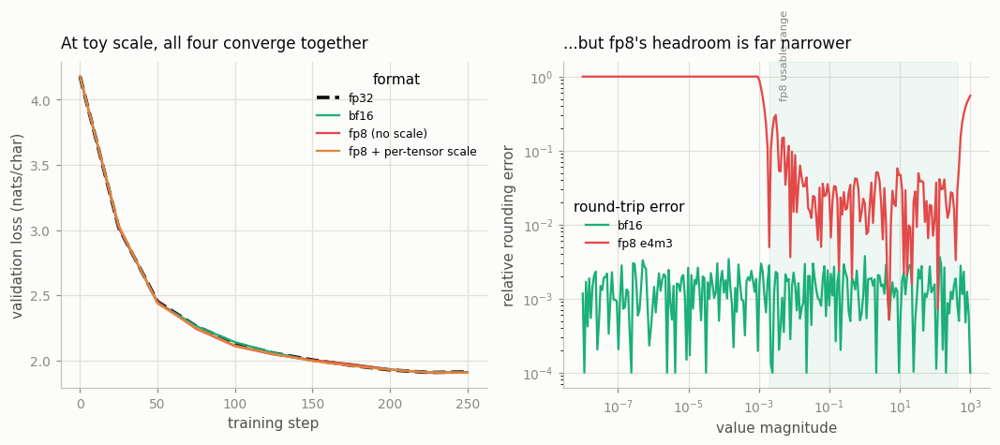

# BF16 vs FP8 Ablation

---

> Fewer bits per number means faster training — right up until the math stops being stable.

---

## ELI5 (Explain Like I'm 5)

- **The Big Idea:** Numbers in a model can be stored with lots of bits (precise, but
  big and slow) or few bits (tiny and fast, but coarse). We compare fp32, bf16, and
  fp8 by *emulating* each format — rounding every number onto its grid. The
  surprise: at this small scale, all three train about equally well. The catch shows
  up not in the loss but in *headroom* — how wide a range of numbers each format can
  even represent.
- **Analogy:** Measuring with rulers of different fineness. For drawing a house
  plan, a coarse ruler is fine. But try to measure a human hair with a ruler whose
  smallest mark is a centimeter and you read "zero" — you've run out of range. fp8
  is that coarse ruler.
- **Example:** All four formats land within 0.006 of each other on the loss. But a
  tiny tensor of values around `3e-4` is **100% wrong** in fp8 without scaling (it
  underflows to zero), and only **2.5% wrong** once per-tensor scaling lifts it into
  fp8's range. That gap is why real fp8 training lives or dies on scaling.

## Key Insight

This [ablation](/shared/glossary/#ablation) trains the same 100M model twice — once in [bfloat16](/shared/glossary/#bfloat16), once in [FP8](/shared/glossary/#fp8) — and compares the [loss](/shared/glossary/#loss-function) curves and training stability. Fewer bits per number save memory and run faster on modern GPUs, but leave less [headroom](/shared/glossary/#headroom) before [numerical issues](/shared/glossary/#numerical-issues) creep in.

## Why This Matters

Lower precision is how big GPUs get used efficiently, and FP8 is the 2024–2026 frontier for training speed. Knowing when dropping precision helps and when it quietly breaks a run is essential to training at scale without wasting hardware.

## What's in this directory

| File | Role |
|------|------|
| `precision_ablation.py` | Emulates fp32/bf16/fp8 with straight-through fake-quantization, trains the same model in each, and probes each format's numeric headroom |

```bash
python precision_ablation.py      # ~3 min on CPU
```

Reuses the GPT skeleton (`model.py`) from
[project 08](../08-nanogpt-reproduction/README.md). We **emulate** the formats
(round every weight and activation onto the target grid, with a straight-through
gradient) rather than run real low-precision kernels — this CPU has no fp8 at all
and its bf16 matmul is a slow emulation. Emulation isolates the one thing that
matters here: rounding, not kernel speed.

## Results

**At toy scale, precision barely matters for convergence.** fp32, bf16, and both
fp8 variants converge on top of one another — a small model is forgiving, and the
quantization noise almost acts like mild regularization:



```
format                    final val loss
fp32                      1.912
bf16                      1.910
fp8 (no scale)            1.907
fp8 + per-tensor scale    1.906     ← all within 0.006; overlapping
```

**But the headroom the formats carry is wildly different** (right panel). bf16 keeps
fp32's full exponent range, so its relative rounding error is a flat ~`2⁻⁸` across
40 orders of magnitude. fp8 e4m3 has only 4 exponent bits: outside its narrow window
(roughly `2⁻⁹` to `448`) the error explodes — small values underflow to zero, large
values saturate. The concrete bite:

```
a tiny tensor (~3e-4), mean relative error:
  fp8, no scaling          1.000   ← underflows: effectively erased
  fp8, per-tensor scaling   0.025   ← scaled into range first, then fine
```

That is the whole reason real fp8 recipes exist: not because fp8 arithmetic is
inherently unstable, but because its *range* is so narrow that every tensor must be
**scaled** into the sweet spot first (per-tensor or per-block scales), and a
higher-precision fp32 master copy must be kept for the optimizer. Skip the scaling
and a whole tensor of small gradients can vanish — the run doesn't crash, it just
quietly stops learning from that signal.

## Why "it converged" is not the same as "it's safe"

The honest lesson of this toy is a subtle one: **lower precision looking fine on a
small run tells you almost nothing about a large one.** bf16 is close to a free
lunch because it kept fp32's exponent range — the same reason it replaced fp16 for
training (fp16's range is what caused the loss-scaling headaches of the 2019 era).
fp8 goes further and gives back range for speed, so at frontier scale — where
activations and gradients span many orders of magnitude and one unlucky outlier can
overflow a tensor — the scaling machinery is not optional. The 34% MFU in
[project 22](../22-compute-calculator/README.md) is exactly what fp8 is chasing:
more of the hardware's arithmetic per second, bought with fewer bits, paid for with
careful scaling.

## Things to try

- Emulate e5m2 (2 mantissa bits, 5 exponent bits) and compare its headroom curve to
  e4m3 — more range, even coarser precision; it's the format used for gradients.
- Shrink the whole model's weights by `1e-3` before training in fp8-no-scale and
  watch it finally break — a deliberate range mismatch is what scaling prevents.
- Scale the loss (an old fp16 trick) and see it does nothing for fp8's *range*
  problem — per-tensor scaling, not global loss scaling, is what fp8 needs.
