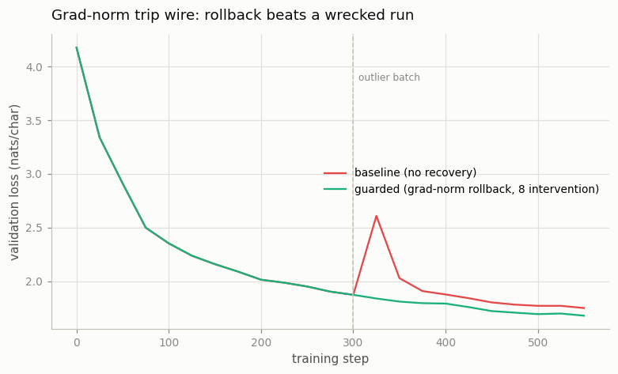
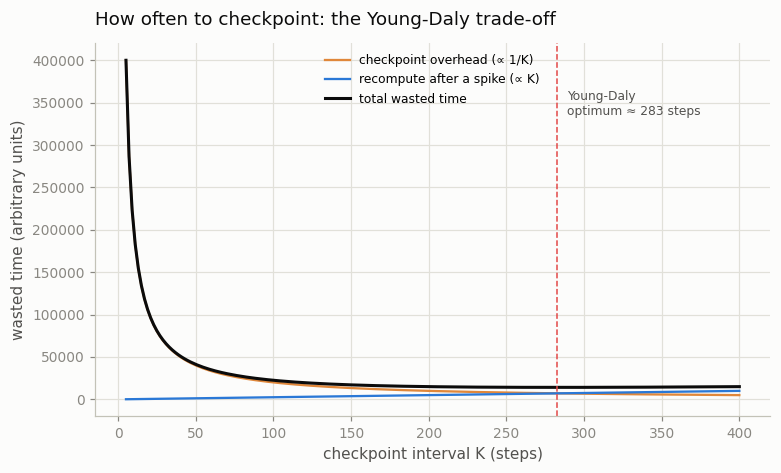

# Loss-Spike Recovery Drill

---

> When the loss explodes mid-run, roll back, skip the bad batch, and keep going.

---

## ELI5 (Explain Like I'm 5)

- **The Big Idea:** Training sometimes hits a bad patch of data that makes the loss
  jump and scrambles the weights. The professional response is a reflex: **watch the
  gradient size**, and the instant it spikes, **undo** to your last save, **skip**
  the bad batch, and **carry on**. We run the same model with and without that reflex
  through a burst of bad data. We also answer the follow-up question every real run
  faces: *how often should I even be saving?*
- **Analogy:** Editing a document with autosave. Paste in a burst of garbage and one
  writer keeps typing on the mangled file (baseline); the other slaps *undo-to-save*
  each time garbage lands and continues clean (guarded). And you tune autosave: too
  rare and a crash costs hours; too frequent and the saving itself slows you down.
- **Example:** A burst of 8 outlier batches spikes the gradient norm to **43.7**
  (healthy is ~0.7). The baseline trains through it and limps to **1.750**; the
  guarded run trips the trip wire **8 times**, rolls back each time, skips the whole
  burst, and finishes clean at **1.679**.

## Key Insight

A [loss spike](/shared/glossary/#loss-spike) is a sudden jump in the training loss, usually from an outlier batch or optimizer instability. This drill catches one by watching the [gradient](/shared/glossary/#gradients) norm, rolls back to the last [checkpoint](/shared/glossary/#checkpoint), skips the offending batch, and resumes.

## Why This Matters

On a [frontier run](/shared/glossary/#frontier-run) burning millions of GPU-hours, a spike you cannot recover from cleanly can throw away days of progress. Rehearsing the catch-and-recover loop on a small model builds the reflex before the stakes are real.

## What's in this directory

| File | Role |
|------|------|
| `recovery_drill.py` | Runs the model with and without the detect→rollback→skip→resume loop through a poison burst, and computes the Young-Daly optimal checkpoint interval |

```bash
python recovery_drill.py      # ~3 min on CPU
```

Reuses the GPT skeleton (`model.py`) from
[project 08](../08-nanogpt-reproduction/README.md).

## The drill (and how it differs from a grad-norm trip wire)

Both runs are **identical and unclipped**, so they share a trajectory right up to the
spike — which is what makes grad-norm detection reliable here (the
[forensics project 19](../19-loss-spike-forensics/README.md) detects on the *loss*
instead, because there the clipped and unclipped runs diverge). At step 300 a burst
of 8 poisoned (random-token) batches arrives:

- **baseline** — no detection: it trains through the burst and carries the scar.
- **guarded** — each step, if the gradient norm crosses the trip wire (3.0), roll
  back to the last checkpoint, skip that batch, and resume. Across the 8-batch burst
  it intervenes 8 times, so the poison never lands.

## Results

**The trip wire turns a scar into a shrug.**



```
run        final val   interventions   peak grad-norm
baseline   1.750        0               43.7   (trained through the burst)
guarded    1.679        8               43.7   (rolled back past every poisoned batch)
```

The baseline's gradient norm hits **43.7** — 60× a healthy step — and the damage
lingers to the end of the run. The guarded run sees the same 43.7, but catches it
before applying it, restores the pre-spike checkpoint, and skips ahead; its loss
curve never even bends.

### How often should you checkpoint?

Recovery only works if you *have* a recent checkpoint — which raises the real infra
question. Checkpoint too rarely and each spike costs a lot of re-done work;
checkpoint too often and the saving itself dominates. That trade-off has a known
optimum (the **Young-Daly** formula), a `√` balance between the two costs:



```
checkpoint overhead ∝ 1/K      (more frequent = more time writing)
recompute after a spike ∝ K    (less frequent = more work lost)
Young-Daly optimum K* = √(2 · checkpoint_cost · MTBF / step_time)
For a 1s step, a 20s checkpoint, and a spike every ~2000 steps → K* ≈ 283 steps.
```

## Why this reflex protects a frontier run

At scale a checkpoint is terabytes and a run is weeks, so spikes are *expected*, not
exceptional — the OPT-175B and BLOOM logs are full of them. The teams that finish
have this loop automated: a grad-norm/loss monitor, checkpoints at the Young-Daly
cadence, and tooling that rolls back and skips a bad data shard without waking anyone.
The mechanics are identical to this toy — watch a scalar, roll back on a trip, tune
the save interval — only the checkpoint is measured in terabytes and the pager goes
off at 3 a.m. The cheapest place to build the reflex is here, where a mistake costs
three minutes.

## Things to try

- Widen the burst to 20 batches and confirm the baseline is wrecked further while the
  guarded run just intervenes 20 times and stays flat — recovery cost is bounded.
- Change the checkpoint cost and MTBF in `young_daly()` and watch the optimal interval
  move — cheap checkpoints ⇒ save often; rare spikes ⇒ save rarely.
- Add gradient clipping to the baseline and see it *soften* the spike but not erase
  the scar — clipping and rollback are complementary, not redundant.
