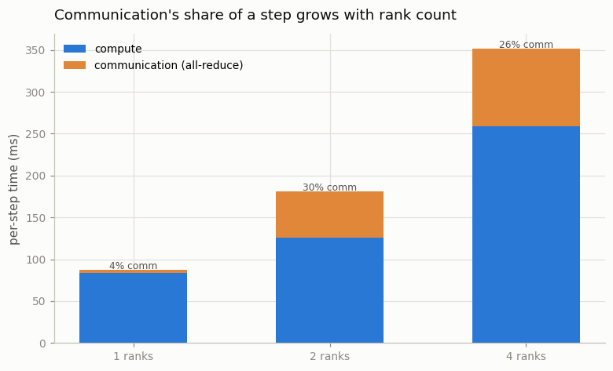
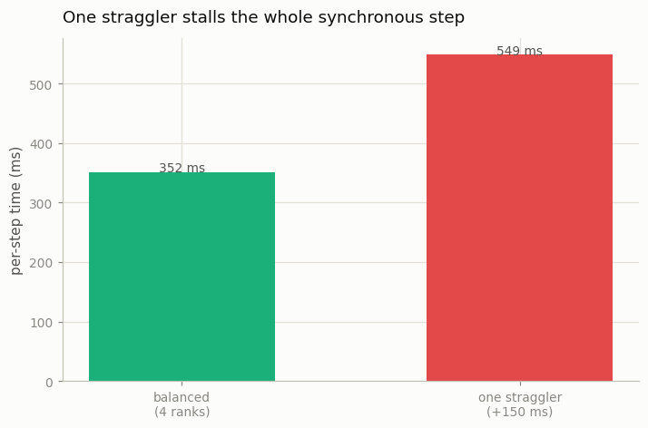

# Multi-Node Training

---

> Sixteen GPUs across two machines, one training loop — if the network can keep up.

---

## ELI5 (Explain Like I'm 5)

- **The Big Idea:** When a training job spans many machines, the model stops being
  the hard part — the *coordination* does. Every step, all the machines must add up
  their gradients over the network (communication), and because they march in
  lockstep, the whole group only goes as fast as its *slowest* member (a straggler).
  We can't add real machines to a laptop, but we can spin up several processes that
  talk over the network stack and measure exactly these two costs.
- **Analogy:** A rowing eight. Add rowers and you *could* go faster — but only if
  they stay perfectly synchronized (communication), and the boat's speed is capped
  by the one rower who's tired (the straggler). One person catching a crab stalls
  the whole boat.
- **Example:** Going from 1 to 2 ranks, the gradient all-reduce jumps from **4%**
  to **30%** of each step. And when we make one of four ranks 150 ms slow, the step
  time balloons from ~350 ms to ~550 ms — everyone waits for the laggard.

## Key Insight

This project runs [FSDP](/shared/glossary/#fsdp) across 2 [nodes](/shared/glossary/#node-distributed) of 8 GPUs each, launched with [`torchrun`](/shared/glossary/#torchrun), aiming for over 70% [MFU](/shared/glossary/#mfu). Once a job spans machines, the hard part shifts from the model to the network and the orchestration between nodes.

## Why This Matters

Real pretraining spans many machines, where slow links and straggler GPUs — not the model — decide [throughput](/shared/glossary/#throughput). Keeping utilization high across nodes is the difference between a run that finishes in days and one that drags on for weeks.

## Honest downscale

The guide targets 2 nodes × 8 GPUs at >70% MFU. A single CPU can't show real
speed-up from "more nodes" — every rank shares the same cores, so throughput stays
flat no matter how many we launch. What it *can* show honestly are the two costs
that actually cap multi-node throughput, and that never appear on a single GPU:
**communication** and **stragglers**. We run real data-parallel DDP over the gloo
backend at 1/2/4 ranks (`torchrun --nproc_per_node=N`), timing the compute/comm
split, then inject an artificial straggler.

## What's in this directory

| File | Role |
|------|------|
| `multinode.py` | Data-parallel DDP over gloo ranks; measures the compute vs all-reduce split per step, and the effect of a straggler |

```bash
torchrun --nproc_per_node=1 multinode.py
torchrun --nproc_per_node=2 multinode.py
torchrun --nproc_per_node=4 multinode.py
STRAGGLER_MS=150 torchrun --nproc_per_node=4 multinode.py
python multinode.py --plot
```

Reuses the GPT skeleton (`model.py`) from
[project 08](../08-nanogpt-reproduction/README.md).

## Results

**Communication's share of a step grows with the rank count.** The all-reduce that
averages gradients is a synchronous barrier; the more ranks, the more it costs:



```
ranks   compute   comm     comm share
1        84 ms    3.6 ms      4%
2       126 ms   54.6 ms     30%
4       259 ms   92.6 ms     26%
```

(Compute *rises* with rank count only because all ranks share this one machine's
cores — on real separate nodes it would stay flat and the throughput would scale;
what transfers from this toy is the *comm* column, which is real.)

**And one straggler stalls everyone.** Delaying a single rank by 150 ms per step
inflates the *whole* group's step, because the barrier can't clear until the
slowest rank arrives:



```
balanced 4 ranks        ~351 ms/step
one straggler (+150 ms) ~549 ms/step   ← everyone waits for the laggard
```

## Why utilization, not the model, decides the timeline

Once a run spans machines, [MFU](/shared/glossary/#mfu) — the fraction of the
hardware's peak FLOPs you actually use (see
[project 22](../22-compute-calculator/README.md)) — is set by how much of each step
is *not* compute. Two things erode it: communication (mitigated by overlapping
all-reduce with the backward pass, by faster interconnects like NVLink/InfiniBand,
and by sharding strategies that reduce traffic) and stragglers (a single slow or
flaky GPU, a thermal-throttled node, an unlucky network hop). A frontier run that
holds 50% MFU across thousands of GPUs and one that limps at 20% differ not in
their model but in their networking and scheduling — which is why "keep the cluster
busy" is a full-time engineering job, and why the last mile of pretraining is a
systems problem, not a modeling one.

## Things to try

- Overlap communication with compute: launch the all-reduce for each layer's
  gradients as soon as they're ready (during the backward), instead of after — this
  is what real DDP's gradient bucketing does, and it hides most of the comm column.
- Vary `STRAGGLER_MS` and plot step time vs the straggler's delay — it's linear, and
  the slope is exactly 1: every millisecond of straggler is a millisecond for all.
- Combine with the FSDP [project 23](../23-fsdp-from-scratch-toy/README.md): shard
  the model *and* replicate across ranks (2D parallelism), the real frontier layout.
