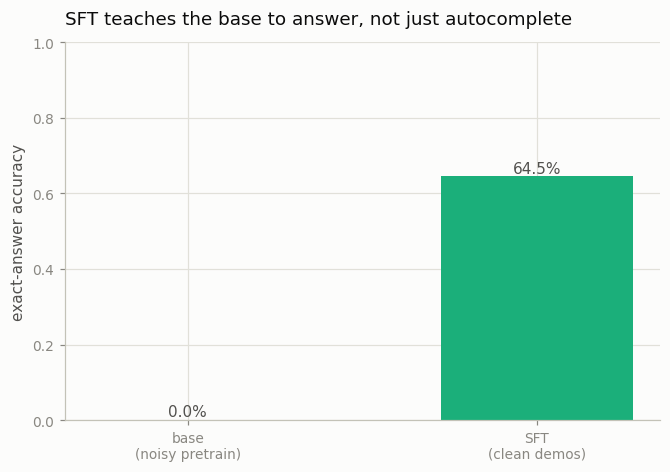

# SFT a 1B Base Model

---

> The first pass that turns a brilliant autocomplete into something that answers you.

---

## ELI5 (Explain Like I'm 5)

- **The Big Idea:** A base model is a world-class autocomplete — it continues text but
  doesn't *answer* you. Supervised fine-tuning (SFT) shows it thousands of
  question→answer examples, training the loss only on the *answer* part, until
  replying-to-a-request becomes its habit. That's the first step that makes an
  assistant.
- **Analogy:** Someone who has read the whole internet but only ever finishes your
  sentences. SFT is the etiquette class that teaches them to *respond* to what you
  asked instead of rambling on.
- **Example:** Our base model (pretrained on noisy arithmetic) knows the format but gets
  the sums wrong — **0%** exact accuracy, answering `20+9=` with "9". After SFT on clean
  demonstrations it answers "29", reaching **64.5%**.

## Key Insight

This project takes an open [base model](/shared/glossary/#base-model) and runs [supervised fine-tuning (SFT)](/shared/glossary/#sft) on instruction-response examples, then scores the result on [MT-Bench](/shared/glossary/#mt-bench). SFT does not teach new facts — it teaches the model the chat format and the habit of replying to a request instead of just continuing the text.

## Why This Matters

SFT is the first and cheapest step that turns a raw [next-token predictor](/shared/glossary/#next-token-prediction) into something that follows instructions. Almost every assistant you have used started with an SFT pass like this one.

## What's in this directory

| File | Role |
|------|------|
| `sft_lib.py` | **The shared Phase-5 toy stack**: a verifiable arithmetic task, tokenizer, masked SFT, generation, and log-prob helpers — imported by projects 29-35 |
| `sft.py` | Pretrains a noisy base, runs SFT with assistant-only loss masking, and compares accuracy |

```bash
python sft.py       # ~4 min on CPU
```

Reuses the GPT skeleton from [project 08](../08-nanogpt-reproduction/README.md). The
task is a stand-in for instruction tuning: the "user turn" is a problem `37+8=` and the
"assistant turn" is the answer `45;`. Because a verifier can *check* every answer, this
one task carries the whole phase — SFT here, preference pairs and a reward model in
[31](../31-train-a-reward-model/README.md), and RLVR in
[34](../34-grpo-on-a-math-task/README.md). The guide's "1B model on Alpaca, scored on
MT-Bench" becomes a tiny model on arithmetic scored by exact-match — same recipe,
laptop-sized.

## The one line that matters: loss masking

SFT data is prompt + response, but the loss is computed **only on the response tokens**
— the model should imitate answers, not the questions it was handed. That single choice
is the subject of the [next project](../29-loss-masking-bug-hunt/README.md); here we
simply do it right.

## Results

**SFT turns a format-fluent-but-wrong base into a model that answers correctly.**



```
model                     exact-answer accuracy
base (noisy pretrain)     0.000     autocompletes a plausible-looking wrong number
SFT (clean demos)         0.645     actually solves it
```

The samples make the transition concrete — same prompts, before and after SFT:

```
20+9=29    base-> 9    sft-> 29  [OK]
25+41=66   base-> 1    sft-> 66  [OK]
23+37=60   base-> 1    sft-> 60  [OK]
34+6=40    base-> 90   sft-> 41  [X]
```

The base model already "speaks the format" — it emits a number and a terminator — but
has no idea what the answer is. SFT doesn't teach it a new *language*; it teaches it to
*answer*.

## Why this is the first step of every assistant

Pretraining gives a model its knowledge and fluency; SFT gives it the *behavior* of
responding. It's cheap (a few hundred steps here, a few GPU-hours for a real model) and
it's where the "chat" in a chat model comes from. Everything later in this phase —
reward models, PPO, DPO, GRPO — is *polish* on top of the behavior SFT installs. As the
guide's key insight puts it: if a model can't do X after post-training, the fix is
almost never more RLHF; it's better pretraining data plus a small SFT pass to surface
the ability. SFT is the surface.

## Things to try

- Train SFT longer (`steps=1000`) and watch accuracy climb toward ~90% — the ceiling the
  RL projects ([32](../32-ppo-rlhf-loop/README.md), [34](../34-grpo-on-a-math-task/README.md))
  push a *partial* SFT model toward.
- Shrink the demonstration set (fewer unique problems) and watch SFT memorize instead of
  generalize — the same overfitting risk real SFT faces with small curated sets.
- Feed the base model a bare prompt and read its continuation: it often starts a *new*
  problem instead of answering — exactly the autocomplete habit SFT overrides.
