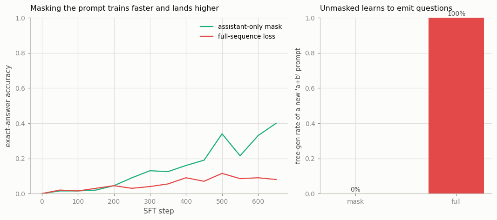

# Loss-Masking Bug Hunt

---

> Grade the model on its answers, not on the questions it was handed.

---

## ELI5 (Explain Like I'm 5)

- **The Big Idea:** In SFT the model reads a question and writes an answer, but *only the
  answer* is its job. If you accidentally train it on the whole thing — question included
  — it burns effort learning to *write questions* (which here are random and unlearnable)
  instead of learning to answer. It's a one-line bug that throws no error; you only catch
  it by its fingerprint.
- **Analogy:** A student practicing for an exam who copies out both the questions *and*
  the answers by hand. Half their study time goes into transcribing questions they'll
  never be asked to write — time stolen from actually learning the answers.
- **Example:** Same model, same data, same steps — only the loss mask differs.
  Assistant-only masking reaches **40%** accuracy; computing loss over the full sequence
  cripples it to **8%**. And the unmasked model learns to *emit questions*: prompted with
  nothing, it spits out a new "a+b" problem **100%** of the time, versus **0%** for the
  masked one.

## Key Insight

This project runs [SFT](/shared/glossary/#sft) twice — once computing the [loss](/shared/glossary/#loss-function) over every token, and once with [loss masking](/shared/glossary/#loss-masking) so only the assistant's reply counts — and compares the two. When the prompt tokens are not masked, the model wastes effort learning to imitate questions instead of learning to answer them.

## Why This Matters

Loss masking is a one-line setting that is easy to get wrong and quietly degrades a fine-tune without ever throwing an error. Knowing how to spot its fingerprint saves you from a whole class of silent SFT bugs.

## What's in this directory

| File | Role |
|------|------|
| `masking.py` | Runs SFT twice (masked vs. full-sequence loss), compares accuracy over training, and probes each model's free-generation behavior |

```bash
python masking.py       # ~3 min on CPU
```

Reuses the shared task (`sft_lib`) and the GPT skeleton from
[project 08](../08-nanogpt-reproduction/README.md). The only difference between the two
runs is one boolean — whether the loss is masked to the assistant's answer.

## Results

**The one-line bug halves nothing — it *quarters* accuracy, and leaves a fingerprint.**



```
loss over...              accuracy   emits a question when prompted freely
assistant only (masked)   0.400      0%
the full sequence         0.080      100%
```

Two things go wrong when you don't mask:

- **Wasted capacity → worse answers.** The prompt is a *random* `a+b` — unpredictable by
  construction. Training the model to predict those random operands pours gradient into
  an impossible task and starves the part that matters, so exact-answer accuracy craters
  (0.40 → 0.08).
- **It learns the wrong job.** Because the loss rewarded reproducing prompts, the
  unmasked model becomes a *question generator*: seeded with nothing it emits a fresh
  `a+b` problem every time (100%), while the masked model never does (0%). That is the
  fingerprint — a fine-tune that "sometimes just writes the user's next message" is
  almost always an un-masked loss.

## Why this silent bug is worth knowing cold

Loss masking throws no error and the loss curve still goes down — it just goes down for
the *wrong tokens*. In a real chat fine-tune the prompts are system messages and user
turns, often far longer than the reply, so an unmasked loss spends most of its budget
learning to imitate users: the model starts completing your questions, role-playing both
sides, or leaking prompt boilerplate into answers. Every SFT framework masks the prompt
by default for exactly this reason, and "did I mask the loss?" is the first question to
ask when a fine-tune mysteriously regresses.

## Things to try

- Lengthen the prompt (add a fixed instruction prefix) and watch the unmasked model get
  *worse* still — the more prompt tokens, the more of the loss budget they steal.
- Mask everything *except* the final token and confirm accuracy collapses too — the model
  needs the loss on the whole answer, not just its last character.
- Inspect a few full-loss generations: they often answer and then keep going into a new
  problem — the "won't stop talking" symptom of a mis-masked fine-tune.
